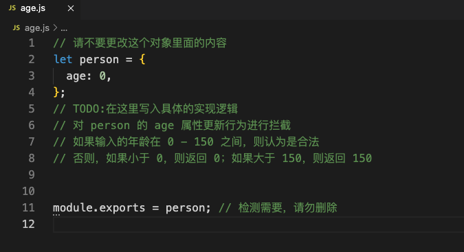

**目标**

在文件 `age.js` 中，有一个 `person` 对象，当它的 `age` 属性值改变时需要对新值做判断，将其永远控制在 0 - 150 之间。具体需求如下：



- 如果新属性值在 0 -150 之间（包含 0 和 150），则直接更新。
- 如果新属性值小于 0，则属性值更新为 0。
- 如果新属性值大于 150，则属性值更新为 150。

> 提示：可以使用 Object.defineProperty 或者 Proxy 对 person 对象进行处理。


*age.js*

```

```

*index.html*

```

```

