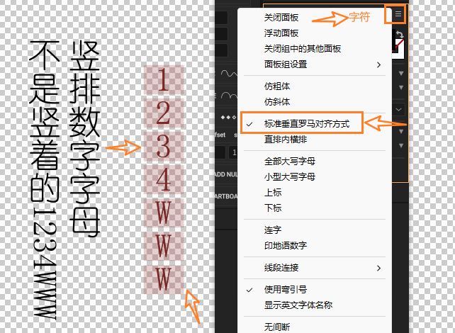

## 摄影
- [ ] BV14M4y1M7bd
- [ ] 大平幸辉After Effects EXPERT

## 技巧

- [ ] [制作思路02](https://www.bilibili.com/video/BV12j411S7Xv/)
- [ ] [【AE教程】PV 形状背景运动](https://www.bilibili.com/video/BV1Hh4y117Qp/)
- [ ] [形状图层与扭曲玩法4](https://www.bilibili.com/video/BV1cV4y187oG/)
- [ ] [【AE插件分享】万花筒效果——轻松生成动态背景](https://www.bilibili.com/video/BV18V4y187o5/)
- [ ] [【ae教程】20秒速成波纹效果](https://www.bilibili.com/video/BV1TX4y1v7KW/)
- [ ] [【AE教程】使用CC Power Pin扩大3D空间的透视感](https://www.bilibili.com/video/BV17z4y1p7AY/)
- [ ] [【AE教程】分形的一种玩法](https://www.bilibili.com/video/BV15y4y1q73B/)
- [ ] [【Ae技巧】两分半教你学会kk老师的故障效果](https://www.bilibili.com/video/BV1Ch411A7xp/)
- [ ] [AE快速提示：应用于蒙版的合成选项](https://www.bilibili.com/video/BV1C14y1d7mS/)
- [x] [[AE疑难杂症\]直排文字立不起来](https://www.bilibili.com/video/BV1yN411S7om/)

- [ ] [【ae教程】致幻蒸汽波](https://www.bilibili.com/video/BV1Af4y1x7mE/)
- [ ] [【全流程】从2D草图到3D虚拟皮套，比你想象的简单！](https://www.bilibili.com/video/BV1E44y1H7iv/)
- [ ] [静止画MADの作り方を教えるのだ| 合成 | 图层拆解 | 排版思路分享 【合成过程】【制作思路】](https://www.bilibili.com/video/BV1Ps4y1F7Zr/)
- [ ] [【PV教程】快速用blender&AE制作风格化故障模型](https://www.bilibili.com/video/BV1vW4y1D7hR/)
- [ ] [【附上工程am】pv摄像机小练习](https://www.bilibili.com/video/BV15h4y1V7Gn/)
- [ ] [时间置换](https://www.bilibili.com/video/BV16c411u7rW/)
- [ ] [AE 水上月落碎片](https://www.bilibili.com/video/BV1F14y1S7D3/)
- [ ] [【MAD教程】关于口型同步的演出【CANO】](https://www.bilibili.com/video/BV1Go4y1J7nb/)
- [ ] [blender-几何节点-挤出和内插的平均厚度原理](https://www.bilibili.com/video/BV1L14y1Q7jQ/)
- [ ] [【AE教程】纯AE制作！这个流体RGB文字动画你一定想学！](https://www.bilibili.com/video/BV1QX4y117f8/)
- [ ] [【Blender】天才的描边控制贴图制作方法！顶点权重与顶点色相互转换！](https://www.bilibili.com/video/BV1no4y1T7jG/)
- [ ] [十字光的制作方式（特效贴图系列）](https://www.bilibili.com/video/BV1zh4y197Hb/)
- [ ] [【静止画MAD/教程】漫画打斗场景冲击效果](https://www.bilibili.com/video/BV11z4y1q7q7/)
- [ ] [AE教程 光 （上集）](https://www.bilibili.com/video/BV1so4y1K7Tc/)
- [ ] [【AE教程】MIR一种背景思路](https://www.bilibili.com/video/BV1ns4y1g7NT/)
- [ ] [【AE教程】直播录屏，做了三个东西，也许对你的后期工作有帮助吧](https://www.bilibili.com/video/BV1Ao4y1u7QK/)
- [ ] [Week End加解析](https://www.bilibili.com/video/BV1vX4y187z1/)
- [ ] [Coloso - 赤動 - 从基础到实践：创建 16 种效果](https://www.bilibili.com/video/BV1Ym4y1479S/)
- [ ] [AE教程 - AI&AE制作钻石动画_diamonds](https://www.bilibili.com/video/BV1ek4y1x7jf/)
- [ ] [AE教程：电子小哥的弹性shake](https://www.bilibili.com/video/BV1Rh411V7am/)
- [ ] [学会建立mg元素库](https://www.bilibili.com/video/BV1qP411X7xj/)
- [ ] [【Ae教程】如何制作文字PV part4](https://www.bilibili.com/video/BV1cV4y1C7T9/)
- [ ] [【AE教程？】如何用cc lens做泡泡(popo)](https://www.bilibili.com/video/BV1kM4y147uN/)
- [ ] [动画摄影-浅谈广角镜头在动画中的应用](https://www.bilibili.com/video/BV1bo4y1A7wP/)
- [ ] [【Ae教程】2分钟教你学会炫酷的流体文字动效！还不丢进收藏夹里吃灰？](https://www.bilibili.com/video/BV1Uz4y1t7y3/)
- [ ] [「芸大不安？」feat. 水槽 / あっこゴリラ MV](https://www.bilibili.com/video/BV1U14y1Z7xj/)
- [ ] [【动画摄影/二维合成】新手的总结以及一些合成思路的分享](https://www.bilibili.com/video/BV1cs4y1X71Y/)
- [ ] [摄影合成记录](https://www.bilibili.com/video/BV12m4y1h7AJ/)
- [ ] [【AE教程】AE常见小问题汇总（持续更新中）](https://www.bilibili.com/video/BV1vm4y1C7QN/)
- [ ] [【中文字幕\AE教程】MV1UP讲座-快速提升的大技巧（一起来成为术力口动画师吧！）](https://www.bilibili.com/video/BV12h411w76K/)
- [ ] [已失效视频](https:javascript:;)
- [ ] [【Ae教程】如何制作文字PV part3](https://www.bilibili.com/video/BV1ts4y137HT/)
- [ ] [【AE教程】渐变流体](https://www.bilibili.com/video/BV1Lg4y157N5/)
- [ ] [【Ae教程】如何制作文字PV part1](https://www.bilibili.com/video/BV1kX4y1m7Vx/)
- [ ] [分享用【AE內建特效】嘗試建立酒杯水滴的思路](https://www.bilibili.com/video/BV1V14y1Z7Qj/)
- [ ] [【AE教程】渐变玻璃背景](https://www.bilibili.com/video/BV1u24y1F7wM/)
- [x] [After EffectsとTrapcode Particularでロゴや文字が燃えながら消えていくエフェクトの作り方](https://www.bilibili.com/video/BV12V4y1R7NH/)
- [ ] [【动画摄影】如何给动画人物增加质感？](https://www.bilibili.com/video/BV14M4y1M7bd/)
- [ ] [中世纪ae白魔法表演](https://www.bilibili.com/video/BV11s4y1d7bp/)
- [ ] [zdmc氏に教えて貰ったりして作った背景の作り方](https://www.bilibili.com/video/BV1r24y1c7Vm/)
- [ ] [【PV笔记】关于3D摄像机中的方框文字](https://www.bilibili.com/video/BV1Jo4y1q7qh/)