私は止まらないよ。

vector矢量输出的是**值**和**方向**

**Math** 就是 **值**

**Vector Math** 带有 **颜色** 的 **坐标** 被移动

**从Texture Coordinate的object开始，在输出前都用ColorRamp更直观的看出图形**

**（可以的话最好使用less then 或Greater then），不要通过ColorRamp去控制图形大小**

**点（圆）**

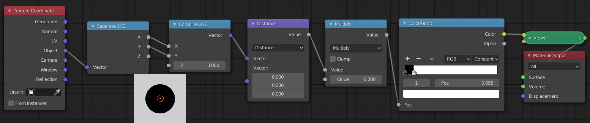

距离（distance）的话一样而且还可以控制圆的位置（如上），不过distance必须要通过分离合并xyz

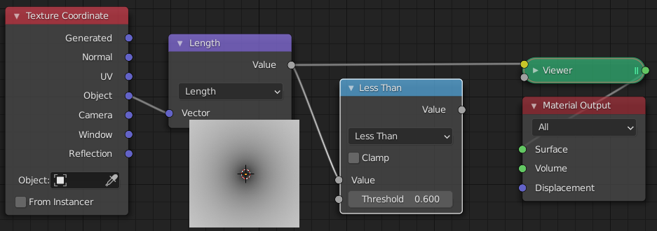

长度（length）直接连object就行，后面的math值用来控制scale，控制位置的话当然是vector math啦

**线****(四边形)**

主要就是absolute

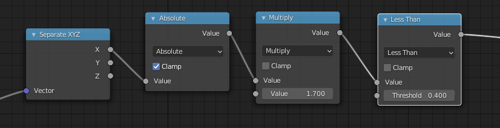

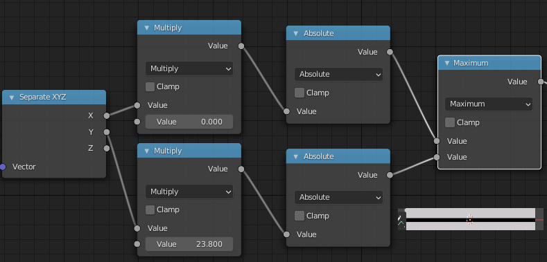

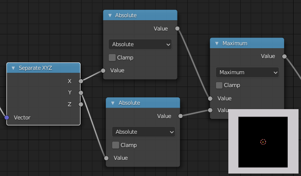

**三角形**

最难理解的一个

宽高的控制自己想

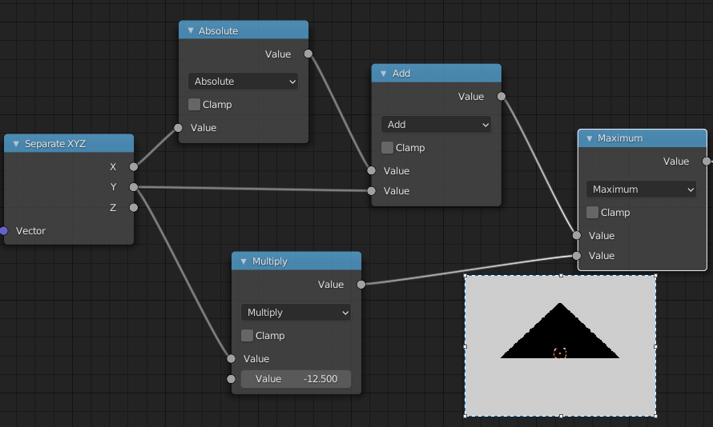

**多边形**

分裂面，中心坐标在圆环上

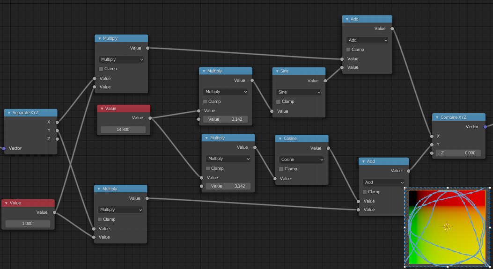

（非常有意思）

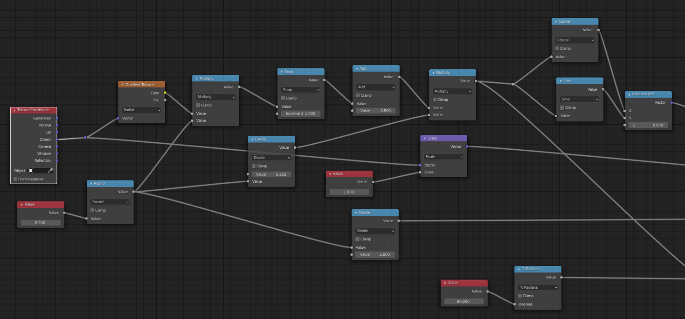

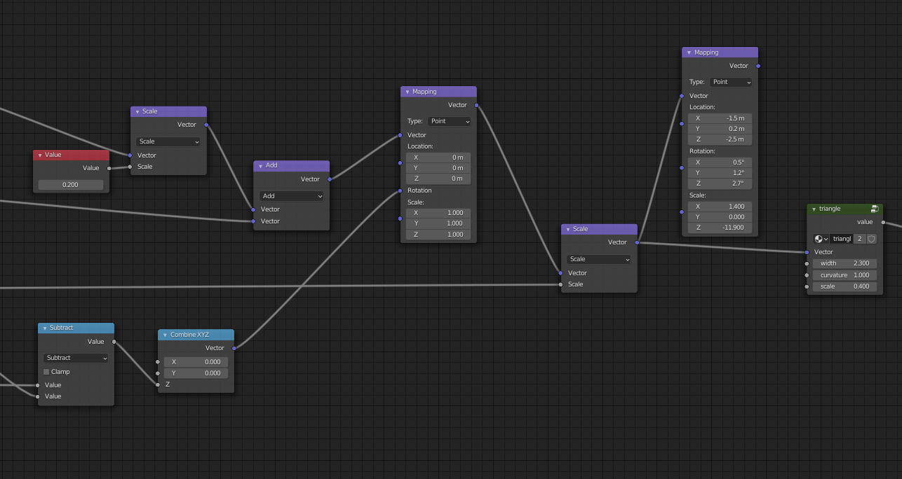

**矩阵**

（坐标会产生偏移，这得看制作方法

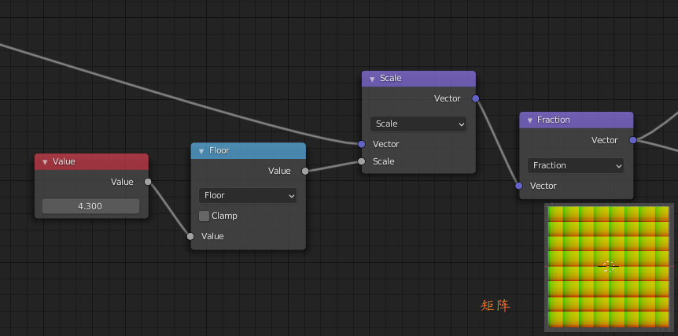

**放射**

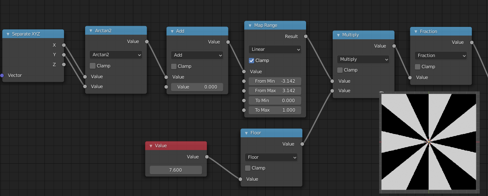

**环**

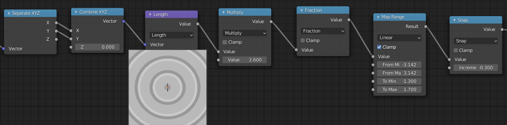

**曲线**

**嵌套**

(最重要的是（0，0）这个点要挪到每个方块的中心

先分割再上图形

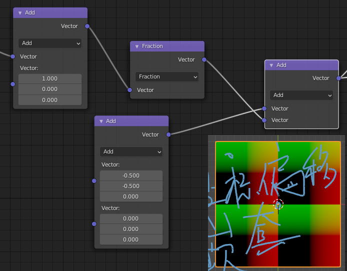

**缩放**

摸啥好讲

**旋转**

（重要的是在坐标上旋转）

**剪切**

less then  Greater then 加 减

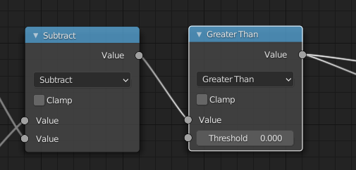

**alpha（黑白反转）**

less then 0 与 Greater then 0是个反转

less then if A

**Greater then if A>B else 0**

**(横批：我是笨蛋)**

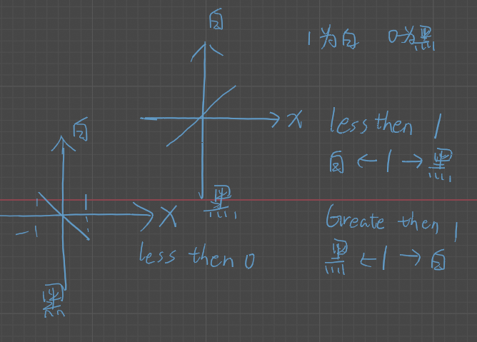