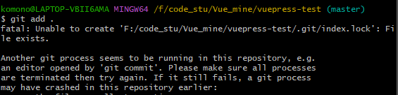

> https://www.runoob.com/git/git-tutorial.html

## 初始化git

名称要和github上的保持一致，不然push上去的账号会不一致

github

```git
git config --global user.email "mugibatake99@gmail.com"
git config --global user.name "maiiitian"
```

gitee的，呃呃呃呃传完记得改回上面的

```
git config --global user.name "Naitiam"
```

## 重新连Github

`ssh-keygen -t rsa -C “naitiam@LAPTOP-VBII6AMA”`  (执行后一直回车就可以了)    生成新的公钥

`clip < ~/.ssh/id_rsa.pub`  复制 `id_rsa.pub` 文件内容到


`ssh -T git@github.com `  SSH 测试

Hi maiiitian! You've successfully authenticated, but GitHub does not provide shell access.

`git init`  本地目录

`git clone git@github.com:maiiitian/ ` 克隆远程仓库到本地

`git remote add origin git@github.com:`  添加远程地址**（使用ssh方式每次push不需要登录**

`git remote rm origin` 删除远程地址

> git pull <远程主机名> <远程分支名>:<本地分支名>

`git pull origin master`   从远程获取代码并合并本地的版本 

`git remote -v`  查看远程仓库地址


`git add . `  添加全部文件到暂存区

`git commit -m "message" ` 提交到暂存区

`git push -u origin master ` 将本地仓库的项目提交到远程仓库，分支名称被改变。把默认改为master而非main

`git status`  查看状态

`git log`  查看提交的状态

`git reset `  将尚没有commite之前加入到暂存区的文件重新拉回

**文件状态：**

1. 没有被add过的文件叫untracked
2. add之后文件处于staged状态等待commite
3. commit之后文件处于unmodified这里之所以是modified是因为文件会跟仓库中的文件对比
4. 当unmodified的文件被修改则会变为modified状态
5. modified之后的文件add之后将继续变为staged状态
6. unmodifed的文件还有一种可能是已经不再需要了，那么可以remove它不再追踪变为untracked状态

## 分支

`git checkout -b 分支名`  以参考分支为模板创建新分支

`git checkout 分支名`  切换到指定分支

`git branch` 查看本地所有分支

`git merge 分支名 ` 合并分支的变更

手动解决冲突

`git fetch `  ?监测远程仓库（查看分支）


## 遇到的问题



在.git目录下删除index.lock文件


想要链接到远程仓库，报权限变更

` git config --global  --add   safe.directory '*'`

## 管理工具SublimeMerge

使用 SublimeMerge 管理仓库


