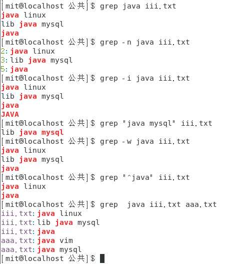

# 文件与目录管理

[toc]

## 一、Linux和Windows系统目录区别

1、Windows系统文件访问具体过程为:ntfs fat32

先确定硬盘，再确定硬盘上的分区以及每个分区所对应文件系统，最后找到存放在某个分区特定的文件系统中的文件。 她她她  

2、Linux系统文件访问:ext3 ext4 swap

“虚拟文件系统-硬盘-硬盘上的分区-分区上的特定文件系统-特定文件系统中的文件” 

假设访问上述硬盘第三个分区 dir1 目录中的文件 test.file

Window系统上的路径：E:\dir1\test.file

Linux系统上的路径：/mnt/sda3/dir1/test.file


## 二、目录与路径

如果一个目录或文件名以一个点 . 开始，表示这个目录或文件是一个隐藏目录或文件(如：.bashrc)。即以默认方式查找时，不显示该目录或文件。

> sudo apt install tree
>
> tree命令，查看目录结构

**系统启动必须：**

- **/boot：**存放的启动Linux 时使用的**内核文件**，包括连接文件以及镜像文件。

- **/etc：**存放**所有的系统需要的配置文件和子目录列表，**更改目录下的文件可能会导致系统不能启动。

- **/lib**：存放**基本代码库**（比如c++库），其作用类似于Windows里的DLL文件。几乎所有的应用程序都需要用到这些共享库。

- **/sys**： 这是linux2.6内核的一个很大的变化。该目录下安装了2.6内核中新出现的一个**文件系统 sysfs** 。sysfs文件系统集成了下面3种文件系统的信息：针对进程信息的proc文件系统、针对设备的devfs文件系统以及针对伪终端的devpts文件系统。该文件系统是内核设备树的一个直观反映。当一个内核对象被创建的时候，对应的文件和目录也在内核对象子系统中。

**指令集合：**

- **/bin：**存放着**最常用的程序和指令。**

- **/sbin：**只有系统管理员能使用的程序和指令。

**文件管理：**

- **/dev ：**Device(设备)的缩写, 存放的是Linux的外部设备。**注意：**在Linux中访问设备和访问文件的方式是相同的。

- **/mnt**：**临时挂载**别的文件系统的，我们可以将光驱挂载在/mnt/上，然后进入该目录就可以查看光驱里的内容了。

**临时文件：**

- **/tmp**：这个目录是用来存放一些临时文件的。

**运行过程中要用：**

- **/var**：存放经常修改的数据，比如程序运行的日志文件（/var/log 目录下）。

- **/proc**：管理**内存空间！**虚拟的目录，是系统内存的映射，我们可以直接访问这个目录来，获取系统信息。这个目录的内容不在硬盘上而是在内存里，我们也可以直接修改里面的某些文件来做修改。

**账户：**

- **/root**：系统管理员的用户主目录。

- **/home**：用户的主目录，以用户的账号命名的。

- **/usr**：用户的很多应用程序和文件都放在这个目录下，类似于windows下的program files目录。

- **/usr/sbin：**超级用户使用的比较高级的管理程序和系统守护程序。（**只有root能访问**

## 三、常用目录处理命令 

#### ls 列出目录及文件名

```shell
ls -a 全部的文件，连同隐藏文件( 开头为 . 的文件) 一起列出来
ls -l 长数据串列出，包含文件的属性与权限等等数据
-rw-r--r--.  1   root       root       1807  12月 20 12:47  initial-setup-ks.cfg
  权限     链接数  文件拥有者 文件所属群主  文件容量  修改日期    文件名
文件权限：
共10位   
第1位：-文件  d目录   
后9位：权限（每3位为一个单元） r读取  w写入  x执行
rw-  r--  r--
u    g    o
4+2  4    4
文件所有者(u)+文件所属组(g)+用户其他人(o)
```

#### cd  切换目录

```shell
# 绝对路径切换目录
cd /目录名/目录名/
#相对路径切换目录
cd ./目录名/*-+
绝对路径：必须从根目录写起，/home/mit/文档/..
相对路径：
	~表示用户主目录 /home/mit   /root
	.表示当前目录
	..表示当前目录的上一级目录 
	-代表前一个工作目录 
```

#### pwd  显示目前的目录

```shell
[root@localhost runoob]# pwd
/home/mit/公共/runoob
```

#### mkdir  创建新的目录

```shell
# -p 创建嵌套目录
mkdir -p a1/a2 a1/a3 b1 c1/c2 c1/c3
# 一般新建的目录权限默认为755
# -m 创建带权限的目录
mkdir -m 711 目录名
711的意义：drwx--x--x
必须写上权限号 会报mkdir: 缺少操作数
# -v 可以显示创建目录的信息
mkdir -p f1/d1 f1/{d1,d2,d3/{w1,w2}}
```
#### rmdir  删除目录
```shell
# 删除空目录
rmdir 目录名称
-p 从该目录起，一次删除多级空目录
mkdir -p d1/d2
rmdir -p d1/d2
rm -rf 直接强制删除嵌套目录 
```

## 四、常用文件处理命令

- 蓝色：目录
- 浅蓝色：连接文件
- 红色：压缩文件
- 黄色：设备文件
- 绿色：可执行文件

### 文件处理相关

#### touch  创建空文件，修改时间

```shell
# 新建一个txt文件
touch iii.txt
默认权限是644  -rw-r--r--
touch {1..10}.mp4 # 创建10个MP4文件命名为1到10
touch *.mp4 #修改已有文件的时间属性（不再重新创建新的文件）
```

```
touch -r e1 e3 将e3的文件时间更改为e1的文件时间
```

#### cp  复制文件和目录


```shell
cp /etc/passwd /root/pas # 将ect目录下的password复制到root目录下并重命名为pas
-p 表示在复制文件时，保持原有文件属性不变（-a）
-r 表示复制文件目录及目录下所有文件
# 将c1目录下c2目录复制到b1目录下 
[root@localhost 公共]# cp -r ./c1/c2/ ./b1/ 
-f 表示强制复制文件，若有重名文件，直接覆盖。
-i 有交互
```

#### mv  移动，重命名文件与目录页

```shell
mv aaa a # 把名为aaa的txt重命名为a
mv a b1 # 把名为a的txt移动到b1目录下
-f 强制
-i 交互
-u 当源文件与目标文件重名时，若源文件较新，则更新目标文件，否则不更新目标文件
```

#### rm  删除文件或目录

```
rm -rf 可直接删除嵌套目录 
-i 交互
-f 强制
-r 递归删除
```

#### find  查找文件              

```
find 路径 [选项] 文件名
```

### 文件内容相关

#### cat 查看文件内容，创建文件，文件合并，追加文件内容

```shell
# 查看文件内容（会显示在终端界面界面
cat  由第一行开始显示文件内容 
-n  进行行编号
-b  参数对除空白行以外所有行进行编号
# 合并文件内容
> 会覆盖
cat yiu.txt a.txt>b.txt
>> 追加
cat yiu.txt a.txt>>b.txt
cat >a.txt 输入文本
ctrl+d 退出
# 使用管道 |
sort 字母顺序排序
cat iii.txt|sort
```

#### tac  从最后一行开始显示，可以看出 tac 是 cat 的倒着写！

#### nl   显示的时候，顺道输出行号！

#### more 一页一页的显示文件内容

```
-n 显示行数
more -7 iii.txt
```

#### less 与 more 类似，但是比 more 更好的是，他可以往前翻页！（按q退出

#### head 只看头几行 

```
-n 显示行数
head -7 iii.txt
```

#### tail 只看末尾几行

```
-n 显示行数
tail -7 iii.txt
```

#### echo 打印变量或字符串

```
-e 输出反斜杠开头的转义字符 
echo  –e  “Hello\nWorld\n!”
Hello
World
!
# 新建文件并输入文本
echo "hello Linux">tmp
```

####  file 查看文件的类型、编码格式

```
file iii.txt
iii.txt: ASCII text 
```

#### grep 搜索

```shell
#可以使用正则表达式，不只应用于文本内部，和管道一起搜索字符串
grep # 文件内容查找 
grep java iii.txt #默认区分大小写
grep -n java iii.txt # 显示所在行号
grep -i java iii.txt  # 不区分大小写
grep "java mysql" iii.txt 
grep -w java iii.txt
grep "^java" iii.txt # java开头
grep  java iii.txt aaa.txt # 搜索两个文件
```



```shell
uniq 显示文件去重后的内容
uniq iii.txt
wc 统计指定文件中的单词数、行数, 并将统计结果显示输出
wc iii.txt
 7  9 47 iii.txt
-l  仅列出行
-w 仅列出多少字(英文单字)
-m  多少字符
```

> 有个od，但我觉得不重要，使用不到

### 文件属性相关

#### chgrp  更改文件属组

```shell
chgrp [-R] 属组名 文件名
# -R：递归更改文件属组，就是在更改某个目录文件的属组时，如果加上-R的参数，那么该目录下的所有文件的属组都会更改。
```

#### chown 修改所属用户与组

```
chown [–R] 属主名 文件名
chown [-R] 属主名:属组名 文件名
```

#### chmod 修改用户的权限

```
u 表示所属用户 
g 表示所属用户组 
o 表示其他用户
a 则代表all，即全部的身份
+ 表示增加权限
- 取消权限
= 设定指定权限
–R 表示修改目录及子目录下所有文件的权限
第1种形式可以输入chmod u=rwx,g=rwx,o=rwx -R /boot/grub2
第2种形式可以输入chmod a=rwx -R /boot/grub2
第3种形式可以输入chmod 777 -R /boot/grub2
这三种形式的结果都是一样的
```

 ### 压缩解压

#### tar 

```shell
tar -cf aaa.tar aaa.txt
# -cf 	只打包未压缩
tar -czvf txt.tar.gz *.txt
# -czvf 压缩了
# -z    使用gzip或这gunzip压缩格式处理备份文件
# –c    创建一个新的压缩文件，格式为.tar
# –v	显示过程
# –f	指定压缩后的文件名
# –x	从压缩文件中还原文件
# –r	新增文件至已存在的压缩文件中结尾部分
sudo tar -xf aaa.tar -C ./iii
# -C 解压到指定目录
```

#### gzip 

> 文件

```shell
gzip -9 aaa.txt
# -1	1代表最快压缩
# -9	9代表最佳状况压缩
gzip -d aaa.txt.gz
# –d	解压缩指定文件
gzip -r 目录名
# -r	递归式地查找指定目录并压缩其中的所有文件或者是解压缩
gzip -dr 目录名
```

#### gunzip 解压缩以gzip压缩的. gz文件

-r

#### zip

> 可以压缩目录

```shell
zip [选项]压缩文件名 需要压缩的文件
mit@mit-virtual-machine:~$ zip -r f1.zip f1/*
  adding: f1/d1/ (stored 0%)
  adding: f1/d2/ (stored 0%)
  adding: f1/d3/ (stored 0%)
  adding: f1/d3/w2/ (stored 0%)
  adding: f1/d3/w1/ (stored 0%)
  adding: f1/i (deflated 43%)
mit@mit-virtual-machine:~$ zip -d f1.zip f1/i
deleting: f1/i
mit@mit-virtual-machine:~$ zip -m f1.zip aaa.txt
adding: aaa.txt (deflated 43%)
mit@mit-virtual-machine:~$ 
# -d	从 zip 文件移出一个文件
# -m	将特定文件移入 zip 文件中，并且删除特定文件
# -r	递归压缩子目录下的所有文件，包括子目录
# -1	最快压缩，压缩率最差
# -9	表示最慢速度的压缩（最佳化的压缩
```

#### unzip 解压缩zip文件

```shell
unzip -n f1.zip -d 路径
# -n	解压时不覆盖已经存在的文件。
# -d	目录名把压缩文件解压到指定目录下。
```

