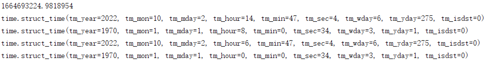
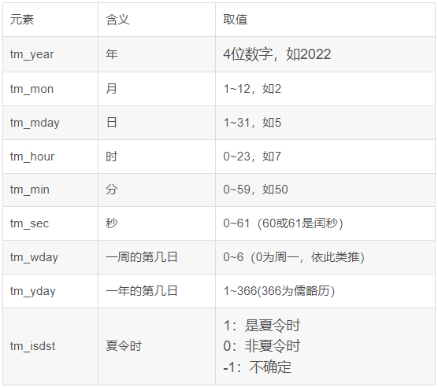
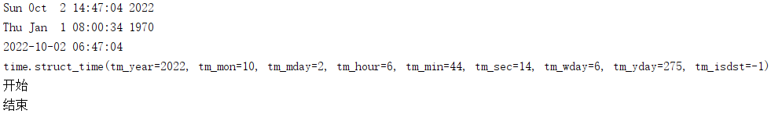

```
基础
绘图库
分词词云库
可视化库
那就做点简单练习
```


```python
# 单行注释
''' 多行注释 '''
```

 `<变量> = input(<提示性文字>) `  从控制台输入

```python
message = input('请输入信息')
```

`eval(<字符串>)`  解析并执行字符串

```python
x = 1
print(eval("x+1"))
```

`import`关键字 引入函数库

`turtle` 函数库绘制图像

`def`定义函数

## 数据类型

**数值**

- 整数类型
- 浮点类型
- 复数类型
- 布尔类型

**字符串**

- 两种序号体系
  - 反向递减序号：…… -9 -8 -7 -6 -5 -4 -3 -2 -1
  - 正向递增序号：0 1 2 3 4 5 6 7 8 9……
- 常用函数与方法：

| 方法                          | 说明                                       |
| ----------------------------- | ------------------------------------------ |
| `lower()`                     | 转换为小写                                 |
| `upper()`                     | 转换为大写                                 |
| `split(sep,maxsplit)`         | 将一个字符串按照指定的分隔符切分成多个子串 |
| `replace(old,new,count=None)` | 替换字符串                                 |

**列表**['','','']

append  remove

**元组()**：不涉及元素修改的操作

**集合{}**：set  不重复

**字典{" ":" "}**


## 运算符


| 运算符 | 说明 | 实例 | 结果 |
| ----- | ---- | ---- | ---- |
| `+`    | 加 | 12.45*15 | =27.45 |
| `-`    | 减 | 4.56-0.26 | =4.3 |
| `*`    | 乘 | 5*3.6 | =18.0 |
| `/`    | 除 | 7/2 | =3.5 |
| `//`   | 整除 | 7/2 | =3 |
| `%`    | 取余 | 7%2 | =1 |
| `**`  | 幂运算 | 2**3 | =8 |

扩展赋值运算符

`=`   `+=`  `-=`  `*=`  `/=`  `%=` `**=`  `//=  `

- `&= `  按位与
- `|=`  按位或

- ` ^=`  安慰异或
- ` <<=`  左移复制
- `>>= `  右移赋值

## 内置数值函数 

**range()**

```python
range(10); 		# 从0开始，步长为1，不包括10
range(0,10);	# 从0开始，步长为1，不包括10
range(0,10,2);	# 从0开始，步长为2，不包括10
```

## 切片

```python
arrs1 = [1,2,3,4,5]
arrs2 = arrs1[0:3]
print(arrs2)  # [1, 2, 3]
arrs2 = arrs1[-3:5]
print(arrs2)  # [3, 4, 5]
arrs2 = arrs1[:3]
print(arrs2)  # [1, 2, 3]
arrs2 = arrs1[-3:]
print(arrs2)  # [3, 4, 5]
arrs2 = arrs1[:]
print(arrs2)  # [1, 2, 3, 4, 5]
arrs2 = arrs1[::-1]  # 反转列表
print(arrs2)  # [5, 4, 3, 2, 1]
```

## 分支

```python
if <条件>：
	<语句块>
elif <条件>:
    <语句块>
else:
    <语句块>
```

## 循环

```python
# range(m,n,k) 控制循环次数
for i in range(100,0,-1):
	<语句块>
while <条件>:
    <语句块>
continue;
break;
```

## time库

包含三类函数：

- 时间获取： `time ()`、`ctime()`、` gmtime()`、` localtime()`

- 时间格式化：`strftime()`、 `strptime()`、 `asctime()`

- 程序计时： `sleep()`、 `perf_ counter()`

  ```python
  import time
  print(time.time())  # 获取当前时间戳
  #获取当前时间，表示为计算机可处理的时间格式（struct_time格式）
  print(time.localtime())         # 默认以以time（）函数获取的时间戳作为参数，为当地时间
  print(time.localtime(34.54))    # 参数为浮点数
  print(time.gmtime())            # 世界统一时间
  print(time.gmtime(34.54))
  ```





```python
print(time.ctime())
print(time.ctime(34.56))
print(time. strftime("%Y-%m-%d %H:%M:%S", time.gmtime()))
#strptime()函数，strptime(字符串，格式），主要将该格式的字符串输出为struct_time.
print(time.strptime("2022-10-02 06:44:14",'%Y-%m-%d %H:%M:%S'))
print("开始")
time.sleep(3.3) #程序休眠，秒为单位
print("结束")
```



## random库

```python
import random
print(random.random()) 				# 生成一个[0.0,1.0)之间的随机小数
print(random.randint(1,3)) 			# randint(a,b)生成一个[a,b]之间的整数
print(random.randrange(1,100)) 		# randrange(m,n[k])生成一个[m,n)之间以k为步长的随机整数
print(random.choice([1, 2, 3, 4, 5, 6, 7, 8, 9, 0])) 	# 随机选出一个
```

## 函数

```python
def fabs(x):
    if x>=0:
        y=x
    else:
        y=-x
    return y
print(fabs(-7))
```

```python
# 可变参数函数
def max(*x):
    if len(x)==0:
        return "没有数据"
    else:
        maxX = x[0]
        for i in x:
            if i>maxX:
                maxX = i
        return maxX
print(max(12,76,98,45,34))

# 可选参数的函数，需为该参数指定默认值
```

## 异常处理

```
try:
except:
	pass
```

