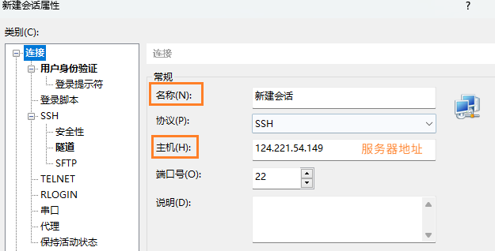
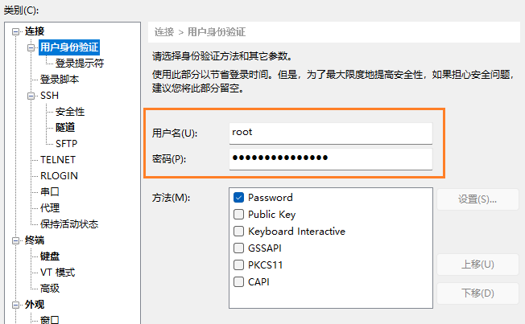
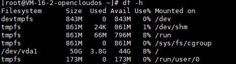
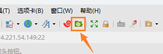
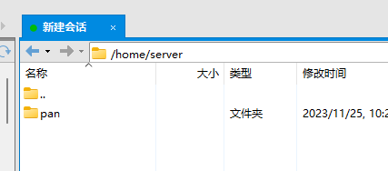

## 连接服务器

使用 Xshell 连接服务器

新建，配置以下两项





查看服务器配置

```
df -h
```



通过Xftp打开



## 上传项目打包文件

在home文件夹中新建server放项目文件

例如一个vue和springboot项目

在里面新建 项目名称 ，新建 vue 和 java 文件夹 分别传入 前端打包后的dist 和 后端项目打包好的jar

编写启动文件




## 安装 jdk nginx mysql

jdk

```
tar -zxvf /tmp/jdk-8u371-linux-x64.tar.gz -C /usr/local/
mv /usr/local/jdk1.8.0_371 /usr/local/java
   
vi /etc/profile

export JAVA_HOME=/usr/local/java
export PATH=$JAVA_HOME/bin:$PATH

source /etc/profile

# 验证
java -version
```

安装库文件

```
#安装gcc
yum install gcc-c++
 
#安装PCRE pcre-devel
yum install -y pcre pcre-devel
 
#安装zlib
yum install -y zlib zlib-devel
 
#安装Open SSL
yum install -y openssl openssl-devel
```

解压、编译nginx并安装

```
mkdir /usr/local/nginx
tar -zxvf /tmp/nginx-1.24.0.tar.gz -C /usr/local/nginx

cd /usr/local/nginx/nginx-1.24.0
# 编译安装
./configure --with-http_stub_status_module --with-http_ssl_module
make && make install
```

nginx 命令

```
cd /usr/local/nginx/sbin
./nginx     # 启动

ps -ef | grep nginx  # 查看
./nginx -s stop      # 停止
./nginx -s reload    # 重启
```

nginx配置

```
server {
    listen       80;
    server_name  localhost;
    
    #charset koi8-r;
    
    #access_log  logs/host.access.log  main;
    
    location / {
        root   /home/server/honey2024/vue/dist;
        index  index.html index.htm;
        try_files $uri $uri/ /index.html;
    }
}
```

