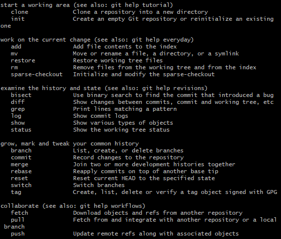

`git init`  该目录下

`git clone git@github.com:maiiitian/ ` 克隆远程仓库到本地

`git remote add origin git@github.com: 添加远程地址`

`git remote -v` 查看远程仓库地址

`git add . `  添加全部文件到暂存区

`git commit -m "message" `提交到暂存区

`git push -u origin master `将本地仓库的项目提交到远程仓库，分支名称被改变。把默认改为master而非main

`git status` 查看状态

`git log` 查看提交的状态

`git reset ` 将尚没有commite之前加入到暂存区的文件重新拉回

**文件状态：**

1. 没有被add过的文件叫untracked
2. add之后文件处于staged状态等待commite
3. commit之后文件处于unmodified这里之所以是modified是因为文件会跟仓库中的文件对比
4. 当unmodified的文件被修改则会变为modified状态
5. modified之后的文件add之后将继续变为staged状态
6. unmodifed的文件还有一种可能是已经不再需要了，那么可以remove它不再追踪变为untracked状态

**分支**

`git checkout -b 分支名` 以参考分支为模板创建新分支

`git checkout 分支名`  切换到指定分支

`git branch` 查看本地所有分支

`git  merge 分支名 `合并分支的变更

手动解决冲突

`git fetch ` 监测远程仓库（查看分支）

