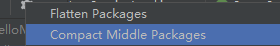

### VSC快捷键

ctrl+d	选中当前单词

ctrl+b	收起左侧栏

an+tab	箭头函数  *javascript(es6) snippet*  需安装此插件

fof			for..of语句

alt+shift+f 	格式化

https://docs.emmet.io/cheat-sheet/ 	写代码快捷方式查看

### VSC插件

open in browser 右键单击，选择open in default browse，在浏览器中打开页面

Live Server 页面实时重载

JavaScript (ES6) code snippets 生成ES6代码片段

ESLint 检测代码

Prettier 格式化代码

Stylelint 定制代码格式

Path Intellisense 输入路径时，目录和文件名提示

Git Lens Git工作流程

Auto Close Tag 自动闭合标签

>vue2 使用 vetur 插件
>
>vue3 建议禁用 vetur 使用 volar

Vetur 主要针对vue文件，有代码高亮、错误检查、格式化、debugger以及一些vue文件的定制功能

Vue Language Features (Volar) 

=======================================

### IDEA快捷键

psvm	添加public static void main

sout	添加System.out.println();

atl+enter	自动导入,生成接口

alt+insert	快速搜索创建文件

ctrl+h	查看接口实现类结构

ctrl+p	查看（）内能放的参数

ctrl+L	看方法

ctrl+o	重写

不勾选，不把packge叠在一起

勾选，显示target文件

=======================================

### eclipse快捷键

shift+alt+s	添加构造