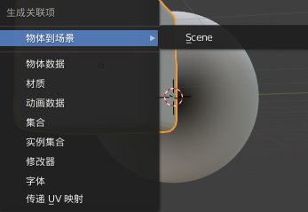

ALT+G  坐标归零（世界中心

ALT+R  旋转归零

ALT+H  xianshiyincang

R+X+90  x轴旋转90度

CTRL+P  设置父子集

ALT+P  清除父集

平滑着色出现划痕是因为法线反了，全选Shift+N   重新计算法线

CTRL+A  应用apply

SHIFT+D  复制  

SHIFT+C  youbiao

Z  切换视图形式

ALT+Z  切换透视模式

CTRL+2  添加细分修改器

CTRL+L  生成关联项

SHIFT + E 对称挤出骨骼

\>>姿态模式  m 骨骼分层

贝塞尔曲线   ALT+S缩放   CTRL+T  倾斜

\>>编辑模式   ALT+M  合并

\>>编辑模式   CTRL+A   重置蒙皮尺寸，需配合蒙皮修改器与衰减修改器>>勾选仅相连项  使用

\>>编辑模式   ALT+点击面/ALT+SHIFT + 点击   环选

\>>编辑模式  SHIFT + E   边线折痕

\>>编辑模式  U   展开uv  

\>>编辑模式  并排选：Ctrl+Alt+左键 环选：Alt+左键 多选：Shift+左键

\>>编辑模式  J  连接顶点路径

\>>编辑模式  CTRL+SHIFT+B  顶点倒角

\>>编辑模式  CTRL+B  边线倒角

\>>节点编辑器  CTRL+SHIFT+左键点击   预览该节点开启插件Node:Node Wrangler

\>>节点编辑器  SHIFT +A 添加节点  SHIFT +F 

Math

divide除

volume体积

multiple倍数

falloff衰减

vertex顶点

curve曲线

mesh网格

edge边

polygons多边形

破面