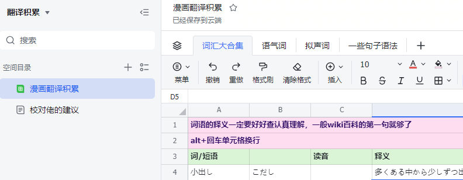

[一些积累](https://g3u6hdfcqy.feishu.cn/wiki/LEkpw63BpiCx8ckoFjAcNOFOnog?sheet=79c6f5)

注意一下角色的片假名翻译，不要有错别字（例如，的地不分）

搜角色名的时候，有时不用汉字用平假名才能搜得到...

简体繁体切换快捷键 Ctrl+Shift+F

漫画翻译：翻译人员译完是简体，校对完成后转为繁体再嵌字

用[繁化姬](https://zhconvert.org/)一定要用【维基繁体化】！！

其他台湾化、香港化、繁体化统统不行！“裡”會變成“裏”的。

### 日语输入法技巧

1. っ（促音）双打后一个假名的罗马字发音的第一个辅音（仅限k,s,t,p），如 “もっと” 为 “motto” 。
2. 拨音ん用nn表示；促音用后面辅音字母表示，如：“はってん”为 “hattenn” 
3. 小写的あいうえお 在a,i,u,e,o前加 “l" 或 "x" 即可。
4. “コーヒー”中的“ー” 是 “P” 右上方的 “-” 号键。
5. 点击  **F6键／ctrl+ caps lock**　变成**平假名**，击 **F7键／alt+caps lock** 变成**片假名**。
6. 在日语输入法中有一个 “IME Pad” ，里面有手写输入，可查询汉字音读和训读读音。
7. **切换日语和英文输入**  **shift+caps lock** 

### 关于标点符号

省略号的输入方法为 “同时按下 shift 键和数字 6”  ……

波浪号的输入方法为 “同时按下 shift 键和数字 1 左边的键”。 ~~

破折号的输入方法为 “同时按下 shift 键和减号键”。 ——

引号与括号〝 〞「 」『 』

### 得意忘形法

目前主流的翻译技巧是“得意忘形法”，即 **“得其意，忘其形”** 。 不被原文的句式所拘束，理解到其意思之后，再利用中文去还原。但请注意，一切的大前提是**不出现翻译腔**，译文内的表达一定要符合中文习惯，也就是说，一定要是**人话**。

### 辞典查询

应该多使用日语去搜集信息，去阅读这些词句的日语解释。必要时也 可以借助英语来查到中文意思（即日语→英语→中文）。因百度能提供的信息实在有限，只要是在国内网站上查不到的信息，在此都推荐各位到谷歌、雅虎 或者必应国际版上面进行查询。 

一些常用的查词网站：

http://global.bing.com/ 必应国际版，可以不用梯子。查询格式为“想查的内容+とは” 

http://www.ctrans.org/ 北辞郎，日中和中日都能查。

https://thesaurus.weblio.jp/ 类语词典，输入你不太明白的词，进去看它有哪些近义词。

http://fuseji.net/ 伏字词典，如果原文玩梗出现中间挖字的情况，可以到这个网站进行搜索。 把被挖去的字换成〇即可（日语输入法输入“まる”）。 

https://wantwords.net/ 反向词典，用于查汉语词。当你想要某个词，能描述出那个意思，却无 法精准定位到词的时候，可以上这个网站，把描述输入进去，就能找到对应的词语。

http://name.m3q.jp/ 名字词典，只知道角色名字的发音，不知道汉字，纠结取什么名字的时 候，可以来这里查。但取名请符合习惯，不要给欧美设定的角色起亚洲风格的名字。

http://sura-sura.com/ 网页版拟声拟态词辞典，能查到一部分，但不太全。

http://xh.5156edu.com/page/z2155m1104j18596.html 可查中文的拟声词。

### 题外话

😊了解该组的作品是否合自己胃口。冲自己看的漫画停更了去。

找组时的招呼：（表情包）大家好，我今年刚通过N？测试，没有漫画翻译经验。感兴趣的作品类型是组里《xxx》和《xxx》这种以及xxx这位作者的作品。（表情包）