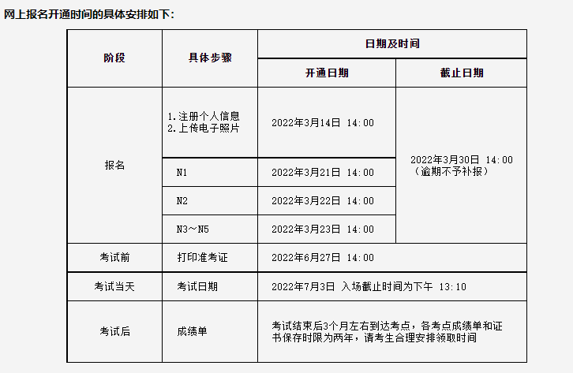
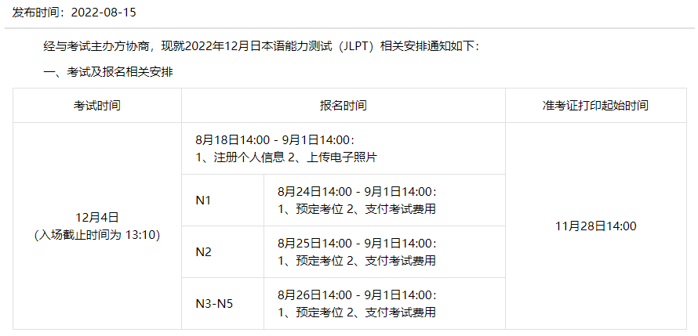

# **N2考试时间及划分**

言读 13:30-15:15

共105分钟

35分钟+65分钟

听解 15:20-16:10

答题卡BV1ue411V7Zy

1、语言知识部分：(总分60分)

文字词汇共有5个题型

问题1--考查汉字单词读音，1分X5题=5分

问题2--考查假名选出正确的汉字，1分X5题=5分

问题3--查看接头词、接尾词，1分X5题=5分

问题4--考查单词含义，1分X7到题=7分

问题5--考查单词近义词，1分X5题=5分

问题6--考查单词日本人地道用法，2分X5题=10分

语法部分共有3个题型

问题7--语法选择题，1分X12题=12分

问题8--排列组合题，1分X5题=5分

问题9--文章中考查语法的题型，1分X5题=5分

2、阅读部分：(总分60分)

问题10--短篇读解题，2分X5题=10分

问题11--中篇读解题，3分X9题=27分

问题12--综合理解题，3分X2题=6分

问题13--长篇读解题，4分X3题=12分

问题14--信息检索题，3分X2题=6分

3、听力部分：(总分60分)

问题1--课题理解题，2分X5题=10分

问题2--要点理解题，2分X6题=12分

问题3--概要理解题，2分X5题=10分

问题4--即时应答题，1分X12题=12分

问题5--综合理解题，3分X4题=12分

# 过往报名时间

