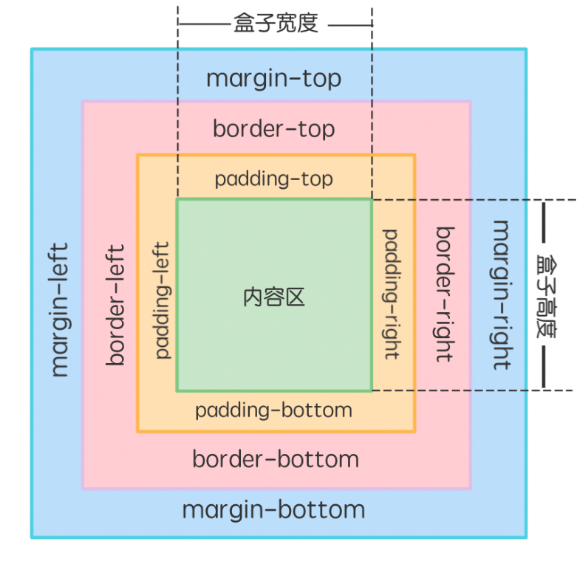
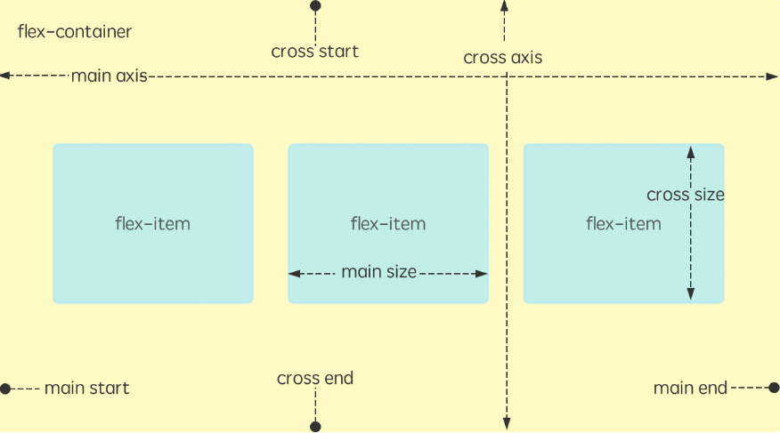

## CSS基本语法

### 选择器优先级

**id 选择器 > 类选择器 > 标签选择器**

**后代选择器**  父标签名和后代标签名必须用**空格**隔开

**群组选择器**  两个选择器之间必须要用英文逗号隔开

### 背景样式

- background-color
- background-image: url("");
- background-size: 300px 300px;
- background-position: center;
- background-repeat: no-repeat;

### 文本属性

line-height	设置行高

- `normal`：取决于用户端。
- `number`：数字乘以元素的字体大小。
- `length`：指定长度用于计算高度。
- `%`：计算值是给定的百分比值乘以元素计算出的字体大小。

text-align	left、right、center、justify、start、end	设置对齐方式

text-decoration	设置文本装饰线

- `text-decoration-line` 设置线的位置，可取值包含：`underline`（下划线）、`overline`（上划线）、`line-through`（中划线）。
- `text-decoration-color` 设置线的颜色。
- `text-decoration-style` 设置线的样式，可取值包含：`wavy`（波浪线）、`solid`（实线）、`dashed`（虚线）。
- `text-decoration-thickness` 设置线的粗细。

### 字体属性

font				在一个声明中设置所有的字体属性

font-family	设置字体类型

font-size		设置字体大小

font-weight	设置字体粗细

font-style		设置字体风格

### 链接中的伪类

链接伪类的使用顺序很重要，变换顺序会导致样式覆盖

a:link	普通的、未被访问的链接。

a:hover	鼠标指针位于链接的上方。

a:active	链接被单击的时刻。

a:visited	用户已访问的链接。

### 列表样式

list-style	list-style-type、list-style-position、list-style-image	在一个声明中设置所有的列表属性
list-style-image	URL、none	设置图像为列表项标志
list-style-position	inside、outside、inherit	设置列表中列表项标志的位置
list-style-type	disc（默认）、circle、square、decimal 等	设置列表项标志的类型

## 盒模型

盒子模型就是用来装 HTML 元素的盒子，它用于描述一个装有 HTML 元素的矩形盒子。该模型包括边框（border）、内边距（padding）、内容（content）、外边距（margin）、宽和高等属性。



`border: border-width border-style border-color;`

- `border-style`：是边框线的样式，一般有 solid（实线）、dotted（圆点）、dashed（虚线）、double（双横线）。

`padding: 上右下左;`

`margin: 上 左右 下;`

`margin: 上下 左右;`

## display 属性

- block				元素以块级方式展示。
- inline				元素以内联方式展示。
- inline-block	元素以内联块的方式展示。既具有块内元素的特点，又具备行内元素的特点。
  - 想要给行内元素设置宽高
- none				隐藏元素。

## 浮动与定位

float: left|right;

position  属性  结合 top right bottom left 

- 静态定位（inherit）
  - 一般的标签元素不加任何定位属性时，默认都属于静态定位，静态定位在页面的最底层属于标准流（普通流）。
- 相对定位（relative）：相对于它原始的位置来计算的。
- 绝对定位（absolute）：精确地放在任意位置。
- 固定定位（fixed）：被固定的元素不会随着滚动条的拖动而改变位置。

## CSS3 新特性

**新增三类选择器**

- 属性选择器

  - E[attr^=“xx”]	选择元素 E，其中 E 元素的 attr 属性是以 xx 开头的任何字符

  - E[attr$=“xx”]	选择元素 E，其中 E 元素的 attr 属性是以 xx 结尾的任何字符

  - E[attr*=“xx”]	选择元素 E，其中 E 元素的 attr 属性是包含 xx 的任何字符

  - ```
          a[href^="#"] {
            color: rgb(179, 255, 0);
          }
          a[href$="org"] {
            color: rgb(195, 0, 255);
          }
          a[href*="un"] {
            background-color: rgb(0, 255, 149);
            color: white;
          }
        <ul>
          <li><a href="#">本地链接</a></li>
          <li><a href="https://www.lanqiao.cn">蓝桥云课</a></li>
          <li><a href="https://developer.mozilla.org">MDN</a></li>
          <li><a href="https://unsplash.com">Unsplash</a></li>
        </ul>
    ```

- 子元素伪类选择器

  - E:first-child	选择元素 E 的第一个子元素。

  - E:last-child	选择元素 E 的最后一个子元素。

  - E:nth-child(n)	选择元素 E 的第 n 个子元素，n 有三种取值，数字、odd 和 even。注意第一个子元素的下标是 1。

  - E:only-child	选择元素 E 下唯一的子元素。

  - E:first-of-type	选择父元素下第一个 E 类型的子元素。

  - E:last-of-type	选择父元素下最后一个 E 类型的子元素。

  - E:nth-of-type(n)	选择父元素下第 n 个 E 类型的子元素，n 有三种取值，数字、odd 和 even。

  - E:only-of-type	选择父元素唯一的 E 类型的子元素。

  - E:nth-last-child(n)	选择所有 E 元素倒数的第 n 个子元素。

  - E:nth-last-of-type(n)	选择所有 E 元素倒数的第 n 个为 E 的子元素。

  - ```
        <style>
          div {
            width: 100px;
            height: 100px;
            margin-top: 10px;
            background-color: rgb(0, 255, 242);
          }
          div:nth-child(2) {
            background-color: rgb(0, 255, 128);
          }
          div:nth-of-type(4) {
            background-color: rgb(111, 0, 255);
          }
        </style>
        <div></div>
        <div></div>
        <div></div>
        <div></div>
    ```

- UI 伪类选择器

  - :focus	给获取焦点的元素设置样式。

  - ::selection	给页面中被选中的文本内容设置样式。

  - :checked	给被选中的单选框或者复选框设置样式。

  - :enabled	给可用的表单设置样式。

  - :disabled	给不可用的表单设置样式。

  - :read-only	给只读表单设置样式。

  - :read-write	给可读写的表单元素设置样式。

  - :valid	验证有效。

  - :invalid	验证无效。

  - ```
    <input type="email" />
            /*格式错误*/
            input:invalid {
                background-color: red;
            }
    
            /*格式正确*/
            input:valid {
                background-color: green;
            }
    
            input:focus {
                background-color: rgb(255, 153, 0);
            }
    ```

**文本阴影**  

`text-shadow: x-offset y-offset blur color;`

**文本溢出**  

`text-overflow: clip|ellipsis;`

- clip	修剪文本

- ellipsis	显示省略符号来代表被修剪的文本


> overflow: hidden; /*隐藏超出文本*/
>
> white-space: nowrap; /*强制单行显示*/

**圆角边框**

` border-radius: 取值;`

**盒子阴影**  

`box-shadow: h-shadow v-shadow blur spread color inset;`

**多图背景**  

​	background-image: url(), url(), ..., url();

​	background-position: position1, position2, ..., positionN;

​	background-repeat: repeat1, repeat2, ..., repeatN;

**渐变属性**

- 线性渐变 `background-image: linear-gradient(side-or-corner|angle, linear-color-stop);`
- 径向渐变`background-image: radial-gradient(shape, color-stop);`

**元素转换 transform**

> 结合过渡transition使用

- `transform: rotate(角度); /*元素按照指定角度旋转*/`
- `transform: translate(移动值); `
- `transform: scale(缩放值); `

**过渡**

`transition: 指定属性 持续时间 速度曲线 开始时间;`

**动画**

```
@keyframes 动画名 {    
    0% {样式属性：属性值;}    
    25% {样式属性：属性值;}    
    50% {样式属性：属性值;}    
    100% {样式属性：属性值;} 
}
```

```
      .circle {
        width: 60px;
        height: 60px;
        border-radius: 100%;
        background-color: #ffd8a6;
        animation-name: action;
        animation-duration: 9s;
        animation-iteration-count: 10;
      }
      @keyframes action {
        0% {
          margin-left: 400px;
        }
        25% {
          background-color: #dd7631;
        }
        50% {
          border-radius: 10%;
        }
        100% {
          margin: 100px;
        }
      }
```

## CSS3 弹性盒子

> CSS3 中给 `display` 属性增加了新的属性值 `flex`

flex 主要由两个轴来控制布局，如下图所示。



上图说明如下：

- main axis 是主轴，该轴的开始为 main start，结束为 main end。
- cross axis 是交叉轴，该轴的开始为 cross start，结束为 cross end。
- flex item 是 flex 容器中的元素。

`flex-direction` 属性指定了弹性子元素在父容器中的排列方向和顺序。

```
flex-direction: row | row-reverse | column | column-reverse;
```

| 属性值         | 描述                                                     |
| -------------- | -------------------------------------------------------- |
| row            | 横向从左到右排列（左对齐），默认的排列方式。             |
| row-reverse    | 反转横向排列（右对齐），从后往前排，最后一项排在最前面。 |
| column         | 纵向排列                                                 |
| column-reverse | 反转纵向排列，从后往前排，最后一项排在最上面。           |

```html
<!DOCTYPE html>
<html lang="en">
  <head>
    <meta charset="UTF-8" />
    <meta name="viewport" content="width=device-width, initial-scale=1.0" />
    <title>Document</title>
    <style>
      .content1 {
        width: 200px;
        height: 200px;
        border: 1px solid #c3c3c3;
        display: flex;
        flex-direction: row; /*默认值，行对齐，主轴起点与终点相同*/
      }
      .content2 {
        width: 200px;
        height: 200px;
        border: 1px solid #c3c3c3;
        display: flex;
        flex-direction: row-reverse; /*行对齐，主轴起点与终点相反*/
      }
      .content3 {
        width: 200px;
        height: 200px;
        border: 1px solid #c3c3c3;
        display: flex;
        flex-direction: column; /*列对齐，主轴起点与终点相同*/
      }
      .content4 {
        width: 200px;
        height: 200px;
        border: 1px solid #c3c3c3;
        display: flex;
        flex-direction: column-reverse; /*列对齐，主轴起点与终点相反*/
      }
      .box {
        width: 50px;
        height: 50px;
        color: black;
      }
    </style>
  </head>
  <body>
    <div class="content1">
      <div class="box" style="background-color:#FFE5B9;">A</div>
      <div class="box" style="background-color:#EFF8FF;">B</div>
      <div class="box" style="background-color:#C9CBFF;">C</div>
    </div>
    <div class="content2">
      <div class="box" style="background-color:#FFE5B9;">A</div>
      <div class="box" style="background-color:#EFF8FF;">B</div>
      <div class="box" style="background-color:#C9CBFF;">C</div>
    </div>
    <div class="content3">
      <div class="box" style="background-color:#FFE5B9;">A</div>
      <div class="box" style="background-color:#EFF8FF;">B</div>
      <div class="box" style="background-color:#C9CBFF;">C</div>
    </div>
    <div class="content4">
      <div class="box" style="background-color:#FFE5B9;">A</div>
      <div class="box" style="background-color:#EFF8FF;">B</div>
      <div class="box" style="background-color:#C9CBFF;">C</div>
    </div>
  </body>
</html>
```

`flex-wrap` 属性用于指定弹性盒子的子元素换行方式。

```
flex-wrap: nowrap|wrap|wrap-reverse|initial|inherit;
```

| 属性值       | 描述                                                         |
| ------------ | ------------------------------------------------------------ |
| nowrap       | 默认， 弹性容器为单行。该情况下弹性子项可能会溢出容器。      |
| wrap         | 弹性容器为多行。该情况下弹性子项溢出的部分会被放置到新行，子项内部会发生断行。 |
| wrap-reverse | 反转 wrap 排列。                                             |

```html
<!DOCTYPE html>
<html lang="en">
  <head>
    <meta charset="UTF-8" />
    <meta name="viewport" content="width=device-width, initial-scale=1.0" />
    <title>Document</title>
    <style>
      div {
        width: 100px;
        height: 100px;
        color: black;
      }

      #content {
        width: 240px;
        height: 300px;
        background-color: white;
        display: flex;
        flex-wrap: wrap-reverse;
      }
      .item1 {
        background-color: #ffe5b9;
      }
      .item2 {
        background-color: #eff8ff;
      }
      .item3 {
        background-color: #c9cbff;
      }
    </style>
  </head>
  <body>
    <div id="content">
      <div class="item1">1</div>
      <div class="item2">2</div>
      <div class="item3">3</div>
    </div>
  </body>
</html>
```

`align-items` 属性是用来设置或检索弹性盒子元素在侧轴（纵轴）方向上的对齐方式。

```
align-items: flex-start | flex-end | center | baseline | stretch;
```

| 属性值     | 描述                                                         |
| ---------- | ------------------------------------------------------------ |
| flex-start | 弹性盒子元素的侧轴（纵轴）起始位置的边界紧靠住该行的侧轴起始边界。 |
| flex-end   | 弹性盒子元素的侧轴（纵轴）起始位置的边界紧靠住该行的侧轴结束边界。 |
| center     | 弹性盒子元素在该行的侧轴（纵轴）上居中放置。                 |
| baseline   | 如弹性盒子元素的行内轴与侧轴为同一条，则该值与 `flex-start` 等效。其它情况下，该值将参与基线对齐。 |
| stretch    | 如果指定侧轴大小的属性值为 `auto`，则其值会使项目的边距盒的尺寸尽可能接近所在行的尺寸，但同时会遵照 `min/max-width/height` 属性的限制。 |

```html
<!DOCTYPE html>
<html lang="en">
  <head>
    <meta charset="UTF-8" />
    <meta name="viewport" content="width=device-width, initial-scale=1.0" />
    <title>Document</title>
    <style>
      div {
        width: 100px;
        color: black;
      }

      #content {
        width: 240px;
        height: 300px;
        background-color: white;
        display: flex;
        align-items: stretch;
      }
      .item1 {
        background-color: #ffe5b9;
      }
      .item2 {
        background-color: #eff8ff;
      }
      .item3 {
        background-color: #c9cbff;
      }
    </style>
  </head>
  <body>
    <div id="content">
      <div class="item1">1</div>
      <div class="item2">2</div>
      <div class="item3">3</div>
    </div>
  </body>
</html>
```

`align-content` 属性可以用于控制多行的对齐方式，如果只有一行则不会起作用。

```
align-content: flex-start | flex-end | center | space-between | space-around |
  stretch;
```

| 属性值        | 描述                                                         |
| ------------- | ------------------------------------------------------------ |
| stretch       | 默认。各行将会伸展以占用剩余的空间。                         |
| flex-start    | 各行向弹性盒容器的起始位置堆叠。                             |
| flex-end      | 各行向弹性盒容器的结束位置堆叠。                             |
| center        | 各行向弹性盒容器的中间位置堆叠。                             |
| space-between | 各行在弹性盒容器中平均分布。                                 |
| space-around  | 各行在弹性盒容器中平均分布，两端保留子元素与子元素之间间距大小的一半。 |

```html
<!DOCTYPE html>
<html lang="en">
  <head>
    <meta charset="UTF-8" />
    <meta name="viewport" content="width=device-width, initial-scale=1.0" />
    <title>Document</title>
    <style>
      div {
        width: 60px;
        color: black;
      }
      #content {
        width: 300px;
        height: 300px;
        background-color: antiquewhite;
        display: flex;
        flex-wrap: wrap;
        align-content: stretch;
      }
      .left {
        background-color: gray;
      }
      .center {
        background-color: silver;
      }
      .right {
        background-color: darkgray;
      }
    </style>
  </head>
  <body>
    <div id="content">
      <div class="left">div1块</div>
      <div class="center">div2块</div>
      <div class="right">div3块</div>
      <div class="left">div4块</div>
      <div class="center">div5块</div>
      <div class="right">div6块</div>
      <div class="left">div7块</div>
      <div class="center">div8块</div>
      <div class="right">div9块</div>
      <div class="left">div10块</div>
      <div class="center">div11块</div>
      <div class="right">div12块</div>
    </div>
  </body>
</html>
```

## 媒体查询

> `@media` 可以直接写在 CSS 样式中，或者可以针对不同的媒体设备，从外部链入不同的 stylesheets（外部样式表）。

**1. 直接写在 CSS 样式中**

```
@media mediatype and|not|only (media feature) {
    CSS-Code;
}
```

- 使用 `mediatype` 指定媒体（设备）类型 。
- 使用 `and | not | only` 逻辑操作符构建复杂的媒体查询 。
- 使用 `media feature` 指定媒体特性 。

`mediatype` （媒体类型）取值范围如下：

| 值     | 描述                               |
| ------ | ---------------------------------- |
| all    | 适用于所有设备                     |
| print  | 用于打印机和打印预览               |
| screen | 用于电脑屏幕，平板电脑，智能手机等 |
| speech | 用于屏幕阅读器等发声设备           |

`media feature` （媒体特性）常用取值如下：

| 值          | 描述                                                         |
| ----------- | ------------------------------------------------------------ |
| max-width   | 定义输出设备中的页面最大可见区域宽度                         |
| max-height  | 定义输出设备中的页面最大可见区域高度                         |
| min-width   | 定义输出设备中的页面最小可见区域宽度                         |
| min-height  | 定义输出设备中的页面最小可见区域高度                         |
| orientation | 视口（viewport）的旋转方向。portrait ：表示 viewport 处于纵向，即高度大于等于宽度 ； landscape ：表示 viewport 处于横向，即宽度大于高度 |

**2. 针对不同的媒体设备，从外部链入不同的 stylesheets（外部样式表）**

用 `media` 属性为 `<link>` 指定特定的媒体类型。

```css
<link rel="stylesheet" media="mediatype and|not|only (media feature)" href="mystyle.css">
```

