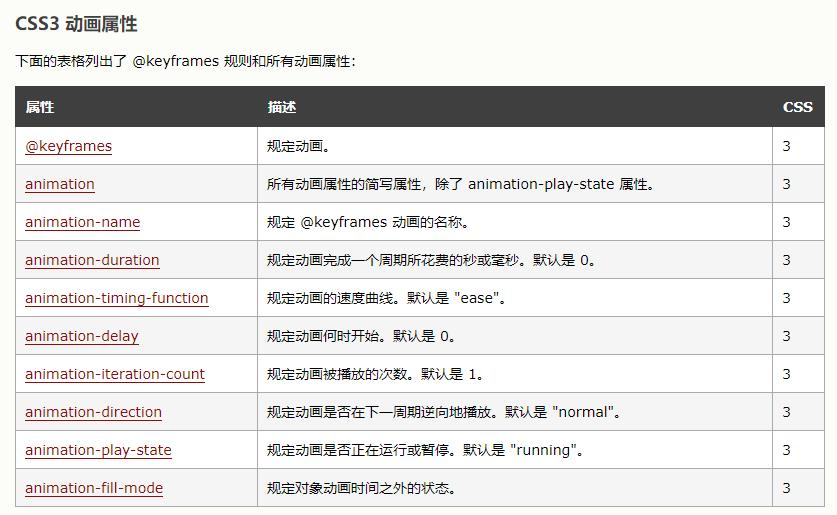

[toc]

# transform（变换）只是一个静态属性

**transform：** 应用于元素的2D或3D转换。

这个属性允许将元素旋转，缩放，移动，倾斜等。

旋转：rotate（）、缩放：scale（）、移动：translate（）、倾斜：skew（）

transform: rotate(45deg);

# transition（过渡） 是animation的简化版本

**transition: property duration timing-function delay;**

property ：css属性的名称

duration ：多长时间完成

timing-function：转速曲线

delay：开始的时候。

transition: .3s;产生过度效果

#  animation（动画）

animate需要结合@keyframs 帧，from to       0%     100%，内部的css属性

**animation: name duration timing-function delay iteration-count direction fill-mode play-state;**

name ：定义的名称

duration ：多长时间完成

delay ：开始前多长的延迟

iteration-count：播放几次

direction ：指定是否应该轮流反向播放动画。

fill-mode：结束的状态

play-state：指定动画是否正在运行或已暂停。

@-webkit-keyframes mycolor{

​            0%{

​                background-color: #ffc602

​            }

​            20%{

​                background-color: #1363bc;

​                 -webkit-transform: translateY(-10px);

​                 height: 210px;

​            }

​            40%{

​                background-color: #cf0fff;

​                 -webkit-transform: translateY(-20px);

​                 height: 220px

​            }

​            60%{

​                background-color: #810977;

​                -webkit-transform: translateY(-30px);

​                height: 230px

​            }

​            80%{

​                background-color: #c91f10;

​                 -webkit-transform: translateY(-40px);

​                 height: 240px

​            }

​            100%{

​                background-color: #ffc602;

​                 -webkit-transform: translateY(-50px);

​                 height: 250px

​            }

​        }

​        .div2:hover{

​            -webkit-animation-name: mycolor;

​            -webkit-animation-duration: 1s;

​            -webkit-animation-timing-function: linear;

​            -webkit-animation-iteration-count: infinite;

​        }