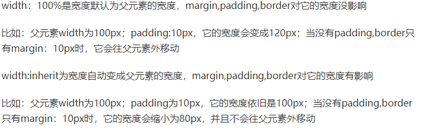

[toc]

### overflow:  hidden

溢出隐藏、清除浮动、解决外边距塌陷

============================================ =========================================

### width: 100%

一般设置在子元素中，而父级需要固定长宽 


=====================================================================================

### 布局浮动

**float**(浮动) 浮动元素会生成一个块级框 

 可以自动排列自动折行, 但需要clear来配合清除浮动 

父级div需要固定宽度

//必写个空的div去清除浮动

（float也会导致元素脱离文档流

=====================================================================================

### position属性

static（默认）：按照正常文档流进行排列；

relative（相对定位）：不脱离文档流，参考自身静态位置通过 top, bottom, left, right 定位；

absolute(绝对定位)：参考距其最近一个不为static的父级元素通过top, bottom, left, right 定位；

fixed(固定定位)：始终相对于浏览器定位。

```css
position: fixed; /*固定在顶部*/ top: 0;/*离顶部的距离为0*/         
```

=====================================================================================

属性规定元素应该生成的框的类型

### display元素类型转换

inline	 显示为行内元素，无换行

**inline-block	行内块元素(代替float达到同样效果**

block		显示为块级元素，换行

table-row	作为一个表格行显示（类似 ）

table-column	作为一个单元格列显示（类似 ）

inherit   从父元素继承 display 属性的值

（w3里未介绍display的flex，所以放到隔壁弹性里介绍）

display的inline-block不脱离文档流，将block元素当作大型字符嵌入文档流内，类似于img或者input默认效果。