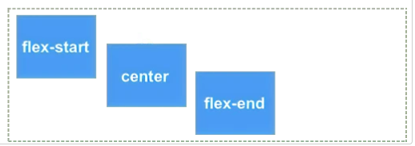
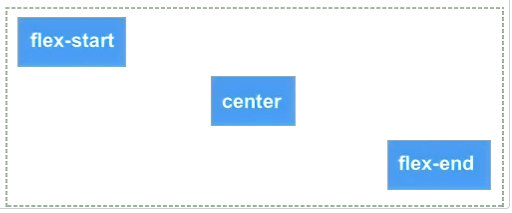
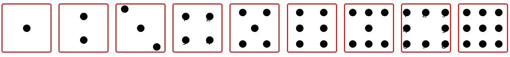

# display: flex;

https://developer.mozilla.org/zh-CN/docs/Web/CSS/CSS_Flexible_Box_Layout/Basic_Concepts_of_Flexbox

flex弹性元素如何伸长或缩短以适应flex容器中的可用空间

设为 Flex 布局以后，子元素的float、clear和vertical-align属性将失效。

- 对齐
  - [`justify-content`](https://developer.mozilla.org/zh-CN/docs/Web/CSS/justify-content) - 控制主轴（横轴）上所有 flex 项目的对齐。
  - [`align-items`](https://developer.mozilla.org/zh-CN/docs/Web/CSS/align-items) - 控制交叉轴（纵轴）上所有 flex 项目的对齐。
  - [`align-self`](https://developer.mozilla.org/zh-CN/docs/Web/CSS/align-self) - 控制交叉轴（纵轴）上的单个 flex 项目的对齐。
  - [`align-content`](https://developer.mozilla.org/zh-CN/docs/Web/CSS/align-content) - 控制“多条主轴”的 flex 项目在交叉轴的对齐。

- 改变主轴方向  `flex-direction`
  - `flex-direction` 为 `row` ，`align-items` 和 `align-self` 对齐的 flex 项目则是垂直方向从左往右。
  - 
  - `flex-direction` 为 `column` ，`align-items` 和 `align-self` 对齐的 flex 项目则是水平方向从左往右。
  - 


## 经典骰子布局



```
<!DOCTYPE html>
<html lang="en">
  <head>
    <meta charset="UTF-8" />
    <meta name="viewport" content="width=device-width, initial-scale=1.0" />
    <title>骰子布局</title>
    <style>
      body {
        margin: 10px 0 0 0;
        display: flex;
        justify-content: space-around;
      }

      body > div {
        display: flex;
        width: 100px;
        height: 100px;
        border-radius: 4px;
        border: 2px solid red;
        box-sizing: border-box;
      }

      p {
        width: 15px;
        height: 15px;
        background-color: black;
        border-radius: 50%;
        margin: 2px;
      }

      .div1 {
        justify-content: center;
        align-items: center;
      }
      /*todo:请补全剩余骰子布局代码*/
      .div2 {
        flex-direction: column;
        align-items: center;
        justify-content: space-around;
      }
      .div3 {
        align-items: center;
        justify-content: space-around;
      }
      .div3 p:nth-child(1) {
        align-self: flex-start;
      }
      .div3 p:nth-child(2) {
        align-self: center;
      }
      .div3 p:nth-child(3) {
        align-self: flex-end;
      }
      .div4,
      .div5,
      .div6,
      .div7,
      .div9 {
        flex-direction: column;
        justify-content: space-around;
      }

      .div4 div,
      .div5 div,
      .div6 div,
      .div7 div,
      .div9 div {
        display: flex;
        justify-content: space-around;
      }
      .div8 {
        flex-direction: column;
        justify-content: space-around;
        /* flex-wrap: wrap; */
      }
      .div8 div {
        display: flex;
        justify-content: space-between;
      }
    </style>
  </head>

  <body>
    <!--骰子1-->
    <div class="div1">
      <p></p>
    </div>
    <!--骰子2-->
    <div class="div2">
      <p></p>
      <p></p>
    </div>
    <!--骰子3-->
    <div class="div3">
      <p></p>
      <p></p>
      <p></p>
    </div>
    <!--骰子4-->
    <div class="div4">
      <div>
        <p>1</p>
        <p>2</p>
      </div>
      <div>
        <p>3</p>
        <p>4</p>
      </div>
    </div>
    <!--骰子5-->
    <div class="div5">
      <div>
        <p></p>
        <p></p>
      </div>
      <div>
        <p></p>
      </div>
      <div>
        <p></p>
        <p></p>
      </div>
    </div>
    <!--骰子6-->
    <div class="div6">
      <div>
        <p></p>
        <p></p>
      </div>
      <div>
        <p></p>
        <p></p>
      </div>
      <div>
        <p></p>
        <p></p>
      </div>
    </div>
    <!--骰子7-->
    <div class="div7">
      <div>
        <p></p>
        <p></p>
        <p></p>
      </div>
      <div>
        <p></p>
      </div>
      <div>
        <p></p>
        <p></p>
        <p></p>
      </div>
    </div>
    <!--骰子8-->
    <div class="div8">
      <div>
        <p>1</p>
        <p>2</p>
        <p>3</p>
      </div>
      <div>
        <p>4</p>
        <p>5</p>
      </div>
      <div>
        <p>6</p>
        <p>7</p>
        <p>8</p>
      </div>
    </div>
    <!--骰子9-->
    <div class="div9">
      <div>
        <p></p>
        <p></p>
        <p></p>
      </div>
      <div>
        <p></p>
        <p></p>
        <p></p>
      </div>
      <div>
        <p></p>
        <p></p>
        <p></p>
      </div>
    </div>
  </body>
</html>

```


