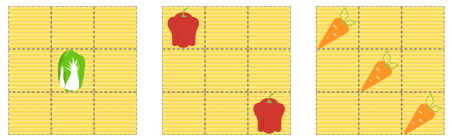

[新鲜蔬菜](https://www.lanqiao.cn/problems/2439/learning/?page=1&first_category_id=2&first%2Bcategory%2Bid=28sort%3Dstudents%20count&second%2Bcategory%2Bid=10&sort=students_count&second_category_id=11&status=1)

目标：



flex布局

```
.box {
  display: flex;
}
#box1 {
  justify-content: center;
  align-items: center;
}
#box2 {
  justify-content: space-between;
}
#box2 .item:last-child{
  align-self: flex-end;
}
#box3 {
  justify-content: space-between;
}
#box3 .item:nth-child(2){
  align-self: center;
}
#box3 .item:last-child{
  align-self: flex-end;
}
```

grid布局

```
/* TODO：待补充代码 */
.box{
  display: grid;
  grid-template-columns: 1fr 1fr 1fr;
  grid-template-rows: 1fr 1fr 1fr;
}
#box1 .item{
  grid-area: 2/2/3/3;
}
#box2 .item:nth-child(2){
  grid-row: 3/4;
  grid-column: 3/4;
}
#box3 .item:nth-child(2){
  grid-row: 2/3;
  grid-column: 2/3;
}
#box3 .item:nth-child(3){
  grid-row: 3/4;
  grid-column: 3/4;
}
```

