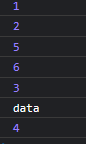

###  Promise对象

> 是一个容器，里面保存着某个未来才会结束的事件（**通常是一个异步操作**）的结果

- 对象的状态不受外界影响。 三个状态： `pending`（进行中）、`fulfilled`（已成功）和`rejected`（已失败）

- 一旦状态改变，就不会再变，任何时候都可以得到这个结果。

`Promise`对象是一个构造函数，用来生成`Promise`实例。

`new Promise((resolved, rejected)=>{})`

Promise构造函数接受一个回调函数作为参数，该函数的两个参数分别是resolve和reject。

- `resolve`函数的作用是，将`Promise`对象的状态从“未完成”变为“成功”（即从 pending 变为 resolved），在异步操作成功时调用，并将异步操作的结果，作为参数传递出去
- `reject`函数的作用是，将`Promise`对象的状态从“未完成”变为“失败”（即从 pending 变为 rejected），在异步操作失败时调用，并将异步操作报出的错误，作为参数传递出去。

Promise实例使用then/catch/finally方法，状态发生改变，才会把任务放进进微队列。执行器不会进

```
    let promise = new Promise((res, rej) => {
      console.log(1);
      console.log(2);
      res("data");
    });
    promise.then((res) => {
      console.log(3);
      console.log(res);
    });
    function fn() {
      return new Promise((resolve, reject) => {
        setTimeout(() => {
          console.log(4);
        }, 1000);
      });
    }
    async function fn2() {
      console.log(5);
      await fn();
    }
    fn2();
    console.log(6); //全局在栈上处理
```



### `Promise.prototype.then()`

Promise 实例具有`then`方法，也就是说，`then`方法是定义在原型对象`Promise.prototype`上的 。

`then`方法的第一个参数是`resolved`状态的回调函数，第二个参数是`rejected`状态的回调函数，它们都是可选的。

`then`方法返回的是一个新的`Promise`实例。因此可以采用链式写法，即`then`方法后面再调用另一个`then`方法。

```javascript
    let pro = new Promise(function (resolved, rejected) {
        //执行异步操作
        let res = {
            code: 200,
            name: '张三'
        }
        setTimeout(() => {
            if (res.code === 200) {
                resolved(res.name);
            } else {
                rejected('错误');
            }
        })
    });
    pro.then((val) => {
        console.log(val);
    }, (err) => {
        console.log(err);
    })

    function timeOut(ms) {
        return new Promise((resolved, rejected) => {
            setTimeout(() => {
                resolved('hello promise')
            })
        })
    };
    timeOut(2000).then((val) => {
        console.log(val);
    })
```

### `Promise.prototype.catch()`

> 用于指定发生错误时的回调函数。

建议使用`catch()` ，可以捕获前面`then`方法执行中的错误，也更接近同步的写法（`try/catch`）。

“Promise 会吃掉错误”：跟传统的`try/catch`代码块不同的是，如果没有使用`catch()`方法指定错误处理的回调函数，Promise 对象抛出的错误不会传递到外层代码，即不会有任何反应。

抛出异常有两种写法

    rejected(new Error("错误信息"))
    throw new Error("错误信息")
### `Promise.prototype.finally()`

> 不管 Promise 对象最后状态如何，都会执行的操作。

```javascript
const getJSON = function (url) {
        return new Promise((res, rej) => {
            const xhr = new XMLHttpRequest();
            xhr.open('GET', url);
            xhr.onreadystatechange = handler;
            xhr.responseType = 'json';
            xhr.setRequestHeader('Accept', 'application/json');
            //发送
            xhr.send();

            function handler() {
                console.log(this);
                if (this.readyState === 4) {
                    if (this.status === 200) {
                        res(this.response)
                    } else {
                        //写法一
                        rej(new Error(this.statusText))
                        //写法二
                        // throw new Error(this.statusText)
                    }
                }
            }
        })
    };	
	//不推荐使用
    // getJSON('https://devapi.qweather.com/v7/weather/3d?location=101010100&key=c8a27a9ef815431d9e5f29b3548abd43')
    // .then((data) => {
    //     console.log(data)
    // }, (err) => {
    //     console.log(err);
    // });

    getJSON('https://devapi.qweather.com/v7/weather/3d?location=101010100&key=c8a27a9ef815431d9e5f29b3548abd43')
        .then((data) => {
            console.log(data.daily)
        }).catch((err) => {
            console.log(err);
        }).finally((first) => { 
        	console.log("结束");
      	});
```

### Promise.resolve()

> 将现有对象转为 Promise 对象
>
> 同理Promise.reject()，状态为失败

```javascript
    console.log(Promise.resolve('foo'));//返回Promise对象
	//等价于
    new Promise(resolve => resolve('foo')).then((data) => {
        console.log(data);
    })
```

### Promise.all()

> 用于将多个 Promise 实例，包装成一个新的 Promise 实例。
>
> 三个都成功 才成功。一个失败就失败

```javascript
    let pro1 = new Promise(() => {});
    let pro2 = new Promise(() => {});
    let pro3 = new Promise(() => {});
    let pro4 = Promise.all([pro1, pro2, pro3]);
    pro4.then(() => {
        //三个都成功 才成功
    })
```

###  Promise.race()

> 同样是将多个 Promise 实例，包装成一个新的 Promise 实例。
>
> 哪个实例的状态先改变，就跟着改变，且将率先改变的Promise实例的返回值，传递给回调函数。

```javascript
function timeout() {
        return new Promise((res, rej) => {
            setTimeout(() => { 
                rej('超时')
             },1000);
        })
    } Promise.race([requestImg('https://i1.hdslb.com/bfs/face/1f2aa0357d1c76ca69d3ee7706c484a1484d5d44.jpg@240w_240h_1c_1s.webp'),timeout()]).then((data) => { 
        console.log('eeeeee');
        console.log('eeeee'+data);
        document.body.appendChild(data);
     }).catch( err =>{
        console.log(err);
     });
```

