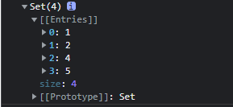

### 生成数组

`Array.from` 把传入的伪数组转为数组

```
function createArr(n) {
  return Array.from({ length: n }, (item, i) => i + 1);
}
function createArr(n) {
  return Array.from({ length: n }).map((item, i) => i + 1);
}
createArr(5)
```

### 数组去重

**Set** 是一个可以存储数据的对象，没有索引。

我们 `new Set()` 获得的是什么

`console.log(new Set([1,1,2,4,5,5]));`



将获取的set对象转换成数组

```
function myUniq(arr) {
  return [...new Set(arr)];
}
function myUniq(arr) {
  return Array.from(new Set(arr));
}
myUniq([1,1,2,4,5,5])
```

