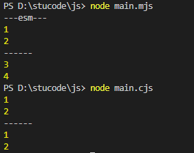

`CJS` , ` AMD` ,  `ESM` 都是 ` Javascript ` 模块化规范。因为 ` Javascript`  没有导入/导出模块的方法 。

## CJS

`CommonJS` 

- 用于在服务器端和桌面端环境中，`Node` 和 `Electron` 就是使用的 `CJS` 语法
- 是同步导入模块

- 不能在浏览器中工作。它必须经过转换和打包

```
// 导入
const obj = require('./test.js');

// 导出
module.exports = function doSomething(n) {
  // ...
}
```

## AMD

Asynchronous Module Definition（异步模块定义）

- 允许异步加载模块，在模块加载完成后执行回调函数
- 通过使用 `define()` 函数，开发者可以定义一个新的模块并指定其依赖项和对应的功能

```
define(['dep1', 'dep2'], function (dep1, dep2) {
    //Define the module value by returning a value.
    return function () {};
});
```

## ESM

ECMAScript Modules（ECMAScript模块）是ECMAScript 6（ES6）引入的官方的JavaScript模块化规范。

- 适用于客户端
- 是异步的

```
// 导入
import { createApp } from 'vue'
import App from './App.vue'

// 导出
export const obj = {}；
export default function() {
  // ...
};
```

## 对比 CJS 和 ESM

`.js` 默认是 `cjs` 规范，当然也可以使用 `cjs`，`mjs`  去指定模块化。

ESM：

```
// index.mjs
let a = 1, b = 2;

setTimeout(() => {
  a = 3,
  b = 4
}, 1000)

export {
  a,
  b
}
 
// main.mjs
console.log("---esm---");

import {a, b} from './index.mjs'

console.log(a); //1
console.log(b); //2
console.log("------");
setTimeout(() => {
  console.log(a); //3
  console.log(b); //4
},2000)
```

CJS：

```
//index.js
let a = 1, b = 2;

setTimeout(() => {
  a = 3,
  b = 4
}, 1000)

module.exports = {
  a,
  b
}

 
// main.cjs
const {a, b} = require("./index.js");
 
console.log(a); //1
console.log(b); //2
console.log("------");
setTimeout(() => {
  console.log(a); //1
  console.log(b); //2
},2000) 
```



在 CommonJS 中，模块的导入和导出是运行时执行的。在执行过程中，通过 `require()` 函数将模块加载到内存中，并返回导出的内容。这就意味着，CJS 模块是在运行时动态加载的，每次导入都会读取文件并执行对应代码，使得模块在每个地方的导入都是一个全新的实例。

在 ESM 中，模块的导入和导出是在编译时静态分析的。通过 `import` 和 `export` 关键字来声明模块的导入和导出依赖关系。编译器在编译阶段会静态解析模块的依赖关系，并确定它需要导入的其他模块。这样，模块在编译时就确定了导入的内容，而不是在运行时动态加载。这使得 ESM 模块具有更好的性能和静态分析的优势。

总结起来，**CJS 模块**的导入和导出是在**运行时动态加载**的，而 **ESM 模块**的导入和导出是在**编译时静态分析**的。

所以，CJS输出的是一个值的拷贝，而ESM输出的是值的引用

