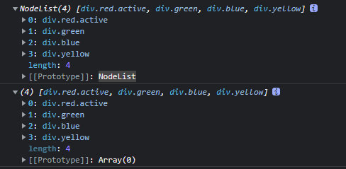
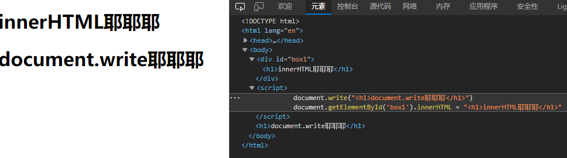
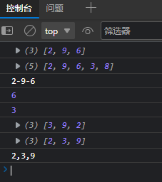
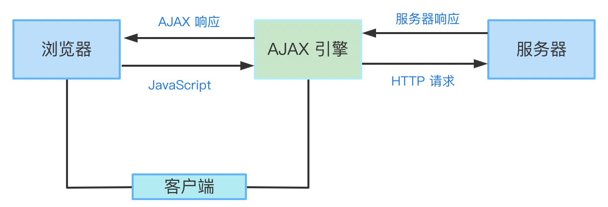
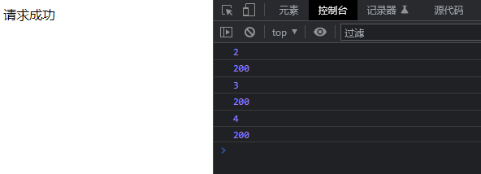

`console.log()  `控制台输出

`alert() `  对话框

`confirm() ` 确认框

`prompt("文本",“默认输入文本”) ` 输入框

`parseFloat()`  将字符串转换为浮点型

`parseInt()`    将字符串转换为整型 

| number | object | undefined |
| ------ | ------ | --------- |
| NaN    | null   | undefined |

自定义函数   `function 函数名(params) {}`

调用函数  `事件名=“函数名()”`

匿名函数  `function(){}`

**数据类型**

- **基本数据类型**：字符串（string）、数字（number）、布尔（boolean）、空（null）、未定义（undefined）。
- **引用数据类型**：Array、Object、Date、RegExp。

全等（===）	当全等号左右两边的操作数相等且类型相同时，返回 true。

字符串 `repeat()`  构造并返回一个新字符串

```
str.repeat(count)
```

> 判断对象为空
>
> ```
> function isEmptyObject(obj) {
> for (let o in obj) {
> return false;
> }
> return true;
> }
> ```
>
> - keys() 返回 Map 对象中键的数组。
>
> - values() 返回 Map 对象中值的数组。
>
> - entries() 返回由键值对组成的数组。
>
> 对象转换为数组  `Object.keys()`
>
> ```
> function isEmptyObject(obj) {
> 	return Object.keys(obj).length === 0;
> }
> //但是如果传入null或undefined会出问题
> isEmptyObject(null); // Uncaught TypeError: Cannot convert undefined or null to object
> isEmptyObject(undefined); // Uncaught TypeError: Cannot convert undefined or null to object
> //在实际项目中，如下方式使用
> function isEmptyObject(obj) {
> return Object.keys(obj || []).length === 0;
> }
> ```
>
> 对象转为 `JSON` 字符串   [JSON.stringify()](https://developer.mozilla.org/zh-CN/docs/Web/JavaScript/Reference/Global_Objects/JSON/stringify) 
>
> ```
> function isEmptyObject(obj) {
>    return JSON.stringify(obj) === "{}";
> }
> ```
>
> `obj.hasOwnProperty()`  判断对象上是否存在某自有属性

**运算符与表达式**

- 算术运算符：+、-、*、/、%、++、--
- 比较运算符：>、<、>=、<=、==、!=、===、!==
- 赋值运算符：=、+=、-=、*=、/=
- 逻辑运算符：&&、||、!
- 条件运算符：条件表达式 ? 表达式 1 : 表达式 2

## DOM文档对象模型

> Document Object Model（文档对象模型），它是浏览器为每个窗口内的 HTML 页面创建的一个 document 对象来对页面的元素进行操作。

### DOM获取元素对象  

`document.getElementById()`

`document.getElementsByTagName()`

`document.getElementsByClassName()`

> 选第一个 document.getElementsByClassName('xxx')[0]

`document.getElementsByName()`

`document.querySelector()`

`document.querySelectorAll()`

> 获取到的是一个类数组对象NodeList  ，并非数组，所以无法使用indexOf()之类的方法。
>
> 
>
> ```
> [...document.querySelectorAll(".tabs>div")]
> 将其转换为数组进行处理
> ```

`document.write()`

### DOM事件 ! ! !

[HTML DOM 事件对象 | 菜鸟教程 (runoob.com)](https://www.runoob.com/jsref/dom-obj-event.html)


#### 事件监听与移除

```
.addEventListener("click",function(){});
.removeEventListener()
```

#### 鼠标事件

```
onclick	鼠标点击事件
onmouseover	鼠标移入事件
onmouseout	鼠标移出事件
onmousedown	鼠标按下事件
onmouseup	鼠标松开事件
onmousemove	鼠标移动事件
```

#### 键盘事件

```
onkeydown 键盘按下会触发的事件
onkeyup 键盘松开会触发的事件
```

#### 表单事件

```
onfocus	表单元素聚焦时触发
onblur	表单元素失焦时触发
```

### DOM元素对象属性和方法

#### 元素的新增，删除

```
.createTextNode();   创建文本的节点
.createElement("tr");   创建元素<tr>
.appendChild()  添加节点
.removeChild()  删除节点
```

```html
    <div id="box">
        <input type="text" id="txt">
        <button onclick="add()">添加</button>
        <p id="p1">这是一个段落。</p>
        <p id="p2">这是另外一个段落。</p>
    </div>
    <script>
        function add() {
            var txtName = document.getElementById("txt").value;
            let txt = document.createTextNode(txtName);
            var para = document.createElement("p");
            para.appendChild(txt);
            var box = document.getElementById("box");
            box.appendChild(para);
        }
        var parent = document.getElementById("box");
        var child = document.getElementById("p1");
        parent.removeChild(child); //删除父元素中的子元素
    </script>
```

#### 操作元素内容

```
.innerHTML  会覆盖掉之前的
.innerText
```

> 以上两个以及document.write()的差别
>
> document.write是直接将内容写入页面的内容流，会导致页面全部重绘，innerHTML将内容写入某个DOM节点，不会导致页面全部重绘
>
> 

#### 操作元素内容属性

```
.src
.href
.getAttribute()
```

#### 操作表单属性

```
.value	更换表单内容
.disabled	表单是否可用，默认false
```

#### 操作样式属性

```
.className
.classList.add("样式名")
.classList.remove("样式名")
.style.样式
```

## 内置对象

### RegExp

```js
// g 全局模式
// i 不区分大小写
// m 多行模式？
//字面量形：由斜杠 (/) 包围
let reg1 = /[bc]at/i;       
// 匹配第一个"bat"或"cat"，不区分大小写，这里的元字符是有特殊含义，表示其中可以匹配其中任意的字符
let reg2 = /\[bc\]at/i;     // 匹配第一个" [bc]at"，不区分大小写
let reg3 = /.at/gi;         // 匹配所有以"at"结尾的 3 个字符的组合，不区分大小写
let reg4 = /\.at/gi;        // 匹配所有".at"，不区分大小写

//构造函数
let reg2 = new RegExp("[bc]at", "i");  
```

```js
//test()方法
let reg = new RegExp("e");
reg.test("The best things in life are free");//true

//exec() 方法
var text = "cat, bat, sat, fat";
var pattern2 = /.at/g;
var matches = pattern2.exec(text);   
// 返回数组 ["cat", index: 0, input: "cat, bat, sat, fat", groups: undefined]
alert(matches.index);                // 0
alert(matches[0]);                   // cat
alert(pattern2.lastIndex);           // 3

var text = "this has been a short summer";
var pattern = /(..)or(.)/g;
if (pattern.test(text)){
    alert(RegExp.$1);           // sh
    alert(RegExp.$2);           // t
}
```

### 数组对象Array

```
var 数组名 = new Array(元素1, 元素2,...,元素n);
var 数组名 = [元素1, 元素2,...,元素n];
```

`.length` 获取数组长度

`new Array(word.length)`生成`word.length`长度的数组，再`fill('*')`代表将数组内的元素全部设置为symbol的值，再调用`join`转换为字符串

    new Array(长度为五).fill('*').join('')  //*****
常用方法：

- `slice(x,y)`  数组切片下标

  - > 将数组按照置顶个数分割
    >
    > ```
    >   const splitArray = (oldArr, num) => {
    >     oldArr.sort((x, y) => x - y);
    >     let res = [];
    >     for (let i = 0; i < oldArr.length; i += num) {
    >       console.log(i);
    >       console.log(i + num);
    >       res.push(oldArr.slice(i, num + i));
    >     }
    >     return res;
    >   };
    >   console.log(splitArray([22, 45, 13, 25, 6, 5, 10, 76, 15, 34, 66, 1], 5));
    > ```

- `unshift()`  数组头部增加新元素

- `shift()`  删除数组首元素

- `sort()`  对元素排序
	- > 是按照ASCII码顺序排序，适用于字母，但不适用于数字，所以不直接使用`sort()`进行排序 
	  >

	  > `arr1.sort([22, 45, 13, 25, 6, 5, 10, 76, 15, 34, 66, 1])` 会发现从小到大排序错误
	  >
	  > `reverse()`  逆序排列  
	  >
	  > 对数值进行排序
	  >
	  > `oldArr.sort((x, y) => x - y);`  正序排序
	  >
	  > `oldArr.sort((x, y) => y - x);`  倒序排序

- `pop()`   删除并返回数组的最后一个元素

- `push()`   像数组末尾添加一个元素，并返回新的长度

- `indexOf()`  查找元素的下标值

- `splice()` 置顶下标位置添加或删除元素

  - `splice(index)`  从index的位置开始，删除之后的所有元素(包括第index个)

  - `splice(index,个数)`  删除从index位置开始的数

  - > 参数大于三个...
    >
    > ```js
    > splice(元素下标, 删除元素个数(可以为0), 要添加的元素(可以不写))
    > ```

- `concat()`  合并多个数组，返回新数组

- `join()`   把数组的所有元素放入一个字符串并返回该字符串。可以指定间隔符

- `includes(元素)`  判断该数组中是否包含某个元素

- `数组名.toString()`  数组转换为字符串并返回结构

````
var a = new Array();
var b = new Array();
a = [2,9,6]
b = [3,8]
console.log(a)
console.log(a.concat(b))
console.log(a.join("-"))
console.log(a.pop())
console.log(a.push(3))
console.log(a.reverse())
console.log(a.sort())
console.log(a.toString())
````



#### array.map()方法

`array.map(function(item,index,arr), thisValue)`

返回一个新数组，不会改变原有数组

- item:数组每一项 (必须)
- index:每项索引 (可选)
- arr：数组本身 (可选)
- thisValue：修改循环时的this指向，默认全局对象 (可选)

```
  //值   索引   数组本身
  let newArr = arr.map((val, index, array) => {
    console.log(val);
    console.log(index);
    console.log(array);
  });
```

结合Array.from使用

定义数组长度,然后自增,就能指定自增或自减

```
console.log(Array.from({ length: 4 }).map((item, i) => i + 1)); //[1, 2, 3, 4]
console.log(Array.from({ length: 4 }).map((item, i) => 4 - i)); // [4, 3, 2, 1]
```

遍历该数组，并处理数据

需要返回新数组时使用，否则请用请用forEach或者forof替代

```
  let list = [
    { name: "张三", age: 18 },
    { name: "李四", age: 19 },
    { name: "王五", age: 20 },
    { name: "老六", age: 66 },
  ];
  newArr = list.map((obj) => obj.name).join(",");
  console.log(newArr);
```


#### array.filter() 方法

`array.filter(function(currentValue,index,arr), thisValue)`

#### array.reduce()方法

`reduce()` 方法对数组中的每个元素按序执行一个由您提供的 reducer 函数，每一次运行 reducer 会将先前元素的计算结果作为参数传入，最后将其结果汇总为单个返回值。

计算数组中元素出现个数

```
  let names = ["Alice", "Bob", "Tiff", "Bruce", "Alice"];
  let countedNames = names.reduce(function (allNames, name) {
    if (name in allNames) {
      allNames[name]++;
    } else {
      allNames[name] = 1;
    }
    return allNames;
  }, {});
  console.log(countedNames);
```

根据属性对Obj进行分类

```
  let people = [
    { name: "Alice", age: 21 },
    { name: "Max", age: 20 },
    { name: "Jane", age: 20 },
  ];
  function groupBy(objectArray, property) {
    return objectArray.reduce(function (acc, obj) {
      let key = obj[property];
      if (!acc[key]) {
        acc[key] = [];
      }
      acc[key].push(obj);
      return acc;
    }, {});
  }
  let groupedPeople = groupBy(people, "age");
```

结合三元运算符，处理数据为键值对模式

```
  let data = [
    {
      id: 1001,
      title: "让我们一起写一个前端监控系统吧！",
      replayCount: 14,
      clickCount: 3612,
    },
    {
      id: 1002,
      title: "花了一天的时间，地板式扫盲了vue3所有API盲点",
      replayCount: 21,
      clickCount: 9812,
    },
    {
      id: 1003,
      title: "我被骂了，但我学会了如何构造高性能的树状结构🔥",
      replayCount: 8,
      clickCount: 973,
    },
  ];
  let titleList = data.reduce(
    (acc, cur) => (
      acc[cur.id] ? acc[cur.id].push(cur.title) : (acc[cur.id] = [acc]), acc
    ),
    {}
  );
  //得到{1001:"让我们一起写一个前端监控系统吧！",1002:"花了一天的时间，地板式扫盲了vue3所有API盲点",1003:"我被骂了，但我学会了如何构造高性能的树状结构🔥"}
```

### JSON对象

`JSON.stringify()`

`JSON.parse()`

```
  console.log(JSON.stringify(data));
  //localStorage/sessionStorage默认只能存储字符串
  //json.stringify()对象转为字符串
  window.localStorage.setItem("name", JSON.stringify(data));
  //json.parse()转回对象
  console.log(JSON.parse(window.localStorage.getItem("name")));
```

### 字符串对象String

`字符串.charAt(下标值)`   返回在指定下标的字符

`toLowerCase()`  把字符串转换为小写

`toUpperCasc()`   把字符串转换为大写

`substring(x,y)`  提取字符串中两个指定的下标之间的字符

`replace(x,y)`   替换字串

```
str = str.replace(reg, function (word, index) {
	//index下标
	return symbol.repeat(word.length);
});
//高级用法，相当高级！！！
"12345678910".replace(/\d(?=(\d{3})+$)/g, `$&,`)
//12,345,678,910
```

`match(reg)`  字符串内检索指定的值，或找到一个或多个正则表达式的匹配，返回数组

`split()`   使用指定的分隔符将一个字符串分割成子字符串数组

`concat()`   连接字符串

`indexOf()`  某个字符在字符串中首次出现的位置

`anchor()`   创建锚点

`lastIndexOf(字符串)`   在字符串中寻找指定的子串，并返回子串的终止位置

`substr(起始索引,长度)`   获取字符串的“起始索引”位置至长度的字符

### 日期对象Date

`getDate()`    返回在一一个月中的哪天(1~31)

`getDay()`    返回在一个星期中的哪天**(0~6**),其中星期天为0

`getHours()`    返回在一天中的哪个小时(0~23 )

`getMinutes()`    返回在一小时中的哪一分钟(0~59 )

`getMonth()`   返回在一年中的哪一月(0~11)

`getSeconds()`	返回在一分钟中的哪-秒(0~59)

`getFullYear()`	以4位数字返回年份，如2010

`setDate()`	设置月中的某一天(1~31)

`setHours()`	设置小时数(0~23)

`setMinutes()`	设置分钟数(0~59)

`setSeconds()`	设置秒数(0~59)

`setFullYear()`	以4位数字设置年份

**扩展：**

`setInterval("showDate()", 1000);`

`setTimeout("showDate()", 10000);`   //间隔多久执行一次

**动态显示当前时间**

```html
    <body onload="showTime()">
        <script>
            function showTime() {
                var date = new Date();
                var year = date.getFullYear();
                var month = date.getMonth() + 1; //因为month属性从0开始所以加1
                var day = date.getDate(); // 日
                var week = date.getDay(); // 星期几，是个数字
                switch (week) {
                    case 1:
                        week = "星期一";
                        break;
                    case 2:
                        week = "星期二";
                        break;
                    case 3:
                        week = "星期三";
                        break;
                    case 4:
                        week = "星期四";
                        break;
                    case 5:
                        week = "星期五";
                        break;
                    case 6:
                        week = "星期六";
                        break;
                    case 0:
                        week = "星期日";
                        break;
                }
                var hour = date.getHours();
                var minute = date.getMinutes();
                var second = date.getSeconds();
                var t = "AM";
                if (hour > 13) {
                    hour = date.getHours() - 12;
                    t = "PM"
                } else {
                    hour = date.getHours();
                }
                second = second < 10 ? "0" + second : second;
                var current = year + "年" + month + "月" + day + "日 " + hour + ":" + minute + ":" + second + " " + t +
                    " " + week;
                document.getElementById("time").innerHTML = current;
            }
            setInterval("showTime()", 1000); //每隔1000毫秒（即1秒）显示一次当前时间
        </script>
        <h3>你好，现在是北京时间：</h3>
        <h3><span id="time"></span></h3>
    </body>
```

### 数学对象Math

> 用于执行常用的数学任务，它包含了若干个数字常量和函数 

**常用属性：**

`Math.PI`	圆周率

**常用方法：**

`ceil() `		返回大于等于数字参数的最小整数，对数字进行上舍入

`floor()  `		返回小于等于数字参数的最小整数，对数字进行下舍入

`random()`	返回一个[0,1]的随机小数

```
Math.round(Math.random()); //随机获取0和1
//随机获取 x~y 之间的一个整数
Math.round(Math.random()*(y-x)+x)
// 1～x 之间的一个整数
Math.ceil(Math.random()*x)
```

`abs()`			返回一个数的绝对值。

`sqrt()`		返回一个数的平方根。

`round()`		返回四舍五入后的整数。

`pow(x, y)`		返回一个数的 y 次幂。

## event对象

type	查看事件类型

```html
    <script>
      window.onload = function () {
        var value = document.getElementById("btn");
        value.onclick = function (e) {
          console.log("这是一个" + e.type + "事件"); // 控制台打印事件类型
        };
      };
    </script>
```

## 原生AJAX

> AJAX 的英文全称为 Asynchronous JavaScript And XML，Asynchronous 是异步的意思。何为异步呢？在这里异步是指通过 AJAX 向服务器请求数据，在不刷新整个页面的情况下，更新页面上的部分内容。



用户在浏览器执行一些操作，通过 AJAX 引擎发送 HTTP 请求到服务器请求数据，请求成功后，由服务器把请求的数据拿给 AJAX 引擎，再由 AJAX 拿给浏览器。AJAX 在这个过程中相当于是服务员，用户点好菜，由服务员把菜单交给厨师，厨师做好菜，由服务员把菜送到用户的餐桌上。

同学们可能会想，我直接把菜单交给厨师，省去中间人沟通岂不是更简单？

浏览器如果直接向服务器请求数据的话，在请求过程中，你是不能对页面进行其他操作的，这叫同步请求，而把请求数据这个活外包给 AJAX 后，在请求过程中，用户还是可以对页面进行其他操作，这就是我们的异步请求了，也是 AJAX 的核心特点。

**1. 创建 XMLHttpRequest 对象**

在 AJAX 中，`XMLHttpRequest` 对象是用来与服务器进行数据交换的。其创建如下所示：

```js
var httpRequest = new XMLHttpRequest();
```

为了保证浏览器的兼容性，我们可以用以下方式来创建。

```js
if (window.XMLHttpRequest) {
  // Mozilla，Safari，IE7+ 等浏览器适用
  httpRequest = new XMLHttpRequest();
} else if (window.ActiveXObject) {
  // IE 6 或者更老的浏览器适用
  httpRequest = new ActiveXObject("Microsoft.XMLHTTP");
}
```

**2.向服务器发送请求**

在步骤一中我们已经创建了用于服务器交换数据的 `XMLHttpRequest` 对象，要向服务器发送请求，我们需要调用该对象中的 `open` 和 `send` 方法。

其使用如下：

```js
// 规定发送请求的一些要求
httpRequest.open("method", "url", async);
// 将请求发送到服务器
httpRequest.send();
```

`open` 方法中的参数说明如下：

- `method` 是请求的类型，常见的有 `GET` 和 `POST`。
- `url` 是请求的地址。
- `async` 是设置同步或者异步请求，其值为布尔类型，当为 true 时，使用异步请求；当为 false 时，使用同步请求，默认为 true。

**3.服务器响应状态**

我们使用 HTTP 请求数据后，请求是否成功，会反馈给我们相应的请求状态。我们使用 `onreadystatechange` 去检查响应的状态，当 `httpRequest.readyState` 为 4 并且 `httpRequest.status` 等于 200 时，说明数据请求成功，其使用如下：

```js
httpRequest.onreadystatechange = function () {
  if (httpRequest.readyState == 4 && httpRequest.status == 200) {
    // 请求成功执行的代码
  } else {
    // 请求失败执行的代码
  }
};
```

```html
<!DOCTYPE html>
<html lang="en">
  <head>
    <meta charset="UTF-8" />
    <meta name="viewport" content="width=device-width, initial-scale=1.0" />
    <title>AJAX 的使用</title>
    <script>
      window.onload = function () {
        if (window.XMLHttpRequest) {
          // Mozilla，Safari，IE7+ 等浏览器适用
          var httpRequest = new XMLHttpRequest();
        } else if (window.ActiveXObject) {
          // IE 6 或者更老的浏览器适用
          var httpRequest = new ActiveXObject("Microsoft.XMLHTTP");
        }
        // 规定发送请求的一些要求
        httpRequest.open(
          "GET",
          "https://jsonplaceholder.typicode.com/users",
          true
        );
        // 将请求发送到服务器
        httpRequest.send();
        httpRequest.onreadystatechange = function () {
          console.log(httpRequest.readyState);
          console.log(httpRequest.status);
          if (httpRequest.readyState == 4 && httpRequest.status == 200) {
            // 请求成功执行的代码
            document.getElementById("item").innerHTML = "请求成功";
          } else {
            // 请求失败执行的代码
            document.getElementById("item").innerHTML = "请求失败";
          }
        };
      };
    </script>
  </head>
  <body>
    <div id="item"></div>
  </body>
</html>
```



 2、3、4 是 `readyState` 的值，它的取值有以下几种：

- 0 代表未初始化请求。
- 1 代表已与服务器建立连接。
- 2 代表请求被接受。
- 3 代表请求中。
- 4 代表请求完成。

## axios

> 需要异步(没讲清)

```
(async () => {
  let data = [];
  await axios.get('js/carlist.json').then(res => {
    data = res.data;
  })
  console.log(data);
)();
```

