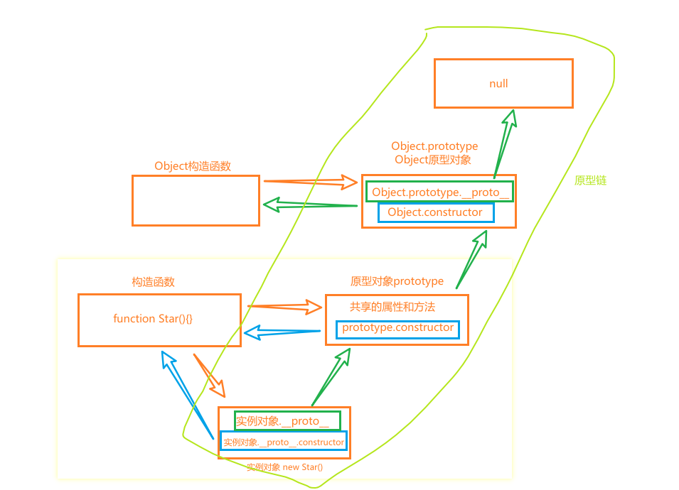

> https://blog.csdn.net/m0_64346035/article/details/124538352

## 深入基础


## 函数

### 作用域链与闭包

**作用域**

- 局部 块作用域{} 
- 全局

> let和const都没有变量提升
> 
> 提升：
>
> 变量提升，函数提升
>
> ```
> // 变量声明提升
> var a; 
> console.log(a);
> a=10; 
> 
> // 函数声明提升
> console.log(f1) // function f1(){}
> function f1() {} // 函数声明
> console.log(f2) // undefined，因为首先会将 var f2 提升
> var f2 = function() {} // 函数表达式
> ```
>
> 无论作用域的声明在什么地方，都将在代码本身被执行前进行处理。可以将这个过程形象地想象成所有的声明（变量和函数）都会被“移动”到各自作用域的最顶端，这个过程被称为提升。

**作用域链**

本质是变量查找机制，查找当前函数作用域-->查找父级作用域

**垃圾回收机制**

内存的分配和回收：全局变量一般不回收（关闭页面回收）；局部变量不用了就会被回收；

内存泄漏：程序中分配的内存由于某种原因程序未释放或无法释放叫做内存泄漏（例子?

**闭包**：**当一个内部嵌套函数引用了嵌套外部函数的变量或函数**时，就产生了闭包

闭包存在的问题：内存泄漏

```js
  // 闭包实现数据的私有
  function count() {
    let i = 0;
    function fn() {
      i++;
      console.log(i);
    }
    return fn;
  }
  const fun = count();
```

### 原型与原型链

> [这可能是掘金讲「原型链」，讲的最好最通俗易懂的了，附练习题！](https://juejin.cn/post/7007416743215759373#heading-1)
> 
> [【何不三连】做完这48道题彻底弄懂JS继承(1.7w字含辛整理-返璞归真)](https://juejin.cn/post/6844904098941108232#heading-0)

**构造函数**：本身就是一个函数，与普通函数没有任何区别，不过为了规范一般将其**首字母大写**。构造函数和普通函数的区别在于，使用new生成实例的函数就是构造函数，直接调用的就是普通函数。

**原型prototype**：一个对象，也称prototype为原型对象

作用：共享方法，节约内存

```js
  // 构造函数Star
  function Star(name, age) {
    this.name = name;
    this.age = age;
    // this.sing = function () {
    //   console.log("唱歌");
    // };
    // 实例化对象的sing地址会不同
  }
  // Star.prototype.sing = function () {
  //   console.log("唱歌");
  // };
  // 原型对象里constructor属性
  Star.prototype = {
    constructor: Star,
    sing: function () {
      console.log("唱歌");
    },
  };
  console.log(Star.prototype);
  const h1 = new Star("a", 19);
  h1.sing();
  const h2 = new Star("b", 32);
  h2.sing();
  // 对象原型
  console.log(h1.__proto__ === Star.prototype);//true
  console.log(h1.__proto__.constructor === Star);//true
```

Object.prototype 的原型是——null，这意味着 Object.prototype 没有原型。




## JS事件循环机制

详情见   [JS事件循环机制](JS事件循环机制.md)

## 浅拷贝与深拷贝

> thanks：[讲讲什么是浅拷贝、深拷贝?](https://juejin.cn/post/7207090090101866557?searchId=20230803223611D84E60E4FE30B8283AC3)

由于数据类型存储方式的不同，浅拷贝与深拷贝**只针对引用类型**

### 浅拷贝

会新建一个对象，拷贝对象的所有属性值, 对于 **基本数据** 来说就是拷贝一份对应的 **值**，但是对于 **引用数据** 则是拷贝一份 引用数据 的 **引用地址**。

- `Object.assign()`
- 扩展运算符 `...`
- 数组方法 `Array.prototype.concat()` `Array.prototype.slice()` `Array.from` 等。

```
  const obj = {
    name: "AAA",
    age: 32,
    children: {
      name: "aaa",
      age: 4,
    },
  };
  const obj2 = { ...obj };
  obj2.age = 33;
  console.log("展开运算符");
  console.log(obj2);
  console.log("Object.assign()");
  const obj3 = {};
  Object.assign(obj3, obj);
  obj3.age = 35;
  console.log(obj3);
  obj3.children.age = 4;
  console.log("原obj被改变,因为children值是引用对象，所以是寻得地址");
  console.log(obj);
```

```
  const arr = [1, 2, 3, 4];
  const arr2 = arr.concat(6);
  arr2[2] = 5;
  console.log("Array.prototype.concat()");
  console.log(arr2);
  console.log("展开运算符");
  console.log([...arr]);
```

- 使用第三方库 `lodash` 中的 `clone` 方法

```
const res = _.clone(obj)
```

#### 手写浅拷贝

```js
const clone = (target) => {
  // 1. 对于基本数据类型(string、number、boolean……), 直接返回
  if (typeof target !== 'object' || target === null) {
    return target
  }
  // 2. 创建新对象
  const cloneTarget = Array.isArray(target) ? [] : {}
  // 3. 循环 + 递归处理
  Object.keys(target).forEach(key => {
    cloneTarget[key] = target[key];
  })
  return cloneTarget
}
const res= clone({ name: 1, user: { age: 18 } }) 
```

### 深拷贝

创建一个 新对象，拷贝对象的所有属性，如果属性是 基本数据，拷贝的就是 **基本数据** 的 **值**； 如果是 **引用数据**，则需要 **重新分配一块内存** ， 拷贝该 引用数据的所有属性，然后将 引用地址赋值给对应的属性， 如果该 引用数据中某个属性也是 引用数据 则需要继续一层层递归拷贝…

- JSON.parse(JSON.stringify())


#### 手写深拷贝

```js
// map 用于记录出现过的对象, 解决循环引用
const deepClone = (target, map = new WeakMap()) => {
  // 1. 对于基本数据类型(string、number、boolean……), 直接返回
  if (typeof target !== 'object' || target === null) {
    return target
  }
  // 2. 函数 正则 日期 MAP Set: 执行对应构造题, 返回新的对象
  const constructor = target.constructor
  if (/^(Function|RegExp|Date|Map|Set)$/i.test(constructor.name)) {
    return new constructor(target)
  }
  // 3. 解决 共同引用 循环引用等问题
  // 借用 `WeakMap` 来记录每次复制过的对象, 在递归过程中, 如果遇到已经复制过的对象, 则直接使用上次拷贝的对象, 不重新拷贝
  if (map.get(target)) {
    return map.get(target)
  }
  // 4. 创建新对象
  const cloneTarget = Array.isArray(target) ? [] : {}
  map.set(target, cloneTarget)
  // 5. 循环 + 递归处理
  Object.keys(target).forEach(key => {
    cloneTarget[key] = deepClone(target[key], map);
  })
  // 6. 返回最终结果
  return cloneTarget
}
```

