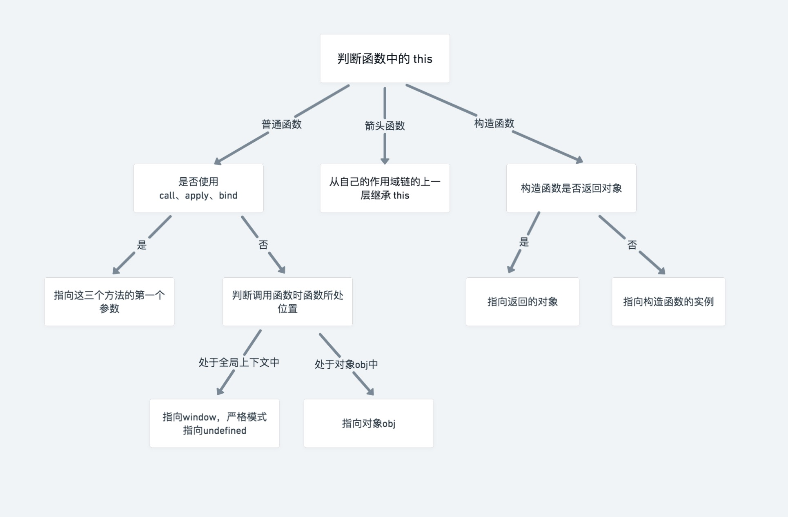

> thanks：蓝桥杯的 [this 是什么](https://www.lanqiao.cn/courses/10532/learning/?id=565247&compatibility=false)

- 全局上下文中的 `this`

  - 不管有没有启用严格模式，都指向 `window` 对象
```
console.log(this === window); // 输出 true
```

- 函数上下文中的 `this`

  - 优先级是 `new` 调用 > `call`、`apply`、`bind` 调用 > 对象上的函数调用 > 普通函数调用



## 改变this指向 call、apply、bind

`Function.prototype.call()` 方法使用一个指定的 this 值和单独给出的一个或多个参数来调用一个函数。

`Function.prototype.apply()` 方法调用一个具有给定 this 值的函数，以及以一个**数组（或类数组对象）**的形式提供的参数。

```
function add(x, y, z) {
  return this.x + this.y + this.z;
}

const obj = {
  x: 1,
  y: 2,
  z: 3,
};

console.log(add.call(obj, 1, 2, 3)); //  指定 this 为 obj，输出 6
console.log(add.apply(obj, [1, 2, 3])); //  指定 this 为 obj，输出 6，只是传参形式不同而已
```

`Function.prototype.bind()` 方法创建一个新的函数，在 bind() 被调用时，这个新函数的 this 被指定为 bind() 的第一个参数，而其余参数将作为**新函数**的参数，供调用时使用。

函数调用 `call` 和 `apply` 会**直接调用**，而调用 `bind` 是创建一个**新的函数**，必须手动去再调用一次，才会生效。

```
function add(x, y, z) {
  return this.x + this.y + this.z;
}

const obj = {
  x: 1,
  y: 2,
  z: 3,
};

const add1 = add.bind(obj, 1, 2, 3); // bind 会返回一个新的函数
console.log(add1()); // 执行新的函数，输出 6
```

案例

```
    <!-- 点击禁用，两秒后恢复 -->
    <button>点击禁用</button>
    <script>
      const btn = document.querySelector("button");
      btn.addEventListener("click", function () {
        this.disabled = true;
        window.setTimeout(
          function () {
            this.disabled = false;
          }.bind(this),
          2000
        );
      });
    </script>
```

解析：

为了在定时器的回调函数中能够访问到按钮元素 `btn`，使用 `bind(this)` 将当前的执行上下文（即按钮元素）绑定到回调函数中

## 题目

```
function fn() {
  console.log(this); // ?
}

fn();
```

----

```
function fn() {
  "use strict";
  console.log(this); // ?
}

fn();
```

----

```
const obj = {
  userName: "zhangsan",
  fn() {
    console.log(this); // ?
    console.log(this.userName); // ?
  },
};

obj.fn();
```

----

```
const obj = {
  userName: "zhangsan",
  fn() {
    console.log(this); // ?
    console.log(this.userName); // ?
  },
};

const fn = obj.fn;

fn();
```

详解：函数 fn 是处在 window 环境下的，所以 this 指向为 window，window 上没有 userName 这个字段，所以为 undefined。

----

```
const person = {
  userName: "zhangsan",
  wife: {
    userName: "xxx",
    fn() {
      console.log(this); // ?
      console.log(this.userName); // ?
    },
  },
};

person.wife.fn();
```

详解：函数 fn 调用的时候是 wife.fn()，所以 this 指向为 wife 对象。

----

```
const o1 = {
  text: "o1",
  fn() {
    return this.text;
  },
};

const o2 = {
  text: "o2",
  fn() {
    return o1.fn();
  },
};

const o3 = {
  text: "o3",
  fn() {
    var fn = o1.fn;
    return fn();
  },
};

console.log(o1.fn()); // ?
console.log(o2.fn()); // ?
console.log(o3.fn()); // ?
```

详解：o1.fn() 中的 this 指向 o1 对象，所以输出的 this.text 为 'o1'。执行 o2.fn() 等价于执行 o1.fn()，所以输出 'o1'。o3.fn() 理解起来稍微复杂一点，o3 对象中的代码等价于下面的代码：

```
  const o3 = {
    text: "o3",
    fn() {
      console.log(this); //指向 o3
      return function () {
        console.log(this); //指向window
        return this.text;
      };
    },
  };
  console.log(o3.fn()());
```


`o3.fn()`方法**内部的函数是以普通函数的方式调用的**（没有任何对象的上下文），因此 this 指向了全局对象 window。所以 this 指向为 window，window.text 为 undefined。

----

```
const o1 = {
  text: "o1",
  fn() {
    return this.text;
  },
};

const o2 = {
  text: "o2",
  fn: o1.fn,
};

console.log(o1.fn()); // ?
console.log(o2.fn()); // ?
```

----

```
const foo = {
  name: "zhangsan",
  sayName() {
    console.log(this.name);
  },
};

const bar = {
  name: "xxx",
};

foo.sayName.call(bar); // ?
foo.sayName.apply(bar); // ?
foo.sayName.bind(bar)(); // ?
```

----

```
function Person1(name) {
  this.name = name;
}
function Person2(name) {
  this.name = name;
  return {};
}
function Person3(name) {
  this.name = name;
  return {
    name: "xxx",
  };
}
function Person4(name) {
  this.name = name;
  return 1;
}

const p1 = new Person1("zhangsan");
const p2 = new Person2("zhangsan");
const p3 = new Person3("zhangsan");
const p4 = new Person4("zhangsan");

console.log(p1.name); // ?
console.log(p2.name); // ?
console.log(p3.name); // ?
console.log(p4.name); // ?
```

----

```
var userName = "xxx";
const obj1 = {
  userName: "zhangsan",
  fn() {
    setTimeout(function () {
      console.log(this.userName); // ?
    });
  },
};

const obj2 = {
  userName: "zhangsan",
  fn() {
    setTimeout(() => {
      console.log(this.userName); // ?
    });
  },
};

obj1.fn();
obj2.fn();
```

----

```
var userName = "xxx";
const obj1 = {
  userName: "lin",
  fn() {
    return () => {
      console.log(this.userName); // ?
    };
  },
};

const obj2 = {
  userName: "lin",
  fn() {
    return () => {
      return () => {
        console.log(this.userName); // ?
      };
    };
  },
};

obj1.fn()();
obj2.fn()()();
```
