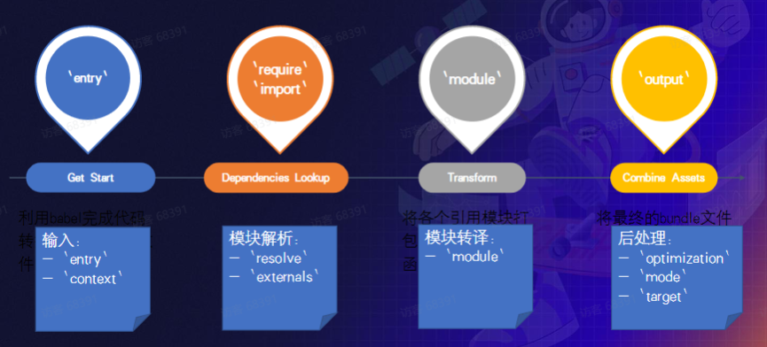

## 什么时Webpack

前端项目由各种资源构成，如 图片，css，js，vue，ts 等

如果手动管理：

- 依赖手工，比如有50个JS文件...操作， 过程繁琐
- 当代码文件之间有依赖的时候，就得严格按依赖顺序书写
- 开发与生产环境一致，难以接入TS或JS新特性
- 比较难接入Less Sass 等工具
- JS.图片、CSS资源管理模型不致

**Webpack**本质时一种前端资源编译，打包工具。

webpack可以帮助我们进行模块化，并且处理模块间的各种复杂关系后，打包的概念就很好理解了。
就是将webpack中的各种资源模块进行打包合并成一个多个包（Bundle）

并且在打包的过程中，还可对资源进行处理，比如压缩图片，将scss转成css，将ES6语法转成ES5语法，将TypeScript转成JavaScript等等操作。

打包工具还有grunt/gulp。

- 多份资源文件打包成一个Bundle
- 支持Babel、Eslint、 TS、CoffeScript、 Less、 Sass
- 支持模块化处理css图片等资源文件
- 支持HMR+开发服务器
- 支持持续监听、持续构建
- 支持代码分离
- 支持Tree-shaking
- 支持Sourcemap

## 使用WebPack

1. 安装

```
npm i -D webpack webpack-cli
```

2. 编辑配置文件

```
module.exports = {
	entry: '',
	output: {},
	module: {
		rules:[{
		s
		}]
	}
}
```

3. 执行编译命令

npx webpack

**核心流程：**

1. 入口处理：从 entry 文件开始，启动编译流程
2. 依赖解析：从 entry 文件开始，根据 require or import 等语句找到依赖资源
3. 资源解析：根据 module 配置，调用资源转移器，将 png，css 等非标准 JS 资源转译为 JS 内容
4. 资源合并打包：将转译后的资源内容合并打包为可直接在浏览器运行的JS文件

**特性：模块化+一致性**

- 多个文件资源合并成一个，减少http 请求数
- 支持模块化开发
- 支持高级 JS 特性
- 支持Typescript、 CoffeeScript 方言
- 统一图片、CSS、字体 等其它资源的处理模型

使用方法基本都围绕“配置”展开，配置分为两大类：

- 流程类:作用于流程中某个or若干个环节，直接影响打包效果的配置项

  

- 工具类:主流程之外，提供更多工程化能力的配置项

