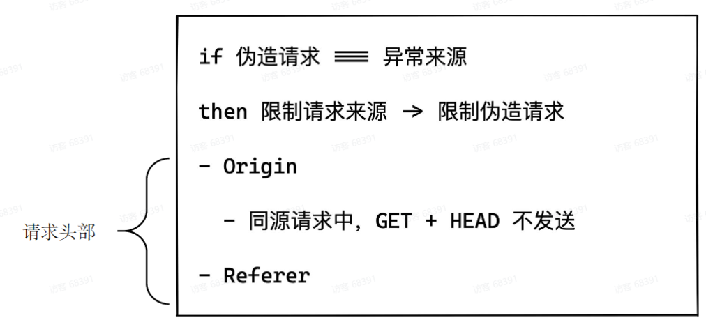
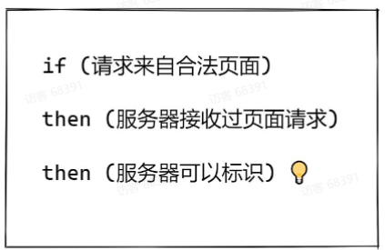
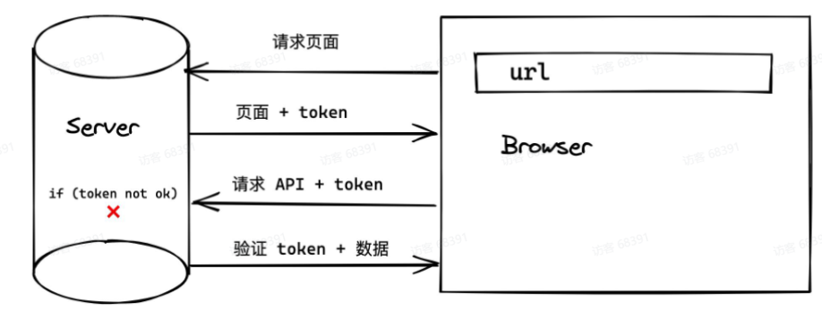
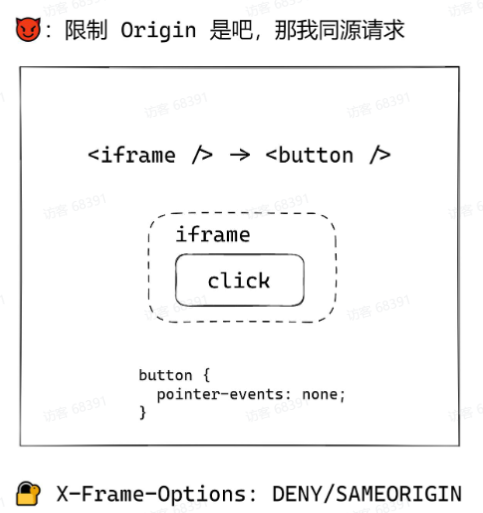
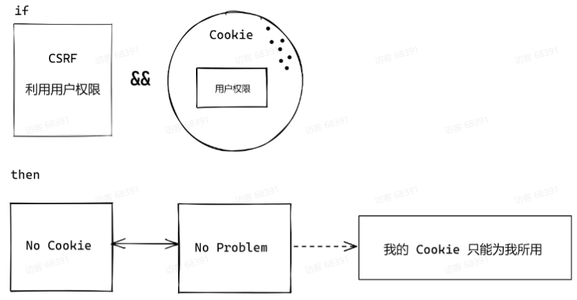
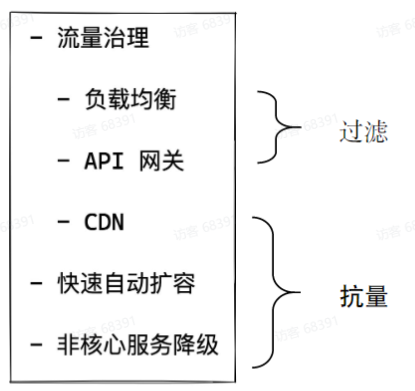
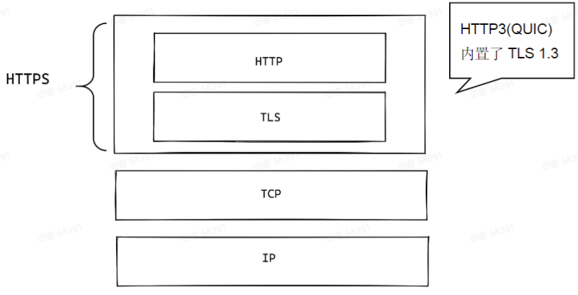

	在网络时代下，Web 安全随处可见并且危害极大，Web 安全问题也越来越受到重视。基于此背景，本节课将从安全问题中「攻击者」的角色出发，讲解目前存在哪些技术手段将危害到 Web 安全。

## 防御篇

### XSS的防御

- 永远不信任用户的提交内容
- 不要将用户提交内容直接转换成DOM

1. 对用户上传的string进行过滤
2. 用户上传svg，因为svg标签内部可以有script脚本代码，所以要对scg进行过滤
3. 用户自定义链接
4. 自定义样式，background中可以嵌套url

**现成工具**

前端

- 主流框架默认防御XSS

- google-closure-tibrary

服务端(Node)

- DOMPurify

**Content Security Policy(CSP)**

1. 哪些源(域名)被认为是安全的
2. 来自安全源的脚本可以执行，否则直接抛错
3. 不要使用 eval + inline script 

#### 防御CSRF

token 

除了Origin + Referrer

其他判断 [ 请求来自于合法来源 ] 的方式

先有页面，后有请求

用户绑定：攻击者也可以是注册用户===可以获取自己的token

过期时间：[前向保密]

SameSite Cookie

SameSite

- Cookie 发送

- domain VS页面域名
- "我跟你说个事儿，出这屋我可就不认了

CORS

- 资源读写(HTTP 请求)
- 资源域名vs页面域名
- 白名单

### 防御DoS

正则 DoS

- Code Review (X /(ab*)+/)
- 代码扫描+正则性能测试
- X用户提供的使用正则

DDoS

### 防御 注入

- 找到项目中查询SQL的地方
- 使用prepared statement

### 防御中间人

HTTPS的一些特性：

- 可靠性:加密
- 完整性: MAC验证
- 不可抵赖性:数字签名

