​	在网络时代下，Web 安全随处可见并且危害极大，Web 安全问题也越来越受到重视。基于此背景，本节课将从安全问题中「攻击者」的角色出发，讲解目前存在哪些技术手段将危害到 Web 安全。

## 攻击篇

### Cross-Site Scripting  XSS

恶意攻击者往Web页面里插入恶意html代码，通常难以从UI 上感知(暗地执行脚本)

- 窃取用户信息(cookie/token)
- 绘制UI (例如弹窗)，诱骗用户点击/填写表单
- 用户隐私泄露，被当做挖矿机器

例如：

- string -> DOM 的部分api

- document.write

- element.innerHTML = anyString;

- SSR(user_data)//伪代码

xss demo 没有过滤

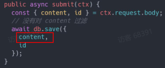

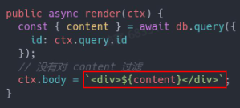

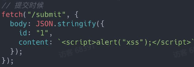

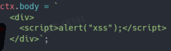

### Stored XSS

- 恶意脚本被存在数据库中
- 访问页面 --> 读数据 = 被攻击
- 危害最大，对全部用户可见

### Reflected XSS

- 不涉及数据库
- 从 URL 上攻击

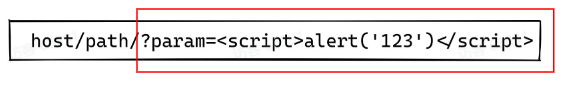

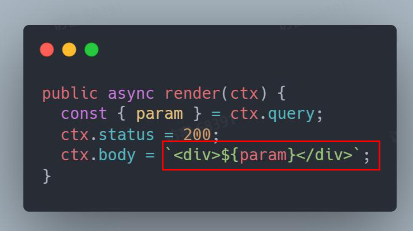

### DOM-based XSS

- 不需要服务器的参与
- 恶意攻击的发起+执行，全在浏览器完成

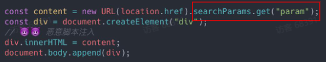

### Reflected vs DOM- based

注入脚本的地方不同

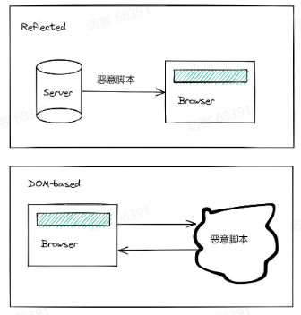

### Mutation-based XSS

- 利用了浏览器渲染DOM的特性(独特优化)
- 不同浏览器，会有区别(按浏览器进行攻击)

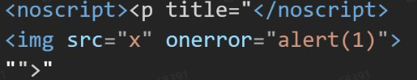

### Cross-site request forgery(CSRF)

- 在用户不知情的前提下
- 利用用户权限(cookie)
- 构造指定HTTP请求，窃取或修改用户敏感信息

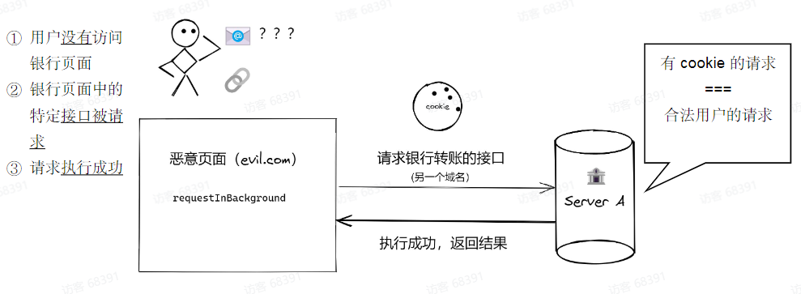

## SQL 注入

请求 SQL参数（恶意注入）----> Server  参数 -> SQL  运行 SQL code ----> 获取其他数据/修改数据/删除数据

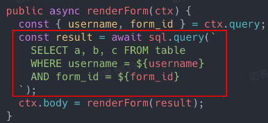

1. 读取请求字段
2. 直接以字符串的形式拼接SQL语句

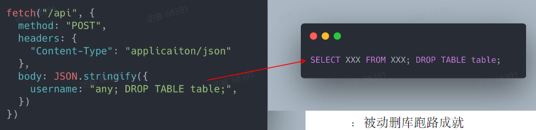

### 注入不只SQL

- CLI
- OS command
- Server-Side Request Forgery(SSRF)，服务端伪造请求
  - 严格而言，SSRF不是injection， 但是原理类似

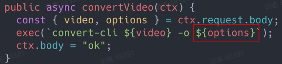

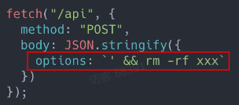

读取+修改

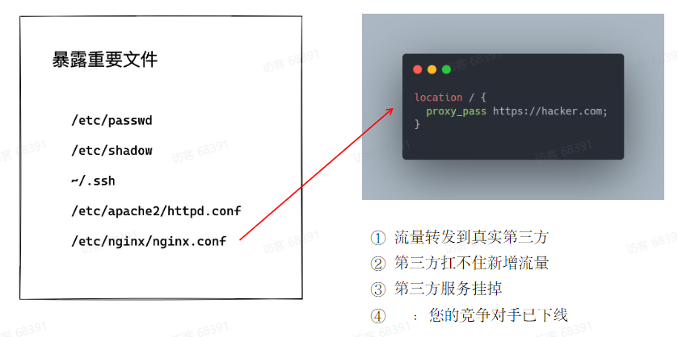

SSRFdemo

1. 请求[用户自定义]的callback URL
2. web server通常有内网访问权限

## Denial of Service(DoS)

拒绝服务攻击，通过某种方式(构造特定请求)，导致服务器资源被显著消耗，来不及响应更多请求，导致请求挤压，进而雪崩效应。

 基于正则表达式的DoS

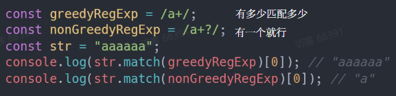

正则表达式-----贪婪模式
重复匹配时  ?  VS  no ?   :  满足 “一个“ 即可 vs 尽量多

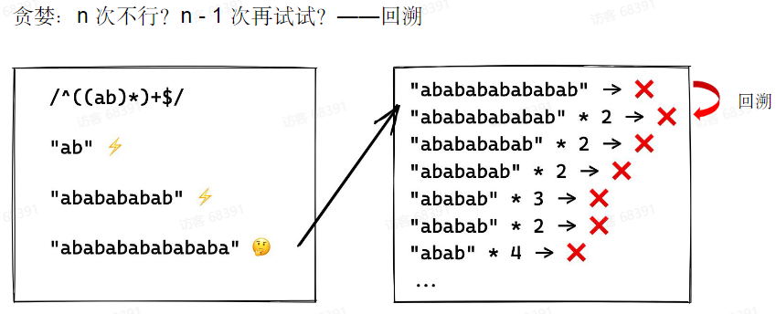

这导致响应时间增加，接口吞吐量减小

### Distributed DoS(DDoS)

短时间内，来自大量僵尸设备的请求流量，服务器不能及时完成全部请求，导致请求堆积，进而雪崩效应，无法响应新请求。

- 直接访问IP
- 任意API
- 消耗大量带宽(耗尽)

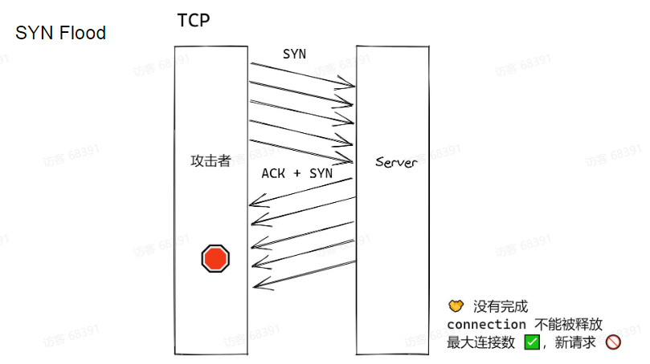

​	SYN 攻击利用的是TCP的三次握手机制，攻击端利用伪造的IP地址向被攻击端发出请求，而被攻击端发出的响应 报文将永远发送不到目的地，那么被攻击端在等待关闭这个连接的过程中消耗了资源，如果有成千上万的这种连接，主机资源将被耗尽，从而达到攻击的目的。