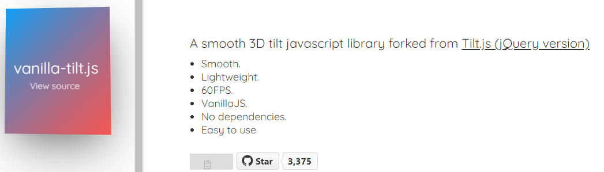
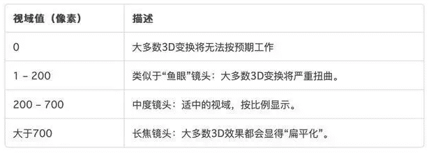
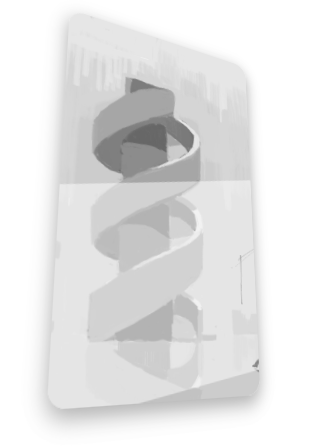

因为看到了很有意思的css动效

vanilla-tilt.js  https://micku7zu.github.io/vanilla-tilt.js/



### CSS 3D

主要是 借助 Javascript 实现鼠标跟随 3D 旋转动效

外部容器元素 上使用 

```
transform-style: preserve-3d;
perspective: 500px;
```

**transform-style** 属性指定嵌套元素是怎样在三维空间中呈现。 使用此属性必须先使用 transform 属性。

- 默认是 flat  表示所有子元素在2D平面呈现。
- preserve-3d  表示所有子元素在3D空间中呈现。

**perspective**  设置元素被查看位置的视图。

- 对于perspective属性，我们可以简单的理解为视距，用来设置用户和元素3D空间Z平面之间的距离。而其效应由他的值来决定，值越小，用户与3D空间Z平面距离越近，视觉效果更令人印象深刻；反之，值越大，用户与3D空间Z平面距离越远，视觉效果就很小。 
- 通常作用在外部容器元素上，例如body，figure和div等标签上。这样我们就在3D空间操作内在的子元素。如果没有这个属性，即使我们应用了CSS 3D的Transforms属性我们也无法看到预期的3D视觉效果。



此时，我们给内部元素添加  transform: rotateX(15deg) rotateY(30deg); 就会有如下效果



###  mouseover 事件

然后 通过结合 `mouseover` 事件，让元素动起来。

这里我将变动范围限制在卡片。

通过 `getBoundingClientRect()` 方法返回元素的大小及其相对于视口的位置。

以元素的中心为界，去旋转卡片。使用此公式：

rotateX = (鼠标 y 坐标 - 元素左上角 y 坐标 - 元素高度的一半)deg

rotateY = (鼠标 x 坐标 - 元素左上角 x 坐标 - 元素宽度的一半)deg

```
			movelimit.addEventListener("mousemove", (e) => {
				window.requestAnimationFrame(function() {
					let box = card.getBoundingClientRect();
					let calcX = (e.clientY - box.y - (box.height / 2)) / multiple;
  				let calcY = (e.clientX - box.x - (box.width / 2)) / multiple;
					card.style.transform = "rotateX(" + calcX + "deg) rotateY(" + calcY + "deg)";
				});
			});
```

追加卡片亮度效果，这里考虑使用`linear-gradient() `函数用于创建一个线性渐变。通过卡片的区域数值来控制角度。

```
let num = (box.height * box.y) / 60;
cardshine.style.background = "linear-gradient(" + num + "deg,rgba(255,255,255,0.5),rgba(255,255,255,0))";
```

鼠标离开卡牌时卡牌复位，渐变复位。

```
			movelimit.addEventListener("mouseleave", (e) => {
				window.requestAnimationFrame(function() {
					card.style.transform = "rotateX(0) rotateY(0)";
					// 让它的渐变为全透明
					cardshine.style.background="rgba(225,225,225,0)";
				});
			});
```

为什么使用requestAnimationFrame？

**requestAnimationFrame** 比起 setTimeout、setInterval的优势主要有两点：

1. requestAnimationFrame 会把每一帧中的所有DOM操作集中起来，在一次重绘或回流中就完成，并且重绘或回流的时间间隔紧紧跟随浏览器的刷新频率，一般来说，这个频率为每秒60帧。
2. 在隐藏或不可见的元素中，requestAnimationFrame将不会进行重绘或回流，这当然就意味着更少的的cpu，gpu和内存使用量。

### 参考文章

https://juejin.cn/post/7090748515945152549