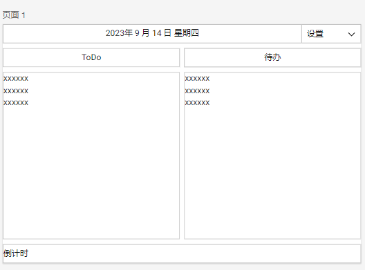
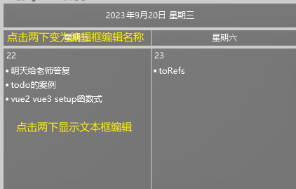

> 对桌面日历抱有不满，又不喜欢便签，由于笔记习惯原因，有notion但是不在上面写笔记，所以使用不到日程功能
>
> 或许飞书可以，飞书的添加日程更适用于办公，不适用于简单计划表
>
> 飞书文档真的香，但是不会经常开，除非用到表格记语法。

啃文档真是太乐了😭

菜单 https://www.electronjs.org/zh/docs/latest/api/menu#menuitems

父子窗口

TAURI

C++桌面应用
