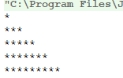

[toc]

### 输出下三角图形

```
    public static void main(String args[]){
        for(int i=0;i<5;i++){
            for(int k=0;k<2*i+1;k++)
                System.out.print ("*");
            System.out.print ("\n");
        }
    }
```



### 输出区间[200，300]上的所有素数

```java
    public static void main(String[] args){
        boolean issushu = true;
        int count = 0;
        System.out.print("200到300的所有素数：");
        for (int i = 200;i <= 300;i++){
            for (int j = 2;j<=Math.sqrt(i);j++){
                if(i % j==0){
                    issushu = false;
                    break;
                }
            }
            if(issushu == true){
                System.out.print(i + " ");
                count ++;
            }
            issushu = true;
        }
    }
```

### 一个数如果恰好是它的因子之和，这个数就称为“完数”，求1000之内的所有完数

```
public static void main(String[] args) {
            System.out.println("1000之内的所有完全数为：");
            int j,k,n;
            for (n=1;n<1000;++n)
            {
                for( j = 1,k =0;n>j;++j)
                {
                    if (n%j==0)
                        k=k+j;
                }
                if (n==k)
                    System.out.println(n);
            }
}
```

### 十进制正整数转换为二进制数

```java
public static void main(String[] args) {
    Scanner sc=new Scanner(System.in);
    System.out.println(“请在输入一个十进制的整数：”);
    int num1 = scanner.nextInt();
    int a = num1; //将获到的值赋值给a
    String str = “”; //定义一个空字符串，用来存放后面的额二进制数
    do {
        int b = a % 2; //对a取除2取余数b
        int c = a / 2; //对a除2取商c
        a = c; //将商c重新赋值给a
        str = b +str; //将余数添加到上面的空字符串中
    }while(a!= 0); //判断商是否为0
    System.out.println(“二进制数为：” + str); //打印最后得到的二进制数字符串
}
```

### 是否为闰年

```java
static void fac(int year){
    if((year%4==0)&&(year%100!=0)||(year%400==0))
        System.out.println(year+"是闰年。");
    else
        System.out.println(year+"不是闰年。");
}
public static void main(String[] args){
    Scanner sc=new Scanner(System.in);
    System.out.println("请输入年份：");
    int year=sc.nextInt(); 
    fac(year);
} 
```

### 求s=1!+2!+…+n!

```java
static void fac(int n){
    int s=0;
    for(int i=1;i<=n;i++){
        int x=1;
        for(int j=1;j<=i;j++)
            x=x*j;
        s=s+x;
    }
    System.out.println("阶乘和为："+s);
}
public static void main(String[] args){
    Scanner sc=new Scanner(System.in);
    System.out.println("请输入一个数：");
    int n=sc.nextInt();
    fac(n);
}
```

### 求s=1-2+3-4+…+99-100

```java
public static void main(String[] args){
    int s=1;
    for(int i=2;i<=100;i++)
    {
        if(i%2==0)
            s=s-i;
        else
            s=s+i;
    }
    System.out.println(s);
}
```

### 从键盘输入一个整数，输出这个数的每位数字之和

```java
public static void main(String[] args){
    Scanner sc=new Scanner(System.in);
    System.out.println("请输入一个整数：");
    int n=sc.nextInt();
    int sum=0;
    while(n>0)
    {
        sum=sum+n%10;
        n=n/10;
    }
    System.out.println("各数字之和为："+sum);
}
```

### 要求用户输入两个数并猜测两数之和的程序。如果用户猜对结果，就显示祝贺消息，否则显示慰问信息以及正确答案。

```java
public static void main(String[] args) {
    Scanner sc=new Scanner(System.in);
    System.out.println("请输入两个数:");
    int a=sc.nextInt();
    int b=sc.nextInt();
    int sum,sum1;
    System.out.println("请猜测两数之和为：");
    sum1=sc.nextInt();
    sum=a+b;
    if(sum1==sum)
        System.out.println("猜测成功!");
    else {
        System.out.println("请继续加油!正确答案为："+sum);
    }
}
```

### 1、1、2、3、5、8、13、21、34……求这列数的第30个数是  多少。

```java
public static void main(String[] args) {
    System.out.println( "结果是："+foo( 30));
}
public static int foo(int i){
    if(i<= 0)
        return 0;
    else if(i> 0 && i<= 2)
        return 1;
    return foo(i- 1) + foo(i- 2);
}
```

### 输入年月日，输出这一天的前一天

```java
import java.util.Scanner;

public class EveDay {
    public static void main(String args[]){
        //用两个数组存储闰年和非闰年的天数
        int a[]= {31,29,31,30,31,30,31,31,30,31,30,31};//闰年日期
        int b[]= {31,28,31,30,31,30,31,31,30,31,30,31};//非闰年日期
        //创建输入对象
        Scanner input = new Scanner(System.in);
        //依次输入年月日
        System.out.print("请输入年份：");
        int year = input.nextInt();
        System.out.println("请输入月份");
        int month=input.nextInt();
        System.out.println("请输入天数");
        int day=input.nextInt();

        //判断日期是否输入正规
        if (year<1900||year>2019){
            System.out.println("请输入正确的年份！！！");
            return;
        }
        if (month<1||month>12){
            System.out.println("请输入正确的月份！！！");
            return;
        }
        if(day<1||day>31){
            System.out.println("请输入正确的日期！！！");
            return;
        }
        if (month==4||month==6||month==9||month==11){
            if (day==31){
                System.out.println("请输入正确的日期！！！");
                return;
            }
        }
        //判断是闰年还是非闰年，后面会用到
        boolean flag = (year%4==0 && year%100!=0 || year%400==0);
        //判断闰年和平年二月的日期是否输入正确
        if (flag){
            if (month==2) {
                if (day>29){
                    System.out.println("请输入正确的日期！！！");
                    return;
                }
            }
        }else {
            if (month==2) {
                if (day>28){
                    System.out.println("请输入正确的日期！！！");
                    return;
                }
            }
        }

        //计算输入日期的前一天
        if (day==1){                        //如果是每个月的一号
            //如果是3月1号
            if (month==3){
                if(flag){
                    System.out.println("上一天是"+year+"年"+"2月"+"29号");
                }else {
                    System.out.println("上一天是"+year+"年"+"2月"+"28号");
                }
            }else{
                if (month==1){
                    System.out.println("上一天是"+(year-1)+"年"+"12月"+"31号");
                }else {
                    month--;
                    if (month==1||month==3||month==5||month==7||month==8||month==10||month==12){
                        day=31;
                    }else{
                        day=30;
                    }
                    System.out.println("上一天是"+year+"年"+month+"月"+day+"号");
                }
            }
        }else {
            System.out.println("上一天是"+(year)+"年"+month+"月"+(day-1)+"号");
        }
    }
}
```

### 数组升序排序

```java
int[] list = {1,9,0,5,4,5,8,6,2};
for(int i = 0;i<list.length-1;i++){
    int min = i;
    for(int j = i+1;j<list.length;j++){
        if(list[j]<list[min]){
            min = j;
        }
    }
    if(i != min){
        int temp = list[i];
        list[i] = list[min];
        list[min] = temp;
    }
}

for (int i=0;i<list.length;i++){
    System.out.print(list[i]+" ");
}
```

### 实现两个字符串变量比较大小

```java
	Scanner sc = new Scanner(System.in);
    String s1 = sc.nextLine();
    String s2 = sc.nextLine();
    int active =ratio(s1,s2);
    if (active==0){
        System.out.println(s1 + "和" + s2 + "一样");
    }else if (active == 1){
        System.out.println( s1 + " 大");
    }else if (active == -1){
        System.out.println(s2 + "大");
    }

public static int ratio(String s1,String s2){
    byte[] b1 =s1.getBytes();
    byte[] b2 =s2.getBytes();
    byte[] min = b1.length<b2.length?  b1 : b2;
    for (int i = 0; i < min.length; i++) {
        if (b1[i] > b2[i]){
            return 1;
        }else {
            return -1;
        }
    }
    if (b1.length !=b2.length){
        return b1.length<b2.length? -1:1;
    }
    return 0;
}
```


### 回文数

> 是一种正序和逆序产生的序列都相同的数字串，如12321,225522。编写程序，利用随机数循环产生5位数值，并判断它是不是回文，直到找到回文数程序结束

```java
public static void main(String[] args) {
    Random random =new Random();
    int num =0;
    do {
        num = 0;
        for (int i = 1 ;i<=10000;i*=10){
            num += random.nextInt(10) * i;
        } 
    }while (!isHuiWen(num));

    System.out.println(num + "是回数");
}
public static boolean isHuiWen(int num){
    int sum = 0;
    int result = num;
    while (num > 0){
        sum += num%10;
        sum *=10;
        num /=10;
    }
    sum/=10;
    return (sum == result);
}
```

