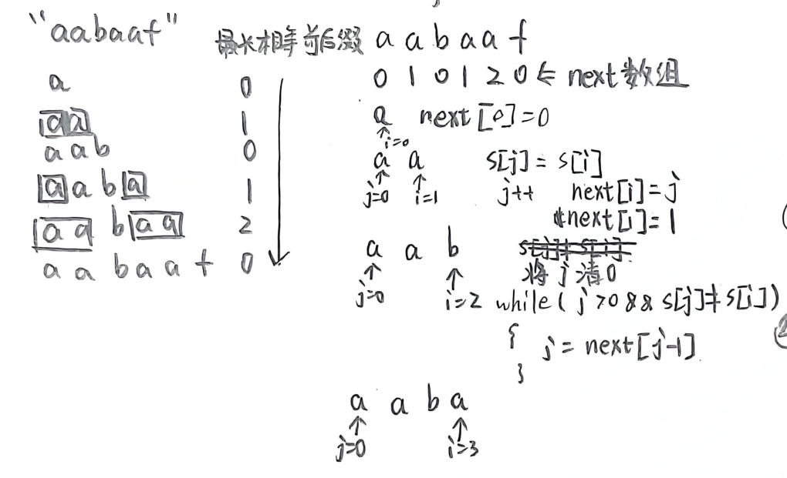

空串

串属于线性结构

## String类

String类是字符串常量，是不可更改的常量。

1. **char charAt(int index)：返回指定索引处的char值。**
2. int compareTo(String anotherString)：按字典顺序比较两个字符串。
3. int compareToIgnoreCase(String str)：按字典顺序比较两个字符串，不考虑大小写。
4. String concat(String str)：将指定字符串连接到此字符串的结尾。
5. boolean endsWith(String suffix)：测试此字符串是否以指定的后缀结束。
6. **boolean equals(Object anObject)：将此字符串与指定的对象比较。**
7. boolean equalsIgnoreCase(String anotherString)：将此String与另一个String比较，不考虑大小写。
8. static String format(String format，Object…args)：使用指定的格式字符串和参数返回一个格式化字符串。
9. int indexOf(int ch)：返回指定字符在此字符串中第一次出现处的索引。
10. int indexOf(int ch，int fromIndex)：返回在此字符串中第一次出现指定字符处的索引，从指定的索引开始搜索。
11. int indexOf(String str)：返回指定子字符串在此字符串中第一次出现处的索引。
12. int indexOf(String str，int fromIndex)：返回指定子字符串在此字符串中第一次出现处的索引，从指定的索引开始。
13. boolean isEmpty()：当且仅当length()为0时返回true。
14. int lastIndexOf(int ch)：返回指定字符在此字符串中最后一次出现处的索引。
15. int lastIndexOf(int ch，int fromIndex)：返回指定字符在此字符串中最后一次出现处的索引，从指定的索引处开始进行反向搜索。
16. nt lastIndexOf(String str)：返回指定子字符串在此字符串中最右边出现处的索引。
17. int lastIndexOf(String str，int fromIndex)：返回指定子字符串在此字符串中最后一次出现处的索引，从指定的索引开始反向搜索。
18. int length()：返回此字符串的长度。
19. String replace(char oldChar，char newChar)：返回一个新的字符串，它是通过用newChar替换此字符串中出现的所有oldChar得到的。
20. String replaceAll(String regex，String replacement)：使用给定的replacement替换此字符串所有匹配给定的正则表达式的子字符串。
21. String replaceFirst(String regex，String replacement)：使用给定的replacement替换此字符串匹配给定的正则表达式的第一个子字符串。
22. String[] split(String regex)：根据给定正则表达式的匹配拆分此字符串。
23. String[] split(String regex，int limit)：根据匹配给定的正则表达式来拆分此字符串。
24. boolean startsWith(String prefix)：测试此字符串是否以指定的前缀开始。
25. boolean startsWith(String prefix，int toffset)：测试此字符串从指定索引开始的子字符串是否以指定前缀开始。
26. String substring(int beginIndex)：返回一个新的字符串，它是此字符串的一个子字符串。
27. **String substring(int beginIndex，int endIndex)：返回一个新字符串，它是此字符串的一个子字符串。**
28. char[] toCharArray()：将此字符串转换为一个新的字符数组。
29. String toLowerCase()：使用默认语言环境的规则将此String中的所有字符都转换为小写。
30. String toUpperCase()：使用默认语言环境的规则将此String中的所有字符都转换为大写。

## StringBuffer类

> StringBuffer 是字符串变量，它的对象是可以扩充和修改的。

主要方法如下:

1. StringBuffer append(String str):将指定的字符串添加到此字符序列的末尾。
2. char charAt(int index):返回此序列中指定索引处的char值 。
3. StringBuffer delete(int start, int end);移除此序列的子字符串中的字符。
4. StringBuffer deleteCharAt(int index):移除此序列指定位置的char.
5. StringBuffer insert(int offset, String str):将字符串插人此字符序列中。
6. StringBuffer replace(int .start, int end, String str):使用给定String 中的字符替换此序列的子字符串中的符。
7. StringBuffer reverse():将此字符序列用其反转形式取代。
8. String substring(int start):返回一个新的String,它包含此字符序列当前所包含的字符子序列。
9. String substring(int start, int end):返回一个新的String,它包含此序列当前所包含的字符子序列。

## BF算法

```java
public class ViolenceMatch {
    public static void main(String[] args) {
        String str1 = "硅硅谷 尚硅谷你尚硅 尚硅谷你尚硅谷你尚硅你好";
        String str2 = "尚硅谷你尚硅你";
        int index = violenceMatch(str1, str2);
        System.out.println("index=" + index);
    }
    public static int violenceMatch(String str1,String str2){
        char[] s1 = str1.toCharArray();
        char[] s2 = str2.toCharArray();

        int s1len = s1.length;
        int s2len = s2.length;

        int i = 0;
        int j = 0;
        //暴力算法为何使用while做循环，秒啊，双数组双指针
        while(i<s1len && j<s2len){
             if(s1[i]==s2[j]) {
                 i++;
                 j++;
             }else {
                 i = i -(j-1);
                 j = 0;
             }
        }
        if(j == s2len){
            return i-j;
        }else {
            return -1;
        }
    }
}
```

## ⭐KMP算法

对next数组的理解：

```java
public static int[] getNext(String t) {
   int[] next = new int[t.length()];
   next[0] = 0;
   //i为后缀缀尾，j为前缀追尾
   for(int i = 1,j = 0;i<t.length();i++){
       //需要处理str1.charAt(i)!=str2.charAt(j)
       //核心就是这个while循环
       while (j>0 && t.charAt(i)!=t.charAt(j)){
           j = next[j-1];
       }
       if(t.charAt(i) == t.charAt(j)) {
           j++;
       }
       next[i] = j;
   }
   return next;
}
```


> 何时使用KMP算法：两个数组 匹配连续字符
>
> 万能模板套套套

```java
public class KMP{
    public static void main(String[] args) {
        String str1 = "BBC ABCDAB ABCDABCDABDE";
        String str2 = "ABCDABD";
        int index = kmp(str1, str2);
        System.out.println("index=" + index);
    }
    
    public static int kmp(String str1,String str2){
        int[] next = new int[str2.length()];
        next[0] = 0;
        //i为后缀缀尾，j为前缀追尾
        for(int i = 1,j = 0;i<str2.length();i++){
            while (j>0 && str2.charAt(i)!=str2.charAt(j)){
                j = next[j-1];
            }
            if(str2.charAt(i) == str2.charAt(j)) {
                j++;
            }
            next[i] = j;
        }

        for (int i=0,j=0;i<str1.length();i++){
            while (j>0 && str1.charAt(i)!=str2.charAt(j)){
                j = next[j-1];
            }
            if(str1.charAt(i)==str2.charAt(j)){
                j++;
            }
            if(j == str2.length()){
                return i-j+1;
            }
        }
        return -1;
    }
}

```

