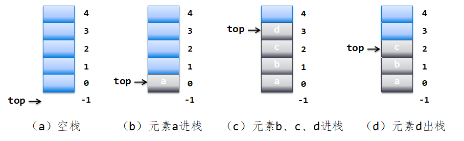
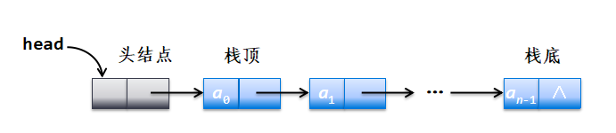
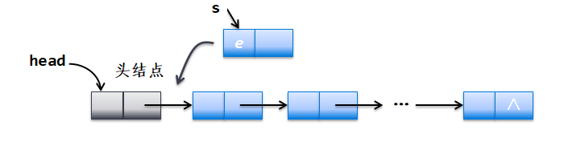
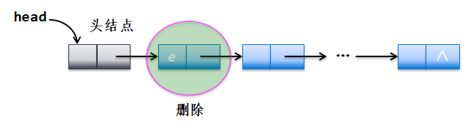
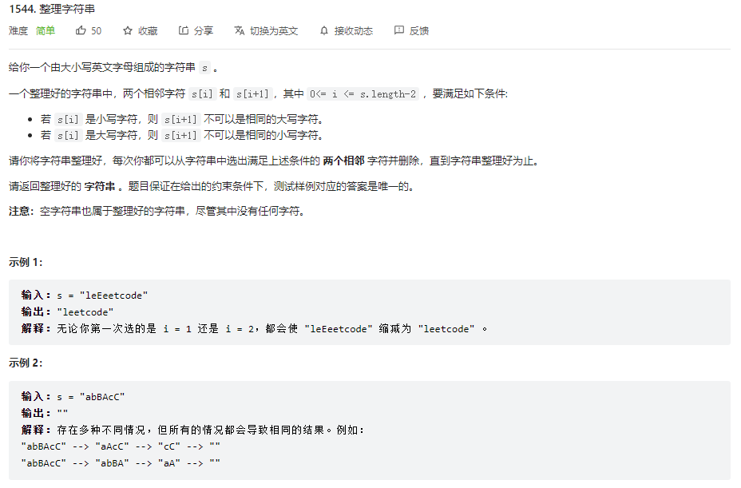

# 栈

栈是一种线性表，这种线性表只能在某一段进行插入和删除操作。

栈顶（Top）：线性表允许进行插入和删除的一端。

栈底（Bottom）：固定的，不允许进行插入和删除的另一端。

空栈：不含任何元素。

## 顺序栈

>  需要限制空间大小



初始时置栈顶指针` top = -1`

进栈：`top++; data[top]=e;`

退栈：` e=data[top]; top--;`

空栈条件：`top == -1`

> 倒栈，初始时指针为n
>
> 进栈：data[top]=e; top--; 
>
> 退栈：top++;e=data[top];

```
public class SqStack {
    public static void main(String[] args) {
        SqStackClass<Integer> sq = new SqStackClass<Integer>(5);
        sq.push(1);
        sq.push(2);
        sq.push(3); 
        sq.push(4);
        sq.push(5);
        sq.pop();
        sq.pop();
        sq.list();
    }
}
class SqStackClass<E>{
    private int maxSize;
    private E[] stack;
    private int top = -1;

    public SqStackClass(int maxSize) {
        this.maxSize = maxSize;
        stack = (E[]) new Object[maxSize];//设定栈的空间
    }

    //isFull
    public boolean isFull(){
        return top == maxSize-1;
    }

    //isEmpty
    public boolean isEmpty(){
        return top == -1;
    }

    //入栈push
    public void push(E e){
        //满栈
        if(isFull()){
            System.out.println("该栈已满");
        }
        top++;
        stack[top] = e;
    }

    //退栈pop
    public void pop(){
        //空栈
        if(isEmpty()){
            System.out.println("该栈为空");
        }
        E e = stack[top];
        top--;
    }

    //遍历栈
    public void list(){
        //空栈
        if(isEmpty()){
            System.out.println("该栈为空");
        }
        while (!isEmpty()){
            //上往下遍历
            System.out.println(stack[top]+"-"+top);
            top--;
        }
    }

    //顶栈
    public E peek(){
        return stack[top];
    }
}

```

## 链栈



初始时只含有一个头结点head并置 `head.next `为null



进栈：(单链表建表的头插法)

```
LinkNode s = new LinkNode(e);
s.next = head.next;
head.next = s;
```



退栈：

```
E e = head.next.data;
head.next = head.next.next;
return e;
```

空栈条件：`head.next == null;`

```
package stu;

public class LinkStack {
    public static void main(String[] args) {
        LinkStackClass<Integer> linkStackClass = new LinkStackClass<Integer>();
        linkStackClass.push(1);
        linkStackClass.push(3);
        linkStackClass.push(4);
        linkStackClass.push(9);
        linkStackClass.pop();
        System.out.println(linkStackClass.peek());
    }
}
class LinkStackClass<E>{
    LinkNode<E> head;

    public LinkStackClass(){
        head = new LinkNode<E>(); //创建头节点
        head.next = null;//设置空栈
    }
    //栈的基本运算
    //为空
    public boolean empty()
    {
        return head.next==null;
    }
    //进栈
    public void push(E e){
        LinkNode s = new LinkNode(e);
        s.next = head.next;
        head.next = s;
    }
    //出栈
    public E pop(){
        if (empty()){
            throw new IllegalArgumentException("栈空");
        }
        E e = head.next.data;
        head.next = head.next.next;
        return e;
    }
    //栈顶元素
    public E peek(){
        if (empty()){
            throw new IllegalArgumentException("栈空");
        }
        return head.next.data;
    }
}
```

##  栈容器Stack<E>

> Java语言中提供了栈容器Stack<E>,它是从Vector<E>继承的,除了继承的许多方法外,作为栈的主要方法如下。

| 方法                      | 说明                                                   |
| ------------------------- | ------------------------------------------------------ |
| boolean empty()           | 判断栈是否为空                                         |
| int size()                | 返回栈中元素的个数                                     |
| E push(E item)            | 把对象压人栈顶，即进栈操作                             |
| E pop()                   | 移除栈顶对象,并作为此函数的值返回该对象，即出栈操作    |
| E peek()                  | 查看栈顶对象,但不从栈中移除它，即返回栈顶元素操作      |
| int search(Object o)      | 返回元素o在栈中的位置，该位置从栈顶开始往下算，栈顶为1 |
| boolean contains(Objecto) | 如果栈中包含指定的元素o，返回true,否则返回false        |

```
public class Stackapp {
    public static void main(String[] args) {
        Stack<String> st = new Stack<String>();
        st.push("a");
        st.push("b");
        st.push("c");
        st.push("d");
        st.push("e");
        st.pop();
        System.out.println("empty():"+st.empty());
        System.out.println("size():"+st.size());
        System.out.println("peek():"+st.peek());
        System.out.println(st.search("a"));
        System.out.println(st.search("no"));
        System.out.println("contains():"+st.contains("d"));
    }
}
```


## 模拟栈

>栈的思想很重要
>
>为何需要模拟栈？
>
>java提供的栈容器Stack<E>,无法满足解决问题的需要，比如和字符串相关的，栈存放单个字符，那么要按顺序输出就很麻烦；另外由于只有一个指针，想获取前一个元素就无法做到。
>
>所以需要使用数组来模拟栈

以该题为例  https://leetcode.cn/problems/make-the-string-great/



使用一般数组

```
public class makeGood {
    public static void main(String[] args) {
        System.out.println(makeGood("aaeE"));
    }
    public static String makeGood(String s) {
        char[] stack = new char[s.length()];//定义数组
        int top = -1;//模拟头节点
        int index = 0;
        while (index<s.length()){
            char c = s.charAt(index++);//获取字符串的单个字符
            if(top != -1){
                if( c-32 == stack[top] || c+32 == stack[top] ){
                    top--;
                    continue;
                }
            }
            stack[++top] = c;
        }
        return new String(stack,0,top+1);
    }
}
```

使用StringBuffer 类搭建数组

```
        StringBuffer str = new StringBuffer();
        int top = -1;
        for (int i= 0;i<s.length();i++){
            char c = s.charAt(i);
            if (str.length()>0&& Character.toLowerCase(str.charAt(top))== Character.toLowerCase(c) && str.charAt(top) != c ) {
                str.deleteCharAt(top);
                top--;
            }else {
                str.append(c);
                top++;
            }

        }
        return String.valueOf(str);
```

