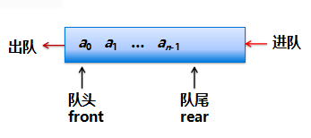
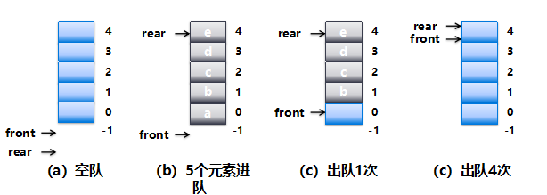

# 队列

> 先进先出

队列（queue）是一种只能在不同端进行插入或删除操作的线性表。

进行插入的一端称做队尾（rear），进行删除的一端称做队头或队首（front）。

队列的插入操作通常称为进队或入队（push），队列的删除操作通常称为出队或离队（pop）。



## 顺序队




## 队列接口Queue<E>

> Java语言中提供了队列接口Queue<E>，提供了队列的修改运算，但不同于Stack<E>，由于它是接口，所以在创建时需要指定元素类型，如`LinkedList<E>`。

| 方法               | 说明                                                         |
| :----------------- | ------------------------------------------------------------ |
| boolean isEmpty()  | 返回队列是否为空                                             |
| int size()         | 队列中元素个数                                               |
| boolean add(E e)   | 将元素e进队（如果立即可行且不会违反容量限制），在成功时返回 true，如果当前没有可用的空间，则抛出异常 |
| boolean offer(E e) | 将元素e进队（如果立即可行且不会违反容量限制），当使用有容量限制的队列时，此方法通常要优于add(E)，后者可能无法插入元素，而只是抛出一个异常 |
| E peek()           | 取队头元素，如果队列为空，则返回null                         |
| E element()        | 取队头元素，它对peek方法进行简单封装，如果队头元素存在则取出并不删除，如果不存在抛出异常 |
| E poll()           | 出队，如果队列为空，则返回null                               |
| E remove()         | 出队，直接删除队头的元素                                     |

```
public class Queueapp {
    public static void main(String[] args) {
        Queue<Integer> q = new LinkedList<>();
        q.offer(4);
        q.offer(3);
        q.offer(6);
        System.out.println("size():"+q.size());
        System.out.println("peek():"+q.peek());
        System.out.println("remove():"+q.remove());
        System.out.println("peek():"+q.peek());
        while (!q.isEmpty()){
            System.out.print(q.poll()+" ");
        }
    }
}
```

