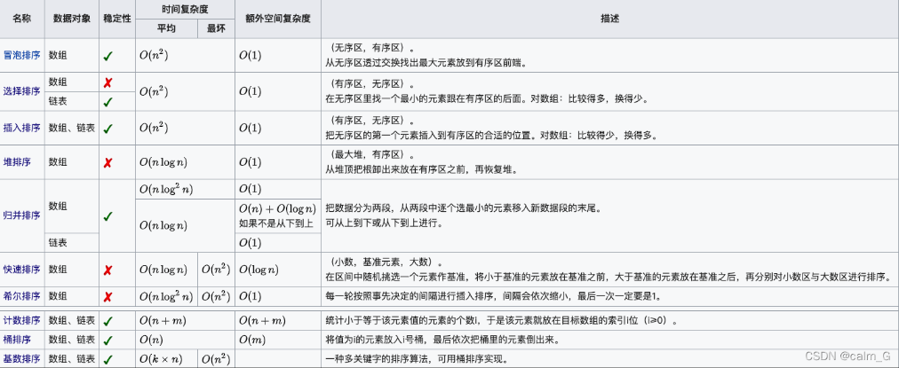
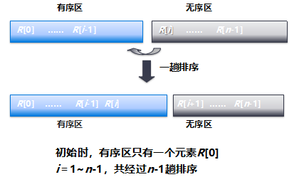

稳定性：经过排序后关键字相同的元素之间的相对次序保持不变

| 排序方法         | 描述                                                         | 时间复杂度   |              |              | 空间复杂度 | 稳定性 |
| ---------------- | ------------------------------------------------------------ | ------------ | ------------ | ------------ | ---------- | ------ |
|                  |                                                              | **平均情况** | **最坏情况** | **最好情况** |            |        |
| **直接插入排序** | 把无序区的第一个元素插入到有序区的合适的位置。对数组:比较得少，换得多。最坏n(n-1)/2 | O(n²)        | O(n²)        | O(n)         | O(1)       | 稳定   |
| **折半插入排序** |                                                              | O(n²)        | O(n²)        | O(nlog2n)    | O(1)       | 稳定   |
| **简单选择排序** | 在无序区里找一个最小的元素跟在有序区的后面。对数组:比较得多，换得少。 | O(n²)        | O(n²)        | O(n²)        | O(1)       | 不稳定 |
| **希尔排序**     | 每一-轮按照事先决定的间隔进行插入排序，间隔会依次缩小，最后一次-定要是1。 | O(n^1.58)    |              |              | O(1)       | 不稳定 |
| **冒泡排序**     | 两两比较，交换。                                             | O(n²)        | O(n²)        |              | O(1)       | 稳定   |
| **快速排序**     | 在区间中随机挑选一个元素作基准，将小于基准的元素放在基准之前，大于基准的元素放在基准之后，再分别对小数区与大数区进行排序。 | O(nlog2n)    | O(n²)        | O(n)         | O(nlog2n)  | 不稳定 |
| **堆排序**       | 从堆顶把根卸出来放在有序区之前，再恢复堆，                   | O(nlog2n)    | O(nlog2n)    | O(nlog2n)    | O(1)       | 不稳定 |
| **二路归并排序** | 把数据分为两段，从两段中逐个选最小的元素移入新数据段的末尾。 | O(nlog2n)    | O(nlog2n)    | O(nlog2n)    | O(1)       | 稳定   |
| **基数排序**     | 种多关键字的排序算法，可用桶排序实现。k:待排元素的维数，m为基数的个数 | O(k(n+m))    | O(k(n+m))    | O(k(n+m))    | O(m)       | 稳定   |

## 直接插入排序

最好情况，正序O(n)

最坏情况，反序O(n^2)

折半插入排序

平均情况O(n2)

## 希尔排序

## 冒泡

## 快速

## 堆排序

判断是否是堆

- 满足完全二叉树
- 每个结点大于等于其两个子节点

## 基数排序

> 桶排序

