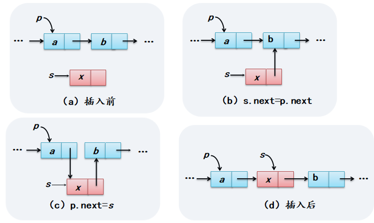
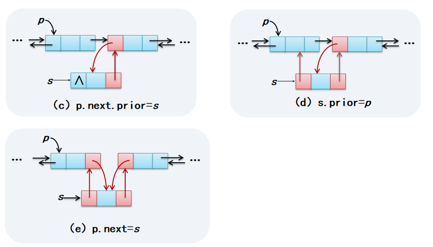
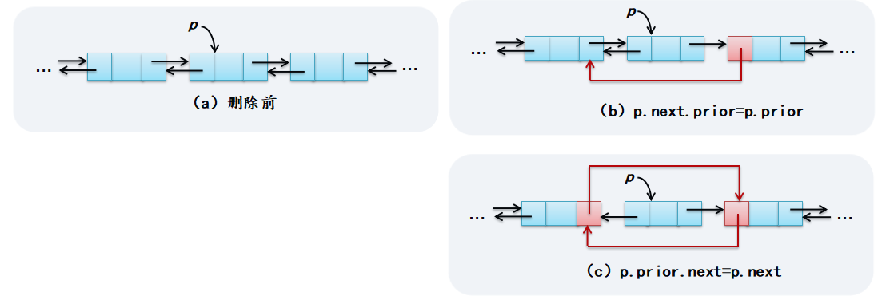

## 插入排序

```
public void InsertSort() 		//对R[0..n-1]递增排序
{  RecType tmp;
   int j;
   for (int i=1;i<n;i++)		//从第2个元素即R[1]开始
   {  if (R[i].key<R[i-1].key)	//反序时
      {  tmp=R[i];			//取出无序区的第一个元素
         j=i-1;			//有序区中从右向左找R[i]插入位置          
         do
         {  R[j+1]=R[j];		//关键字大于tmp.key的元素后移
            j--;			//继续向前比较
         } while (j>=0 && R[j].key>tmp.key);
         R[j+1]=tmp;			//在j+1处插入R[i]
      }
   }
}
```

## 冒泡排序

```
public void BubbleSort()	//对R[0..n-1]按递增有序进行冒泡排序
{  boolean exchange=false;
   for (int i=0;i<n-1;i++) 
   {  exchange=false;			//本趟前将exchange置为false
      for (int j=n-1;j>i;j--)		//一趟中找出最小关键字的元素
         if (R[j].key<R[j-1].key)	//反序时交换
         {  swap(j,j-1); 		//R[j]与R[j-1]进行交换
            exchange=true;		//本趟发生交换置exchange为true
         }
      if (!exchange) return;		//本趟没有发生交换，中途结束算法
   }
}
```

## 二分查找

```
public int BinSearch1(int k)		//拆半查找非递归算法
{  int low=0,high=n-1,mid;
   while (low<=high)			//当前区间非空时
   {  mid=(low+high)/2;		//求查找区间的中间位置
      if (k==R[mid].key)		//查找成功返回其序号mid
         return mid;
      if (k<R[mid].key)		//继续在R[low..mid-1]中查找
         high=mid-1;
      else				//k>R[mid].key
         low=mid+1;			//继续在R[mid+1..high]中查找
   }
   return -1;				//当前查找区间空时返回-1
}
```

## 树的遍历前中后层（递归

```
public void PreOrder1(BTreeClass bt)		//先序遍历的递归算法
{
   PreOrder11(bt.b);
}
private void PreOrder11(BTNode<Character> t) //被PreOrder1方法调用
{  if (t!=null)
   {  System.out.print(t.data+ " ");		//访问根结点
      PreOrder11(t.lchild);			//先序遍历左子树
      PreOrder11(t.rchild);			//先序遍历右子树
   }
}
```

```
public void InOrder1(BTreeClass bt)		//中序遍历的递归算法
{
   InOrder11(bt.b);
}
private void InOrder11(BTNode<Character> t) //被InOrder1方法调用
{  if (t!=null)
   {  InOrder11(t.lchild);			//中序遍历左子树
      System.out.print(t.data+ " ");		//访问根结点
      InOrder11(t.rchild);			//中序遍历右子树
   }
}
```

```
public void PostOrder1(BTreeClass bt)	//后序遍历的递归算法
{
   PostOrder11(bt.b);
}
private void PostOrder11(BTNode<Character> t) //被PostOrder1方法调用
{  if (t!=null)
   {  PostOrder11(t.lchild);			//后序遍历左子树
      PostOrder11(t.rchild);			//后序遍历右子树
      System.out.print(t.data+ " ");		//访问根结点
   }
}
```

```
public void LevelOrder(BTreeClass bt)	//层次遍历的算法
{  BTNode<Character> p;
   Queue<BTNode> qu=new LinkedList<BTNode>(); //定义一个队列qu
   qu.offer(bt.b);			//根结点进队
   while (!qu.isEmpty())		//队不空循环
   {  p=qu.poll();			//出队一个结点
      System.out.print(p.data+" ");	//访问p结点
      if (p.lchild!=null)		//有左孩子时将其进队
          qu.offer(p.lchild);
      if (p.rchild!=null)		//有右孩子时将其进队
         qu.offer(p.rchild);
   }
}
```

## 线性表简单操作（单链表双链表插入删除



```
public void Insert(int i, E e)	//在线性表中序号i位置插入元素e
{  if (i<0 || i>size())		//参数错误抛出异常
     throw new IllegalArgumentException("插入:位置i不在有效范围内");
   LinkNode<E> s=new LinkNode<E>(e);	//建立新结点s	
   LinkNode<E> p=geti(i-1);		//找到序号为i-1的结点p
   s.next=p.next;			//在p结点后面插入s结点
   p.next=s;
}
```

```
public void Delete(int i) 		//在线性表中删除序号i位置的元素
{  if (i<0 || i>size()-1)		//参数错误抛出异常
     throw new IllegalArgumentException("删除:位置i不在有效范围内");
   LinkNode<E> p=geti(i-1);		//找到序号为i-1的结点p
   p.next=p.next.next;		//删除p结点的后继结点
}
```



```
public void Insert(int i, E e)			//在线性表中序号i位置插入元素e
{  if (i<0 || i>size())				//参数错误抛出异常
      throw new IllegalArgumentException("插入:位置i不在有效范围内");
   DLinkNode<E> s=new DLinkNode<E>(e);		//建立新结点s	
   DLinkNode<E> p=geti(i-1);			//找序号为i-1结点p,其后插入s结点
   s.next=p.next;				//修改s结点的next成员
   if (p.next!=null)				//修改p结点的非空后继结点的prior
      p.next.prior=s;
   p.next=s;					//修改p结点的next成员
   s.prior=p;					//修改s结点的prior成员
}
```



```
public void Delete(int i) 		//在线性表中删除序号i位置的元素
{  if (i<0 || i>size()-1)		//参数错误抛出异常
     throw new IllegalArgumentException("删除:位置i不在有效范围内");
   DLinkNode<E> p=geti(i);		//找到序号为i的结点p,删除该结点
   if (p.next!=null)			//修改p结点非空后继结点的prior
     p.next.prior=p.prior;
   p.prior.next=p.next;		//修改p结点的前驱结点的next
}
```

