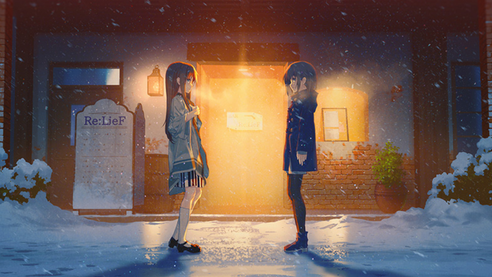
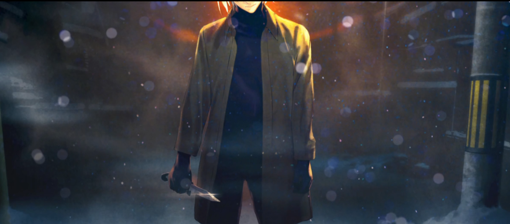
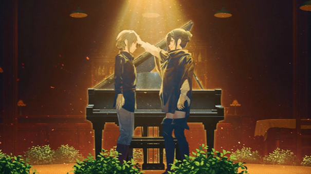
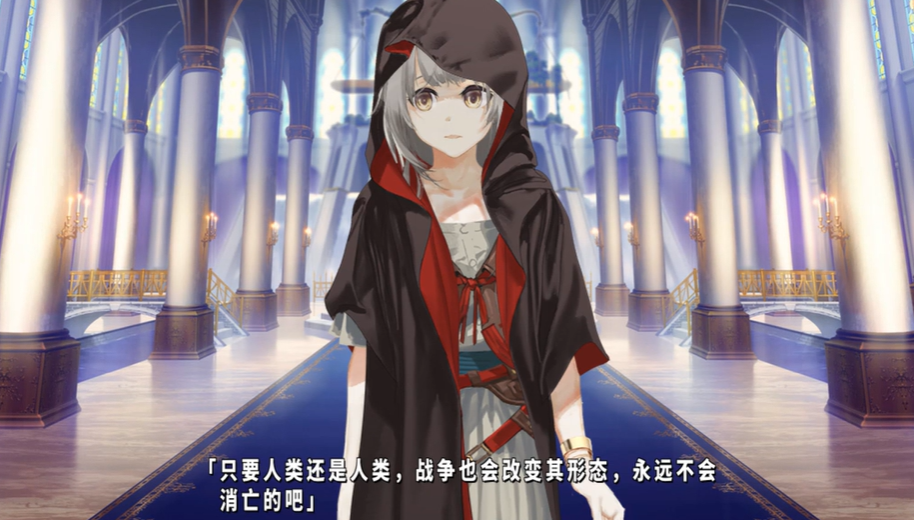
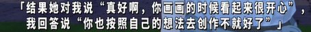
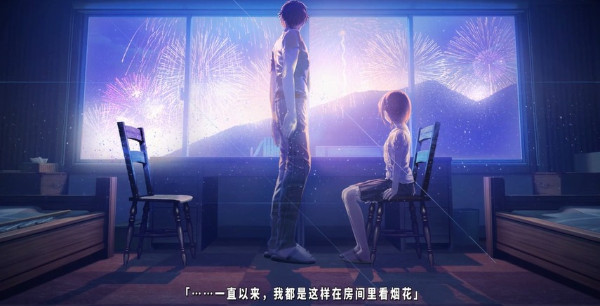
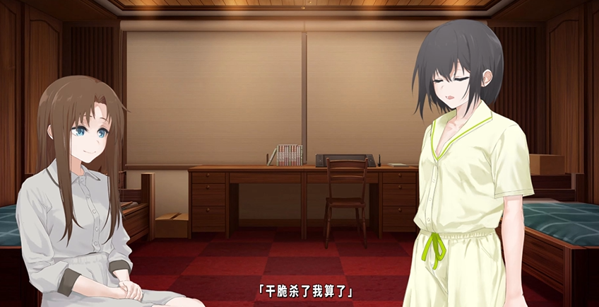
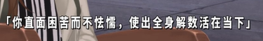
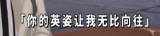

「あなただけが知る世界」

揺れている

心中的波澜

心の波

依旧起伏不定

手のひらに

仍在手心

残る夢

残存的梦想

息もできないような

那些温柔与痛苦

優しさも痛みも

令我窒息

奏で続けていくから

但是我会继续演奏

いつの日にか

只期有朝一日

この世界でーーー

能将梦想实现ーーー

最近第三次重温《TrymenT—献给渴望改变的你—》 的故事

《TrymenT—献给渴望改变的你—》 是我看的最多次的gal，大概因为虽然倒叙插叙，挖的坑太多，有些看不懂。

## 谈谈前作《RelieF—献给亲爱的你—》

因为精美的立绘、音乐、op，《RelieF—献给亲爱的你—》算是我的galgame入坑作，虽然我玩的第一部是ARTI

不过在出了 《TrymenT—献给渴望改变的你—》 后，才买了RelieF和TrymenT这两部开始玩。

RelieF很无聊...因为我是冲着优去的，结果只有爱线...

前三位女主的故事都不完整，只有爱线才逐渐揭开了真相

呜呜呜呜呜优啊...

我爱过你，会一直守护着你

哇哇哇哇哇

## 《TrymenT—献给渴望改变的你—》

TrymenT的计划是一个虚拟世界

中途出现的意义不明的两位白发

在名为 relief 的咖啡店抑或是酒馆，以 甘利纱阳 和 早乙女叶月 身份打招呼的两人

有提到 君岛翔 过去和司、阿尔法（优）等人游玩过一个游戏

以上场景可能源自那个游戏，可能游戏名是就是 RelieF

情感线个人认为是

菖蒲-->喜羽-->翔

## 君岛翔

我很喜欢 君岛翔 这一角色，她身为漫画家的笔名是早乙女叶月

为了完成被腰斩的漫画《献给亲爱的你》（恋爱漫画） 和过去做一个了断参加了tryment计划

失去了初心的玉玉漫画家www

留下的是对创作的理性...

成为漫画家后总是呆在房间里，没有出去交际，摄影也仅是为了拍摄资料

盲猜是BL哈哈哈哈，后面和织鹤说更喜欢 八马x喜羽 ，被说和高中一样

自己就是漫画家早乙女叶月，暴露了的反应，太可爱了，好羞耻

翔 对我而言，就像 菖蒲 说的那样，她直面创作痛苦的英姿令我无比向往

这是 翔 和 菖蒲 两个人的相互救赎。

翔 的声优真不错，有那种沉重感，通过声音感受能明显的到人物的情绪。我很喜欢这个声线。

##  Traumend 

两人的作品最后是 Traumend 的同人wwww ，画中的角色是 甘利纱阳

tryment中 甘利纱阳 早乙女叶月 影山星一 天草月乃，这些名字都是继承自 Traumend 。Traumend中的 甘利纱阳 是一位因事故失去母亲无法行走的少女，封闭了自我沉迷于与母亲唯一联系的钢琴。早乙女叶月 是位漫画家。

星乃菖蒲 设定就改自 甘利纱阳，后面 她也以 甘利纱阳 来作词作曲。尽管无法演奏，但以另一种形式来回应。

君岛翔 大概继承着 团队的想法吧，过去的游戏不火，现在重新创作了tryment这个游戏。

----

身为主人公的少女，儿时因交通事故失去了母亲，自己也因此无法行走。从那之后，少女将自己封闭，沉迷于与母亲唯一关联的钢琴。

有一天，少女像往常一样弹完钢琴，回家路上因为道路不平轮椅不慎翻倒了。在路过的青年的帮助下重新起身。

以此为契机，少女向他倾诉了她的烦恼和想法，逐渐开始成长起来。

随着时间的推移，少女与一直对她弹钢琴持否定态度的继母沟通并理解。在特殊学校上表演钢琴，她开始想为『我想为他人弹奏钢琴』。并且，她还积极接受康复训练，试图克服行动障碍。 最后，为了向年轻人展示她已经成长的样子，以及表达多年来对年轻人的感激之情，少女作曲并演奏了一首钢琴曲。

主人公の少女は、幼い頃に遭った交通事故が原因で実の母を失い、自身も歩行障害を負っていた。けれど少女は、実母との唯一の繋がりであるピアノにのめり込み、自分を閉ざしてしまう。

そんなある日、少女がいつものように、離れにあるピアノを弾いてきた帰り道、悪路で車いすを横転させてしまう。そこを通りすがりの青年に助け起こされる。これがきっかけとなり、少女は青年に悩みや思いを打ち明け、少しずつ成長をし始める。

やがて、少女がピアノを弾く事に否定的で、すれ違ってきた継母とも話し合ってわかり合う事ができるほどに成長した少女は、養護学校でのピアノ演奏を機に『他者の為にピアノを弾きたい』と思うようになる。そして、リハビリにも取り組み、歩行障害を克服しようと試みる。

最後に少女は、青年に成長した自分の姿を見せる為と、長年青年に抱いてきた感謝の思いを込めて作曲したピアノ曲を演奏する。