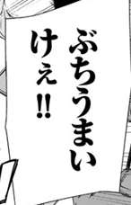
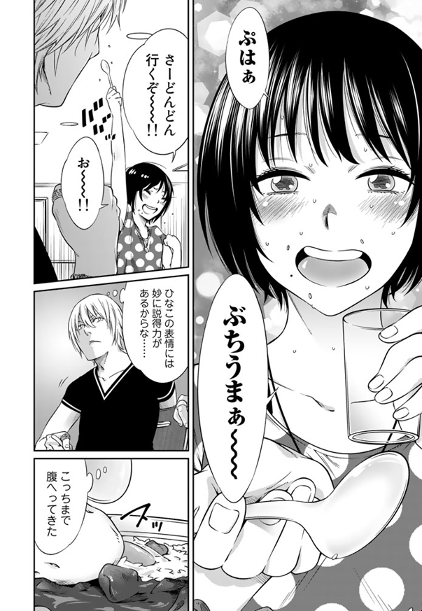
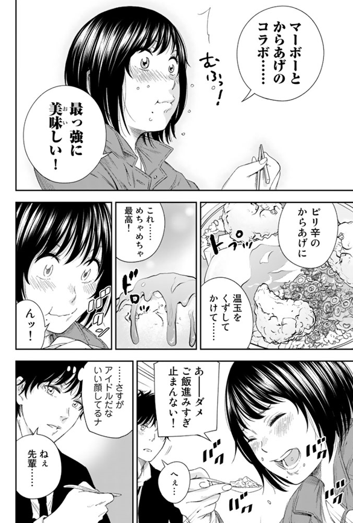
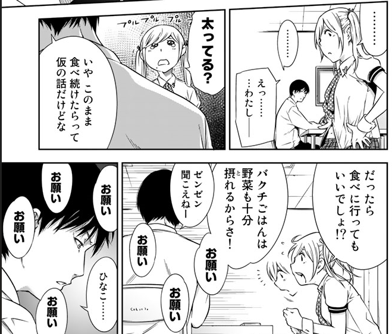
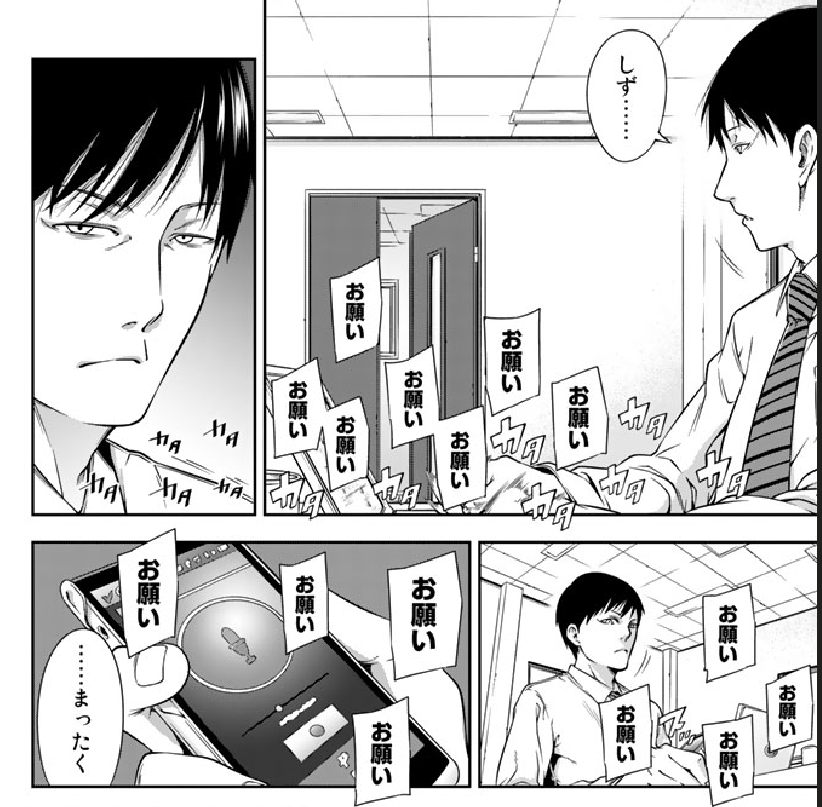

# ばくばく！バクチごはん/大吃特吃！赌场饭

ばくばく是吃东西时的语气词

博打(ばくち)  ：博奕とも。ふつう 賭博 (とばく)と同義。

？？？

没有汉化的原因（个人猜测

讲的是赌博场所的美食。所以漫画名为 バクチごはん ，盘点了不少美食以及创新吃法。涉及到的店名食材科普需要大量的了解。如果是我的话，现实不可能会去那个场所吃那些东西。

駆け出しの女子高校生アイドルが、全国各地の競馬場や競輪場、ボートレース場、オートレース場を訪れ、愛してやまないバクチごはんを堪能。その元気印の愛らしさで周囲を巻き込み、実在する激ウマメニューを食べ尽くしながら、グルメサイトでは見つからない美味しさを伝授するグルメ漫画。実際に原作者である島田英次郎が公営ギャンブル場に赴き、取材して得たエピソードを綴ったコラム「こぼれバクチごはん」も収録されている。「イブニング」2016年19号から2017年21号にかけて掲載された作品。

新人人气偶像在各地赌场尽情品尝美食的故事

**ぶちうまぁー！**　　这句真是印象深刻啊！

高橋コウ 先生所画的角色刻画好强，分镜很有感染力，给人一种极具活力的感觉。

在撒娇好可爱！