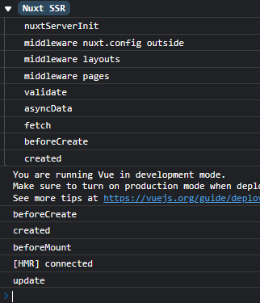
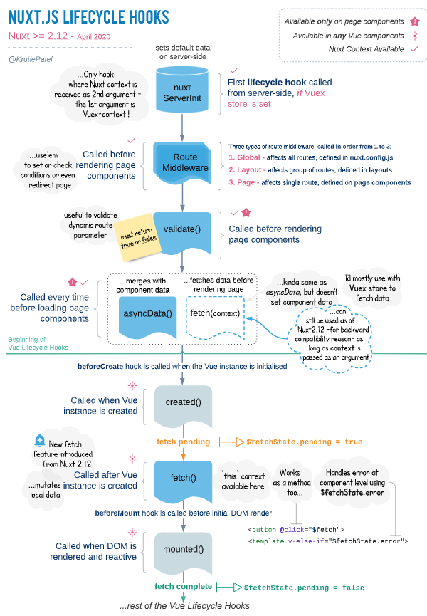

## 什么是SPA

- SPA (single page web application) 单页 Web 应用，Web 不再是一张张页面, 而是一个整体的应用，一个由路由系统、数据系统、页面 (组件) 系统等等，组成的应用程序。例如 Vue。
- 不利于搜索引擎优化，首屏加载慢
- SPA 应用广泛用于对 SEO 要求不高的场景中。

## 什么是SEO

- SEO搜索引擎优化 (Search Engine Optimization)，通过各种技术 (手段) 来确保, 我们的 Web 内容被搜索引擎最大化收录， 最大化提高权重, 最终带来更多流量。
- SEO 解决方案： 提前将 页面和数据 进行整合。

## 什么是SSR

- SSR服务端渲染 (Server Side Render)，网页是通过服务端渲染生成后输出给客户端。
- - 在 SSR 中，前端分为 2 部分：前端客户端、前端服务端。
  - 前端服务端， 用于发送 ajax, 获得数据。
  - 前端客户端， 用于将 ajax 数据和页面进行渲染，渲染成 html 页面，并响应给调用程序 (浏览器、爬虫)。

### Vue的服务器渲染

- `npm init -y`   初始化项目环境，生成一个package.json。
- ` npm i vue vue-server-renderer --save`   服务端渲染包。
- `npm install nodemon --save`    nodemon是一个监听node代码变化的工具，会自动完成node服务器和数据库服务器的重启。
- `npm install express --save `   通过express搭建一个node服务器，做一个响应。

*whatisssr/package.json*

通过配置   `"dev": "nodemon ./server.js"`  

即可  `npm run dev`  来启动服务器

```json
{
  "name": "whatisssr",
  "version": "1.0.0",
  "description": "",
  "main": "index.js",
  "scripts": {
    "dev": "nodemon ./server.js"
  },
  "keywords": [],
  "author": "",
  "license": "ISC",
  "dependencies": {
    "express": "^4.18.2",
    "nodemon": "^2.0.20",
    "vue": "^x.x.xx",
    "vue-server-renderer": "^x.x.xx"
  }
}
```

> ` "vue-server-renderer": "^2.7.14" `  Vue packages version mismatch:版本不一致的报错，解决方法：找到`node_modules\vue-server-renderer`目录下的package.json，把`vue-server-renderer`编译时的vue版本强行改为和vue一致，`"version": "x.x.xx"`，然后重启。
>
> 呃呃呃跑不起来因为  No matching version found for vue-server-renderer@^3.2.45.

*whatisssr/server.js*

```js
const Vue = require('vue');
const server = require('express')();

//express根请求响应
server.get('/', (req, res) => {
    // 1.创建一个Vue实例
    const app = new Vue({
        template: `<div>hello</div>`
    })
    // 2.创建一个renderer
    const renderer = require('vue-server-renderer').createRenderer();
    // 3.将Vue渲染为HTML
    // renderer.renderToString(vue实例,(错误，渲染后的html) => {})
    // renderer.renderToString(app, (err,html) => {
    //     if(err) throw err;
    //     console.log(html);
    // })
    // 若果没有传入回调函数，则会返回 Promise
    renderer.renderToString(app).then(html => {
        // console.log(html);
        res.send(`
        <!DOCTYPE html>
        <html lang="en">
        <head>
            <meta charset="UTF-8">
            <meta http-equiv="X-UA-Compatible" content="IE=edge">
            <meta name="viewport" content="width=device-width, initial-scale=1.0">
            <title>Document</title>
        </head>
        <body>
            ${html}
        </body>
        </html>
        `)
    }).catch(err => {
        console.log(err);
    })
})

//监听端口
server.listen(3000)
```

## Nuxt.js概述

- **Nuxt.js** 是一个基于 Vue.js 的轻量级应用框架,可用来创建服务端渲染 (SSR) 应用,也可充当静态站点引擎生成静态站点应用,具有优雅的代码结构分层和热加载等特性。
- 简单的来说，就是基于原有的通用应用框架（如vue或react）， 通过对客户端/服务端基础架构的抽象组织，进行应用的UI渲染。
- 利用 Vue.js 和 Node.js两者优势构成好更高效的性能。

## 创建NuxtJS项目

```
 npm create-nuxt-app 项目名称（然后就会卡住，创建不成功
 vue init nuxt-community/starter-template 项目名称 
```

```sh
npm i -D @nuxt/typescript
npm install -D @typescript-eslint/eslint-plugin
```

## 目录结构

- assets 资源，被web打包处理，css 图片 字体

- components 通用组件，可复用，不支持服务端钩子

- layouts  布局页面，默认有个default布局

- middleware 存放中间件

  - > middleware即是在进入页面，或者是进入方法之前，优先进入中间层判断（下边生命周期会提及）。如果不满足条件，将用中间的方法控制如何处理。
    >
    > 中间件执行流程顺序  nuxt.config.js -> 匹配布局 -> 匹配页面

- pages 需要经过路由跳转的页面，一级二级目录，复用组件，安排进布局

- plugins 配置插件

- server 服务端的配置，node搭建

- static 静态文件，不需要webpack处理，是一些库

- store  vue下目录树配置

## 生命周期 钩子

**服务端**

> 服务端还没开始渲染之前拿不到客户端的东西，例如windows对象
>
> 服务端this是undefined，通过上下文获取信息

**->`nuxtServerInit`服务器初始化** 

- 第一个参数是Vuex上下文,第二个参数是Nuxt上下文
- 只能定义在 `store/index.js`

```javascript
export const actions = {
  nuxtServerInit(store,context) {
    console.log('nuxtServerInit');
  }
}
```

**-> `middleware`中间件运行**

- 全局中间件

`middleware/auth.js`

```javascript
export default ({store ,router,redirect,params,query,req,res})=>{
  //context 服务端上下文信息，是一个对象。
  //全局守卫业务
  console.log('middleware nuxt.config outside');
}
```

- 布局中间件

`layouts/index.js`

```javascript
export default {
  // middleware: 'auth', 使用全局中间件
  //页面层级中间层的定义
  middleware(){
    console.log('middleware layouts');
  }
}
```

`pages/index.js`

```javascript
export default {
  // middleware: 'auth', 使用全局中间件
  middleware(context) {
    console.log('middleware pages');
  }
}
```

- 路由中间件

`nuxt.config.js`中定义全局中间件

```
  router: {
    middleware: 'auth'
  },
```

**->` validate`校验参数**

`pages/index.js`

```javascript
  //参数的有效性
  validate({ params, query }) {
    //校验业务
    console.log('validate');
    return true;
    // 返回false的话，会默认返回404页面
  },
```

**-> `asyncData fetch`异步数据处理** 

`pages/index.js`

```javascript
  //读数据 返回给组件
  asyncData({ isDev, route, store, env, params, query, req, res, redirect, error }) {
    console.log('asyncData');
    //异步业务逻辑，读取服务端数据
    return {
      b: 2
    }
  },

  //读数据 返回给vuex
  fetch({ store }) {
    //异步业务逻辑，读取服务端数据提交给vuex
    console.log('fetch');
  },
```

----

**客户端**

> windows this指向组件

**-> vue的生命周期**（特殊：其中只有`beforeCreate`和`created`会运行在服务端客户端）

```javascript
  // SSR  && CSR
  beforeCreate() {
    console.log('beforeCreate');
  },
  created() {
    console.log('created');
  },
  // CSR  windows this指向组件
  beforeMount() { console.log('beforeMount'); },
  mounted() { },
  beforeUpdate() { },
  updated() { console.log('update'); },
  beforeDestroy() { },
  destroyed() { },

  // 服务端渲染 激活,失活 不存在
  // activated() { },
  // deactivated() { },
```




