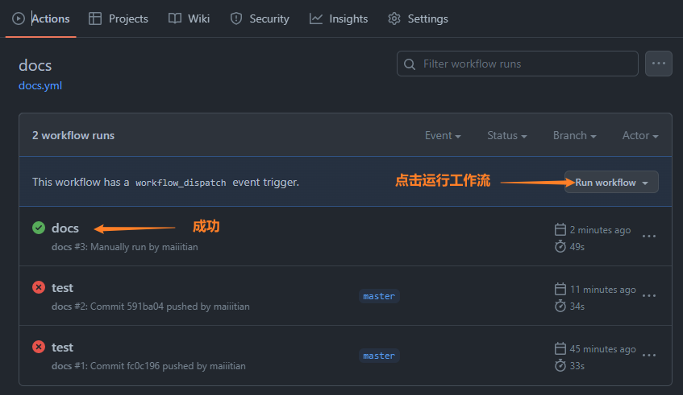

stu  by BV17G4y177YJ

[Home | VuePress (vuejs.org)](https://v2.vuepress.vuejs.org/)   使用版本为2.0

### 创建vuepress

创建并进入一个新目录

```
mkdir vuepress-starter
cd vuepress-starter
```

项目初始化

```
git init
pnpm init
```

将 VuePress 安装为本地依赖

```
pnpm add -D vuepress@next @vuepress/client@next vue
```

 在 `package.json` 中添加一些 [scripts](https://classic.yarnpkg.com/zh-Hans/docs/package-json#toc-scripts)

```
{
  "scripts": {
    "docs:dev": "vuepress dev docs",
    "docs:build": "vuepress build docs"
  }
}
```

 将默认的临时目录和缓存目录添加到 `.gitignore` 文件中

```
echo 'node_modules' >> .gitignore
echo '.temp' >> .gitignore
echo '.cache' >> .gitignore
```

创建你的第一篇文档

```
mkdir docs
echo '# Hello VuePress' > docs/README.md
```

在本地启动服务器来开发你的文档网站

```
pnpm docs:dev
```

### 配置

主页，参考官方文档

主题

```
---
description: null
date: 2023-05-18
permalinkPattern: :year/:month/:day/:slug.html
---
```

### 部署

构建网站 `pnpm docs:build`

GitHub Actions

GitHub Pages 是Github推出的静态页托管。

遇到问题

The process '/usr/bin/git' failed with exit code 128

https://blog.csdn.net/weixin_42282187/article/details/124766382

https://blog.csdn.net/nxg0916/article/details/129063959




