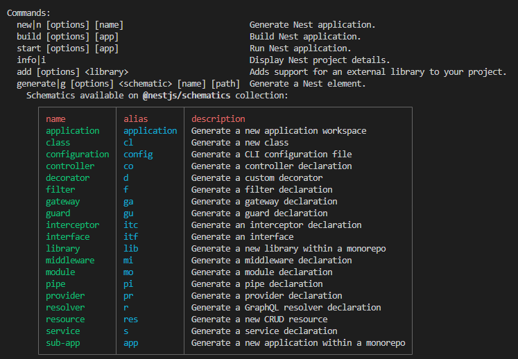
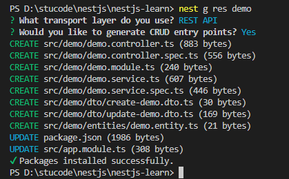

> [nestjs 英文官网](https://nestjs.com/) 
>
> [nestjs 中文网](https://docs.nestjs.cn/) 
>
> 还是看[官方教程](https://www.bilibili.com/video/BV1T44y1W7Si/?spm_id_from=333.999.0.0) 最清晰！

Nest (NestJS) 是一个用于构建高效、可扩展的 Node.js 服务器端应用程序的开发框架。它利用 JavaScript 的渐进增强的能力，使用并完全支持 TypeScript （仍然允许开发者使用纯 JavaScript 进行开发），并结合了 OOP （面向对象编程）、FP （函数式编程）和 FRP （函数响应式编程）。

在底层，Nest 构建在强大的 HTTP 服务器框架上，例如 Express （默认），并且还可以通过配置从而使用 Fastify ！

## 创建nestjs项目

```
pnpm i -g @nestjs/cli
nest new [项目名称]
```

启动

```
pnpm run start
# 自动重新编译并重新加载服务器
pnpm run start:dev 
```

`src` 目录结构

> .spec 测试规范（spec）文件 ，进行单元测试。

```
src
 ├── app.controller.spec.ts	# 带有单个路由的基本控制器示例。
 ├── app.controller.ts		# 对于基本控制器的单元测试样例
 ├── app.module.ts			# 应用程序的根模块。
 ├── app.service.ts			# 带有单个方法的基本服务
 └── main.ts				# 应用程序入口文件。它使用 NestFactory 用来创建 Nest 应用实例。
```

`nest --help`  查看所有 nestjs 命令



### 生成模板

```
# 一个个生成
nest g co demo		# 生成controller模板
nest g mo demo 		# 生成module模板
nest g s demo		# 生成service模板
# 直接生成一套CRUD，在src的demo目录下
nest g res demo
```

选择RESTful风格



当前src目录结构

```
src
│ ....
└─demo
    │  demo.controller.spec.ts
    │  demo.controller.ts
    │  demo.module.ts
    │  demo.service.spec.ts
    │  demo.service.ts
    ├─dto
    │      create-demo.dto.ts
    │      update-demo.dto.ts
    └─entities
            demo.entity.ts
```

开启项目测试页面输出

```
http://localhost:3000/demo/123
```

### 版本控制

*\src\main.ts* 开启版本控制

```
import { NestFactory } from '@nestjs/core';
import { VersioningType } from '@nestjs/common';
import { AppModule } from './app.module';

async function bootstrap() {
  const app = await NestFactory.create(AppModule);
  // 开启版本控制
  app.enableVersioning({
    type: VersioningType.URI,
  });
  await app.listen(3000);
}
bootstrap();
```

*src\demo\demo.controller.ts*

```
@Controller({
  path: 'demo',
  version: '1',
})
```

通过在url中添加路径  `/v+版本号 ` 来访问，例如

```
http://localhost:3000/v1/demo/123
```

## Session

`HTTP session  `提供了一个用于在不同请求间存储信息的方法，

安装需要的包(以及 `TypeScript` 用户需要的类型包)：

```
pnpm i express-session --save
pnpm i -D @types/express-session
```

 *\src\main.ts*  中将`express-session`配置为全局中间件

```
import * as session from 'express-session';
// somewhere in your initialization file
  app.use(
    session({
      secret: 'test',
      name: 'test.session',
      rolling: true,
      cookie: { maxAge: null },
    }),
  );
```

参数配置详解

| 属性    | 解释                                                         |
| ------- | ------------------------------------------------------------ |
| secret  | 加密该会话 ID`cookie`                                        |
| name    | 生成客户端cookie 的名字 默认 connect.sid                     |
| cookie  | 设置返回到前端 key 的属性，默认值为{ path: ‘/’, httpOnly: true, secure: false, maxAge: null }。 |
| rolling | 在每次请求时强行设置 cookie，这将重置 cookie 过期时间(默认:false) |

案例：图形验证：

vite项目添加跨域，*vite.config.ts*

```
export default defineConfig({
  plugins: [vue()],
  server: {
    port: 9090,
    proxy: {
      "/api": {
        target: "http://localhost:3000/",
        changeOrigin: true,
        rewrite: (path) => path.replace(/^\/api/, ""),
      },
    },
  },
});
```

```
pnpm install element-plus -S

import ElementPlus from "element-plus";
import "element-plus/dist/index.css";
const app = createApp(App);
app.use(ElementPlus);

<template>
  <div class="wraps">
    <el-form
      :label-position="labelPosition"
      label-width="100px"
      :model="formLabelAlign"
      style="max-width: 460px"
    >
      <el-form-item label="账号">
        <el-input v-model="formLabelAlign.name" />
      </el-form-item>
      <el-form-item label="密码">
        <el-input type="password" v-model="formLabelAlign.password" />
      </el-form-item>
      <el-form-item label="验证码">
        <div style="display: flex">
          <el-input v-model="formLabelAlign.code" />
          
        </div>
      </el-form-item>
      <el-form-item>
        <el-button @click="submit">登录</el-button>
      </el-form-item>
    </el-form>
  </div>
</template>

<script setup lang="ts">
import { reactive, ref } from "vue";

const codeUrl = ref<string>("/api/demo/code");

const resetCode = () => (codeUrl.value = codeUrl.value + "?" + Math.random());

const labelPosition = ref<string>("right");

const formLabelAlign = reactive({
  name: "",
  password: "",
  code: "",
});

// fetch的返回值？？？
const submit = async () => {
  await fetch("/api/demo/create", {
    method: "POST",
    body: JSON.stringify(formLabelAlign),
    headers: {
      "content-type": "application/json",
    },
  }).then((res) => {
    res.json().then((res) => {
      console.log(res.code);
    });
  });
};
</script>

<style>
* {
  padding: 0;
  margin: 0;
}

.wraps {
  display: flex;
  justify-content: center;
  align-items: center;
  height: inherit;
}

html,
body,
#app {
  height: 100%;
}
</style>

```

*src\demo\demo.controller.ts*

```
  @Get('code')
  createCaptcha(@Req() req, @Res() res) {
    const captcha = svgCaptcha.create({
      size: 4, //生成几个验证码
      fontSize: 50, //文字大小
      width: 100, //宽度
      height: 34, //高度
      background: '#cc9966', //背景颜色
    });
    req.session.code = captcha.text; //存储验证码记录到session
    res.type('image/svg+xml');
    res.send(captcha.data);
  }

  @Post('create')
  createUser(@Req() req, @Body() body) {
    console.log(req.session.code, body);
    if (
      req.session.code.toLocaleLowerCase() === body?.code?.toLocaleLowerCase()
    ) {
      return {
        code: 2000,
        message: '验证码正确',
      };
    } else {
      return {
        code: 2001,
        message: '验证码错误',
      };
    }
  }
```

## Provider（提供者）

`@Injectable()` 装饰器注释的类。可以是 `service`,` repository`, `factory`, `helper` 等等。依赖注入

```
import { Injectable } from '@nestjs/common';
```

## Module（模块）

`@module()` 装饰器接受一个描述模块属性的对象：

| 属性        | 解释                                                       |
| ----------- | ---------------------------------------------------------- |
| providers   | 由 Nest 注入器实例化的提供者，并且可以至少在整个模块中共享 |
| controllers | 必须创建的一组控制器                                       |
| imports     | 导入模块的列表，这些模块导出了此模块中所需提供者           |
| exports     | 由本模块提供并应在其他模块中可用的提供者的子集。           |

## Middleware（中间件）

### 依赖注入中间件

*src\middleware\index.ts*

```
import { Injectable, NestMiddleware } from '@nestjs/common';
import { Request, Response, NextFunction } from 'express';

//对象式中间件
@Injectable()
export class logger implements NestMiddleware {
  use(req: Request, res: Response, next: NextFunction) {
    console.log('我来了');
    // 拦截
    // res.send('被拦截了');
    next();
  }
}
```

*src\demo\demo.module.ts*

```
import {
  MiddlewareConsumer,
  Module,
  NestModule,
  RequestMethod,
} from '@nestjs/common';
import { DemoService } from './demo.service';
import { DemoController } from './demo.controller';
import { logger } from 'src/middleware';

@Module({
  controllers: [DemoController],
  providers: [DemoService],
})
export class DemoModule implements NestModule {
  configure(consumer: MiddlewareConsumer) {
    // 字符串方式
    // consumer.apply(logger).forRoutes('demo');
    // 对象方式
    // consumer
    //   .apply(logger)
    //   .forRoutes({ path: 'demo', method: RequestMethod.GET });
    // 拦截controller中所有请求
    consumer.apply(logger).forRoutes(DemoController);
  }
}
```

### 全局中间件

*src\main.ts*

```
import { Request, Response, NextFunction } from 'express';

//全局中间件，完全使用express，案例：白名单,token,健全
const whiteList = ['/list'];
function MiddlewareAll(req: Request, res: Response, next: NextFunction) {
  console.log(req.originalUrl); // 当前路由
  if (whiteList.includes(req.originalUrl)) {
    next();
  } else {
    res.send('被拦截');
  }
}
async function bootstrap() {
  const app = await NestFactory.create(AppModule);
  // 注册全局中间件
  app.use(MiddlewareAll);
}
bootstrap();
```

### 第三方中间件

例如使用 `cors` 解决跨域

```
pnpm install cors
pnpm install @types/cors -D
```

*src\main.ts*

```
import * as cors from 'cors';
async function bootstrap() {
  const app = await NestFactory.create(AppModule);
  app.use(cors());
}
bootstrap();
```

## CORS跨源资源共享

`Nest` 内部集成了 express 的 [cors](https://github.com/expressjs/cors)  包

为了启用 `CORS`，必须调用 `enableCors()` 方法

```
const app = await NestFactory.create(AppModule);
app.enableCors();
```

或者通过 `create()` 方法的选项对象启用 CORS，将 `cors`属性设置为`true`，以使用默认设置启用 CORS。

```
const app = await NestFactory.create(AppModule, { cors: true }
```

## 上传与下载

### 上传图片

使用 nestjs 自带 multer 包 @nestjs/platform-express

```
pnpm install @types/multer -D
```

*src\upload\upload.module.ts*

```
import { Module } from '@nestjs/common';
import { UploadService } from './upload.service';
import { UploadController } from './upload.controller';
import { MulterModule } from '@nestjs/platform-express';
import { diskStorage } from 'multer';
import { extname, join } from 'path';

@Module({
  imports: [
    MulterModule.register({
      storage: diskStorage({
        destination: join(__dirname, '../images'),
        // _ 在 JavaScript 或 TypeScript 中，使用 _ 作为参数名或变量名是一种约定，用于表示一个被忽略的、不被使用的值。
        filename: (_, file, callback) => {
          const fileName = `${
            new Date().getTime() + extname(file.originalname)
          }`;
          return callback(null, fileName);
        },
      }),
    }),
  ],
  controllers: [UploadController],
  providers: [UploadService],
})
export class UploadModule {}
```

*src\upload\upload.controller.ts*

` FileInterceptor` 这里是单个文件上传，使用 `FilesInterceptor` 做到多文件

```
import {
  Controller,
  Post,
  UseInterceptors,
  UploadedFile,
} from '@nestjs/common';
import { UploadService } from './upload.service';
import { FileInterceptor, FilesInterceptor } from '@nestjs/platform-express';

@Controller('upload')
export class UploadController {
  constructor(private readonly uploadService: UploadService) {}
  @Post('album')
  @UseInterceptors(FileInterceptor('file'))
  upload(@UploadedFile() file) {
    console.log(file);
    return true;
  }
}
```

### 静态目录

*src\main.ts*  可以配置前缀 。

```
import { NestExpressApplication } from '@nestjs/platform-express';
import { join } from 'path';
//访问 http://localhost:3000/img/1691831905496.jpg
  app.useStaticAssets(join(__dirname, 'images'), {
    prefix: '/img',
  });
```

### 下载图片

> ？？这里举例了两种方式

1.直接 `download` 下载

*src\upload\upload.controller.ts*

```
  @Get('export')
  downLoad(@Res() res: Response) {
    // 文件信息应该存数据库
    const url = join(__dirname, '../images/1662894316133.png');
    // console.log(url)
    res.download(url);
    // return  true
  }
```

2.使用文件流的方式下载

...

## 拦截器

> **Nestjs 已经内置了 RxJs** ，具体用法呃呃呃，不清楚

规范前端返回的格式，配合 Rxjs 格式化数据。

*src\common\response.ts*

```
import { Injectable, NestInterceptor, CallHandler } from '@nestjs/common';
import { map } from 'rxjs/operators';
import { Observable } from 'rxjs';

interface data<T> {
  data: T;
}

@Injectable()
export class Response<T = any> implements NestInterceptor {
  intercept(context, next: CallHandler): Observable<data<T>> {
    return next.handle().pipe(
      map((data) => {
        return {
          data,
          status: 0,
          success: true,
          message: '牛逼',
        };
      }),
    );
  }
}
```

*src\main.ts* 注册拦截器

```
import { Response } from './common/response';
app.useGlobalInterceptors(new Response());
```

请求 `http://localhost:3000/` 返回

```
{
    "data": "Hello World!",
    "status": 0,
    "success": true,
    "message": "牛逼"
}
```

## 异常过滤器

捕获并处理 HTTP 异常，将异常信息以特定的 JSON 格式返回给客户端。

*src\common\filter.ts*

`@Catch(HttpException)` 装饰器将 `HttpFilter` 类标记为一个异常过滤器，并指定它将处理 `HttpException` 类型的异常。

```ts
import {
  ExceptionFilter,
  Catch,
  ArgumentsHost,
  HttpException,
} from '@nestjs/common';
import { Request, Response } from 'express';

// 使用 @Catch 装饰器标记该类为异常过滤器，处理 HttpException 类型的异常
@Catch(HttpException)
export class HttpFilter implements ExceptionFilter {
  // 实现 ExceptionFilter 接口的 catch 方法，用于处理捕获到的异常
  catch(exception: HttpException, host: ArgumentsHost) {
    // 从参数 host 中获取 HTTP 上下文对象
    const ctx = host.switchToHttp();
    // 从上下文中获取请求（Request）对象
    const request = ctx.getRequest<Request>();
    // 从上下文中获取响应（Response）对象
    const response = ctx.getResponse<Response>();
    // 获取异常的 HTTP 状态码
    const status = exception.getStatus();

    // 使用响应对象设置状态码，并返回 JSON 格式的响应体
    response.status(status).json({
      data: exception.message,
      time: new Date().getTime(),
      success: false,
      path: request.url,
      status,
    });
  }
}
```

*src\main.ts* 注册全局异常过滤器

```
import { HttpFilter } from './common/filter';
app.useGlobalFilters(new HttpFilter());
```

当请求一个错误的路由 `http://localhost:3000/nothing` 地址是时

```
{
    "data": "Cannot GET /nothing",
    "time": 1691925268385,
    "success": false,
    "path": "/nothing",
    "status": 404
}
```

## ！管道

`Nest` 自带九个开箱即用的管道：

- `ValidationPipe`
- `ParseIntPipe`
- `ParseFloatPipe`
- `ParseBoolPipe`
- `ParseArrayPipe`
- `ParseUUIDPipe`
- `ParseEnumPipe`
- `DefaultValuePipe`
- `ParseFilePipe`

管道有两个典型的应用场景:

- **转换**：管道将输入数据转换为所需的数据输出(例如，将字符串转换为整数)

```
import { ParseIntPipe } from '@nestjs/common';
  // @Get(':id')
  // findOne(@Param('id') id: string) {
  //   return this.demoService.findOne(+id);
  // }
  
  // http://localhost:3000/demo/123
  @Get(':id')
  findOne(@Param('id', ParseIntPipe) id: number) {
    console.log(typeof id); // number
    return this.demoService.findOne(+id);
  }
```

- **验证**：对输入数据进行验证，如果验证成功继续传递; 验证失败则抛出异常

>这里搞类验证器，没懂，官网写的...跳过别看
>
>没跑起来一直报Cannot find module 'class-transformer/storage' ...

**类验证器**

```
# 自动生成管道文件
nest g pi demo 
# 安装验证器的两个库
pnpm i --save class-validator class-transformer
```

*src\demo\dto\create-demo.dto.ts*

```
import { IsNotEmpty, IsString, Length } from 'class-validator';
export class CreateDemoDto {
  @IsNotEmpty() //验证是否为空
  @IsString() //是否为字符串
  @Length(5, 10, {
    message: '不能超过10个字',
  })
  name: string;

  @IsNotEmpty()
  age: number;
}
```

*src\demo\demo.pipe.ts*

```
...
```

在这两种情况下, 管道参数(arguments) 会由 [控制器(controllers)的路由处理程序](https://docs.nestjs.cn/8/controllers?id=路由参数) 进行处理。Nest 会在调用这个方法之前插入一个管道，**管道会先拦截方法的调用参数,进行转换或是验证处理**，然后用转换好或是验证好的参数调用原方法。

### 全局管道

*src\main.ts*

```
import { ValidationPipe } from '@nestjs/common';
app.useGlobalPipes(new ValidationPipe());
```

## ！守卫

根据运行时出现的某些条件（例如 **权限，角色，访问控制列表** 等）来确定给定的请求是否由路由处理程序处理。

**守卫在每个中间件之后执行，但在任何拦截器或管道之前执行。**

```
```

## swagger 接口文档

> 好便利还有这种东西

```
pnpm install  @nestjs/swagger swagger-ui-express
```

*src\main.ts*

```
import { SwaggerModule, DocumentBuilder } from '@nestjs/swagger';
  const options = new DocumentBuilder()
    .setTitle('接口文档')
    .setDescription('描述')
    .setVersion('1')
    .build();
  const document = SwaggerModule.createDocument(app, options);
  SwaggerModule.setup('/api-docs', app, document);
```

访问 http://localhost:3000/api-docs

对接口进行分类， `@ApiTags(...tags)` 装饰器。

```
@ApiTags('demo接口')
export class DemoController {}
```

`@ApiResponse()` 定义自定义 `HTTP` 响应

```
  @Post('create')
  @ApiResponse({
    status: 201,
    description: 'The record has been successfully created.',
  })
  @ApiOperation({
    summary: '验证',
    description: '请求该接口需要amdin权限',
  })
  createUser(@Req() req, @Body() body) {}
```

文件上传

使用 `@ApiBody` 装饰器和 `@ApiConsumes()` 为特定方法启用文件上载。

```
@UseInterceptors(FileInterceptor('file'))
@ApiConsumes('multipart/form-data')
@ApiBody({
  description: '文件上传',
  type: FileUploadDto,
})
uploadFile(@UploadedFile() file) {}
```

*src\upload\dto\create-upload.dto.ts*

```
class CreateUploadDto {
  @ApiProperty({ type: 'string', format: 'binary' })
  file: any;
}
```

##  TypeORM

