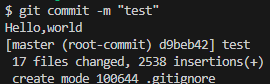
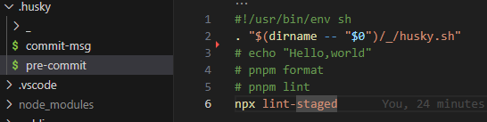
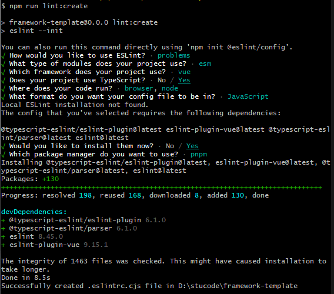
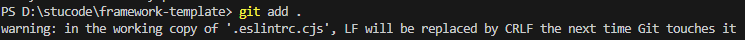
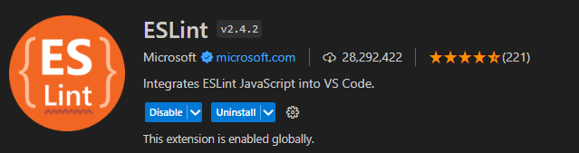
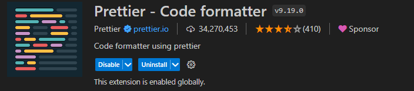
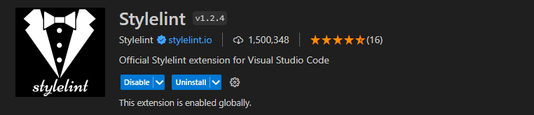

> 需要根据项目要求做出更改
> github.com/maiiitian/standard-dev-app

创建一个统一风格的、规范化的项目对于一个团队来说至关重要。

项目在提交commit时，使用了commitlint & husky 对提交信息进行规范。

在编写代码时，使用eslint + prettier + stylelint + *ls-lint* 对目录命名和代码风格质量进行限制和格式化。

> thanks:
>
> [前端工程代码规范 Husky + Commitlint + Prettier + Eslint + Stylelint](https://blog.csdn.net/by6671715/article/details/126108921)
>
> www.bilibili.com/video/BV1BV4y1N7pd 

## 1. 使用`Vite`脚手架初始化项目

全局安装pnpm

> 包安装速度极快；磁盘空间利用非常高效；支持 monorepo；安全性高。

```
npm install pnpm -g
```

https://cn.vitejs.dev/guide/

```
pnpm create vite standard-dev-app --template vue-ts
cd standard-dev-app
pnpm install
pnpm run dev

修改vite.config.ts，修改域名端口
export default defineConfig({
  plugins: [vue()],
  server: {
    host: 'localhost',
    port: 7070,
    open: true //自动打开浏览器
  }
})
```

## 2. husky

husky 是一个为 git 客户端增加 hook 的工具 ，在一些 git 操作前自动触发的函数

```
pnpm install husky -D
```

打开package.json，配置script脚本
```
"prepare": "husky install"
```

执行  `git init`  命令后，运⾏  `pnpm prepare`  安装 git hook ，⽤于在commit时使⽤eslint校验、prettier格式化、commitlint校验提交信息。

```
git init
pnpm prepare # 安装git hook
npx husky add .husky/pre-commit "echo "Hello,world""
# （.husky文件夹下出现 pre-commit文件）
```

`git add . `   然后 `git commit -m "test" `去测试一下



后期一步步测试



>**常用的 git hooks：**
>
>- pre-commit：由 git commit 调用，在 commit 之前执行
>- commit-msg：由 git commit 或 git merge 调用
>- pre-merge-commit：由 git merge 调用，在 merge 之前执行
>- pre-push：被 git push 调用，在 git push 之前执行，防止进行推送 

## 3. eslint语法校验，prettier代码美化

1. ESLint是 **js** 代码的 **质量** 检查工具，同时也具备一定的代码风格的格式化能力。
2. Prettier是一个**代码风格**的约束工具，Prettier能约束JS、JSX、TypeScript、Vue、CSS、Less、SCSS、HTML、JSON、Markdown等代码风格。

总结：**eslint和prettier，一个保证js代码质量，一个保证代码美观。**

### esLint和prettier冲突

1. ESLint默认语句结尾不加分号，Prettier默认语句结尾加分号；
2. ESLint默认强制使用单引号，Prettier默认使用双引号；
3. ESLint默认句末减少不必要的逗号，Prettier默认尽可能多使用逗号。

```
pnpm install eslint eslint-plugin-vue prettier -D
```
- eslint						ESLint的核心库
- prettier					prettier格式化代码的核心库
- eslint-plugin-vue	eslint在vue里的代码规范

**解决冲突问题的两个**

```
pnpm i eslint-config-prettier eslint-plugin-prettier -D
```

- eslint-config-prettier	禁用掉了一些不必要的以及和 Prettier 相冲突的 ESLint 规则；
- eslint-plugin-prettier	将 prettier 作为 ESLint 的规则来使用，相当于代码不符合 Prettier 的标准时，会报一个 ESLint 错误，同时也可以通过 eslint --fix 来进行格式化；这样就相当于将 Prettier 整合进了 ESLint 中。

执行 `npx eslint --init`  ，选择配置，创建 `.eslintrc` 配置文件



安装完成后，后面的启动项目还缺少一些依赖，提前按需安装好
```
pnpm install typescript @typescript-eslint/parser @typescript-eslint/eslint-plugin eslint-import-resolver-alias -D
```

- @typescript-eslint/parser				eslint解析器，解析typescript，检查规范typescript代码
- @typescript-eslint/eslint-plugin     eslint插件，包含了各类定义好的检测typescript代码的规范
- eslint-import-resolver-alias			让我们可以用import的时候使用@别名

###  `eslintrc.cjs `配置

> 因为`eslint`是 node 工具，所以文件名是`.cjs`结尾(commonjs 规范)——对应的
>
> `.mjs`就是 ES Module 规范

```
module.exports = {
	// 环境:
	env: {
		// 浏览器
		browser: true,
		// 最新es语法
		es2021: true
	},
	// 扩展的eslint规范语法，可以被继承的规则
	// 字符串数组：每个配置继承它前面的配置
	// 分别是：
	// eslint-plugin-vue提供的
	// eslint-config-prettier提供的
	// 前缀 eslint-config-, 可省略
	extends: [
		'plugin:vue/vue3-strongly-recommended',
		'prettier'
	],
	// eslint 会对我们的代码进行检验
	// parser的作用是将我们写的代码转换为ESTree（AST）
	// ESLint会对ESTree进行校验
	parser: 'vue-eslint-parser',
	// 解析器的配置项
	parserOptions: {
		// es的版本号，或者年份都可以
		ecmaVersion: 'latest',
		parser: '@typescript-eslint/parser',
		// 源码类型 默认是script，es模块用module
		sourceType: 'module'
	},
	// 插件
	// 前缀 eslint-plugin-, 可省略
	// vue官方提供了一个ESLint插件 eslint-plugin-vue，它提供了parser和rules
	// parser为 vue-eslint-parser，放在上面的parsr字段，rules放在extends字段里，选择合适的规则
	plugins: [
		'vue',
		'@typescript-eslint'
	],
	settings: {
		// 设置项目内的别名
		'import/reslover': {
			alias: {
				map: [
					['@', './src']
				],
			},
		},
		// 允许的扩展名
		'import/extensions': ['.js', '.jsx', '.ts', '.tsx', '.mjs'],
	},
  /*
   * "off" 或 0    ==>  关闭规则
   * "warn" 或 1   ==>  打开的规则作为警告（不影响代码执行）
   * "error" 或 2  ==>  规则作为一个错误（代码不能执行，界面报错）
   */
  rules: {
    // eslint（https://eslint.bootcss.com/docs/rules/）
    'no-var': 'error', // 要求使用 let 或 const 而不是 var
    'no-multiple-empty-lines': ['warn', { max: 1 }], // 不允许多个空行
    'no-console': process.env.NODE_ENV === 'production' ? 'error' : 'off',
    'no-debugger': process.env.NODE_ENV === 'production' ? 'error' : 'off',
    'no-unexpected-multiline': 'error', // 禁止空余的多行
    'no-useless-escape': 'off', // 禁止不必要的转义字符

    // typeScript (https://typescript-eslint.io/rules)
    '@typescript-eslint/no-unused-vars': 'error', // 禁止定义未使用的变量
    '@typescript-eslint/prefer-ts-expect-error': 'error', // 禁止使用 @ts-ignore
    '@typescript-eslint/no-explicit-any': 'off', // 禁止使用 any 类型
    '@typescript-eslint/no-non-null-assertion': 'off',
    '@typescript-eslint/no-namespace': 'off', // 禁止使用自定义 TypeScript 模块和命名空间。
    '@typescript-eslint/semi': 'off',

    // eslint-plugin-vue (https://eslint.vuejs.org/rules/)
    'vue/multi-word-component-names': 'off', // 要求组件名称始终为 “-” 链接的单词
    'vue/script-setup-uses-vars': 'error', // 防止<script setup>使用的变量<template>被标记为未使用
    'vue/no-mutating-props': 'off', // 不允许组件 prop的改变
    'vue/attribute-hyphenation': 'off', // 对模板中的自定义组件强制执行属性命名样式
};
```

打开package.json，配置script脚本

```
"lint": "eslint . --ext .vue,.js,.ts,.jsx,.tsx --fix",
```

###  `.eslintignore` 忽略校验文件 

```
.vscode
.husky
assets
node_modules

dist
components.d.ts
```

### `.prettierrc.cjs ` 配置

```
module.exports = {
  arrowParens: 'always', // 只有一个参数的箭头函数的参数是否带圆括号（默认avoid:添加括号）
  bracketSameLine: false, // 对于多行结构（如对象或数组），括号是否与起始位置放在同一行
  bracketSpacing: true, // 在对象，数组括号与文字之间加空格 "{ foo: bar }"（默认true）
  embeddedLanguageFormatting: 'auto', // 是否对嵌入语言进行格式化。
  htmlWhitespaceSensitivity: 'css', // 根据显示样式决定 html 要不要折行
  insertPragma: false, // 是否在文件顶部插入格式化的指令。
  jsxSingleQuote: false, // jsx 不使用单引号，而使用双引号
  printWidth: 120, // 一行最多 120 字符(默认80)
  proseWrap: 'never', // 是否在 markdown 文件中处理换行。
  quoteProps: 'as-needed',  // 对象的 key 仅在必要时用引号
  requirePragma: false, // 是否在 markdown 文件中处理换行。
  semi: true, // 行尾需要有分号(默认true)
  singleQuote: true, // 是否使用单引号。
  tabWidth: 2,  // 每个tab相当于多少个空格（默认2）
  trailingComma: 'all', // 多行使用拖尾逗号（默认none）
  useTabs: false, // 是否使用tab进行缩进（默认false）
  vueIndentScriptAndStyle: false, // 在 Vue 文件中是否缩进 <script> 和 <style> 标签的内容。
  singleAttributePerLine: false, // 对于 HTML、JSX 属性，是否每个属性都放在单独的行上。
};
```

### `.prettierignore` 忽略文件配置

```
.husky
.vscode
assets
node_modules

dist
components.d.ts
```

打开package.json，配置script脚本

```
"format": "prettier --write \"./**/*.{html,vue,ts,js,json,md,less,sass,scss,sty}\""
```

## 4.  stylelint 样式校验

CSS 检查器(linter)

```
pnpm install postcss postcss-html stylelint stylelint-config-prettier stylelint-config-standard  stylelint-config-standard-vue stylelint-order -D （对vue里面样式的支持，vue的样式需要依赖前面这个库）
对less的支持
pnpm install postcss-less stylelint-less stylelint-config-recommended-less -D
对scss的支持
pnpm install postcss-scss stylelint-scss stylelint-config-recommended-scss -D
```

配置 `.stylelintrc.cjs`  

 less

```
module.exports = {
  extends: [
    'stylelint-config-standard',
    'stylelint-config-prettier',
    'stylelint-config-recommended-less',
    //"stylelint-config-recommended-scss",
    'stylelint-config-standard-vue',
  ],
  plugins: ['stylelint-order'],
  // 不同格式的文件指定自定义语法
  overrides: [
    {
      files: ['**/*.(less|css|vue|html)'],
      customSyntax: 'postcss-less',
    },
    {
      files: ['**/*.(html|vue)'],
      customSyntax: 'postcss-html',
    },
  ],
  ignoreFiles: ['**/*.js', '**/*.jsx', '**/*.tsx', '**/*.ts', '**/*.json', '**/*.md', '**/*.yaml'],
  rules: {
    'selector-class-pattern': [
      // 命名标准 -
      '^([a-z][a-z0-9]*)(-[a-z0-9]+)*(__[a-z0-9]+)*$',
      {
        message: 'Expected class selector to be kebab-case',
      },
    ],
    'declaration-block-trailing-semicolon': null,
    'string-quotes': 'single',
    'no-descending-specificity': null, // 禁止在具有较高优先级的选择器后出现被其覆盖的较低优先级的选择器
    'selector-pseudo-element-no-unknown': [
      true,
      {
        ignorePseudoElements: ['v-deep'],
      },
    ],
    'selector-pseudo-class-no-unknown': [
      true,
      {
        ignorePseudoClasses: ['deep'],
      },
    ],
    // 指定样式的排序
    'order/properties-order': [
      'position',
      'top',
      'right',
      'bottom',
      'left',
      'z-index',
      'display',
      'justify-content',
      'align-items',
      'float',
      'clear',
      'overflow',
      'overflow-x',
      'overflow-y',
      'padding',
      'padding-top',
      'padding-right',
      'padding-bottom',
      'padding-left',
      'margin',
      'margin-top',
      'margin-right',
      'margin-bottom',
      'margin-left',
      'width',
      'min-width',
      'max-width',
      'height',
      'min-height',
      'max-height',
      'font-size',
      'font-family',
      'text-align',
      'text-justify',
      'text-indent',
      'text-overflow',
      'text-decoration',
      'white-space',
      'color',
      'background',
      'background-position',
      'background-repeat',
      'background-size',
      'background-color',
      'background-clip',
      'border',
      'border-style',
      'border-width',
      'border-color',
      'border-top-style',
      'border-top-width',
      'border-top-color',
      'border-right-style',
      'border-right-width',
      'border-right-color',
      'border-bottom-style',
      'border-bottom-width',
      'border-bottom-color',
      'border-left-style',
      'border-left-width',
      'border-left-color',
      'border-radius',
      'opacity',
      'filter',
      'list-style',
      'outline',
      'visibility',
      'box-shadow',
      'text-shadow',
      'resize',
      'transition',
    ],
  },
}
```

scss

```
module.exports = {
  root: true,
  plugins: ['stylelint-order', 'stylelint-scss'],
  customSyntax: 'postcss-html',
  extends: ['stylelint-config-standard', 'stylelint-config-prettier', 'stylelint-config-html'],
  rules: {
    'selector-class-pattern': null,
    'selector-pseudo-class-no-unknown': [
      true,
      {
        ignorePseudoClasses: ['deep', 'global'],
      },
    ],
    'selector-pseudo-element-no-unknown': [
      true,
      {
        ignorePseudoElements: ['v-deep', 'v-global', 'v-slotted'],
      },
    ],
    'at-rule-no-unknown': [
      true,
      {
        ignoreAtRules: [
          'tailwind',
          'apply',
          'variants',
          'responsive',
          'screen',
          'function',
          'if',
          'each',
          'include',
          'mixin',
        ],
      },
    ],
    'no-empty-source': null,
    'named-grid-areas-no-invalid': null,
    'unicode-bom': 'never',
    'no-descending-specificity': null,
    'font-family-no-missing-generic-family-keyword': null,
    'declaration-colon-space-after': 'always-single-line',
    'declaration-colon-space-before': 'never',
    // 'declaration-block-trailing-semicolon': 'always',
    'rule-empty-line-before': [
      'always',
      {
        ignore: ['after-comment', 'first-nested'],
      },
    ],
    'unit-no-unknown': [true, { ignoreUnits: ['rpx'] }],
    'keyframes-name-pattern': null,
    'order/order': [
      [
        'dollar-variables',
        'custom-properties',
        'at-rules',
        'declarations',
        {
          type: 'at-rule',
          name: 'supports',
        },
        {
          type: 'at-rule',
          name: 'media',
        },
        'rules',
      ],
      { severity: 'warning' },
    ],
    'order/properties-order': [
      'position',
      'top',
      'right',
      'bottom',
      'left',
      'z-index',
      'display',
      'float',
      'width',
      'height',
      'max-width',
      'max-height',
      'min-width',
      'min-height',
      'padding',
      'padding-top',
      'padding-right',
      'padding-bottom',
      'padding-left',
      'margin',
      'margin-top',
      'margin-right',
      'margin-bottom',
      'margin-left',
      'margin-collapse',
      'margin-top-collapse',
      'margin-right-collapse',
      'margin-bottom-collapse',
      'margin-left-collapse',
      'overflow',
      'overflow-x',
      'overflow-y',
      'clip',
      'clear',
      'font',
      'font-family',
      'font-size',
      'font-smoothing',
      'osx-font-smoothing',
      'font-style',
      'font-weight',
      'hyphens',
      'src',
      'line-height',
      'letter-spacing',
      'word-spacing',
      'color',
      'text-align',
      'text-decoration',
      'text-indent',
      'text-overflow',
      'text-rendering',
      'text-size-adjust',
      'text-shadow',
      'text-transform',
      'word-break',
      'word-wrap',
      'white-space',
      'vertical-align',
      'list-style',
      'list-style-type',
      'list-style-position',
      'list-style-image',
      'pointer-events',
      'cursor',
      'background',
      'background-attachment',
      'background-color',
      'background-image',
      'background-position',
      'background-repeat',
      'background-size',
      'border',
      'border-collapse',
      'border-top',
      'border-right',
      'border-bottom',
      'border-left',
      'border-color',
      'border-image',
      'border-top-color',
      'border-right-color',
      'border-bottom-color',
      'border-left-color',
      'border-spacing',
      'border-style',
      'border-top-style',
      'border-right-style',
      'border-bottom-style',
      'border-left-style',
      'border-width',
      'border-top-width',
      'border-right-width',
      'border-bottom-width',
      'border-left-width',
      'border-radius',
      'border-top-right-radius',
      'border-bottom-right-radius',
      'border-bottom-left-radius',
      'border-top-left-radius',
      'border-radius-topright',
      'border-radius-bottomright',
      'border-radius-bottomleft',
      'border-radius-topleft',
      'content',
      'quotes',
      'outline',
      'outline-offset',
      'opacity',
      'filter',
      'visibility',
      'size',
      'zoom',
      'transform',
      'box-align',
      'box-flex',
      'box-orient',
      'box-pack',
      'box-shadow',
      'box-sizing',
      'table-layout',
      'animation',
      'animation-delay',
      'animation-duration',
      'animation-iteration-count',
      'animation-name',
      'animation-play-state',
      'animation-timing-function',
      'animation-fill-mode',
      'transition',
      'transition-delay',
      'transition-duration',
      'transition-property',
      'transition-timing-function',
      'background-clip',
      'backface-visibility',
      'resize',
      'appearance',
      'user-select',
      'interpolation-mode',
      'direction',
      'marks',
      'page',
      'set-link-source',
      'unicode-bidi',
      'speak',
    ],
  },
  ignoreFiles: ['**/*.js', '**/*.jsx', '**/*.tsx', '**/*.ts'],
}
```

打开package.json，配置script脚本

```
"lint:style": "stylelint \"./**/*.{html,css,less,sass,scss,vue}\" --fix",
```

## 5. lint-staged、commitlint 提交规范

1. lint-staged过滤出Git代码暂存区文件(被git add的文件的工具，将所有暂存文件的列表传递给任务
2. commitlint是对我们git commit提交的注释进行校验的工具

```
pnpm install lint-staged commitlint @commitlint/config-conventional -D
```

执行  `npx husky add .husky/pre-commit "npx lint-staged"`   添加钩子（.husky文件夹下出现 pre-commit文件）就可以添加各种 git hooks 钩子，pre-commit 一般添加的是lint-staged，去对git暂存区的代码做一些格式化的操作

打开package.json，配置

```
  "lint-staged": {
    "*.{vue,js,jsx,ts,tsx}": [
      "pnpm lint",
      "pnpm format"
    ],
    "*.{vue,less,css,scss,sass}": [
      "pnpm lint:style"
    ]
  }
```

执行  `npx husky add .husky/commit-msg "npx --no-install commitlint --edit "$1""`   添加钩子（.husky文件夹下出现 commit-msg文件）

`.commitlintrc.cjs` 配置

```
module.exports = {
	extends: ['@commitlint/config-conventional'],
	rules: {
		'type-enum': [
			2,
			'always',
			[
				'build', // 编译相关的修改，例如发布版本，对项目构建或者依赖的改动
				'feat', // 新功能(feature)
				'fix', // 修复bug
				'update', // 更新某功能
				'refactor', // 重构
				'docs', // 文档
				'chore', // 构建过程或者辅助工具的变动,如增加依赖库等
				'style', // 不影响代码运行的变动
				'revert', // 撤销commit,回滚到上一个版本
				'perf', // 性能优化
				'test', // 测试(单元,集成测试)
			],
		],
		'type-case': [0],
		'type-empty': [0],
		'scope-empty': [0],
		'scope-case': [0],
		'subject-full-stop': [0, 'never'],
		'subject-case': [0, 'never'],
		'header-max-length': [0, 'always', 74],
	},
};
```

> commit时，注意[ : ]后有[ space ]空格

## 6. ls-lint 文件目录命名规范

```
pnpm add -D @ls-lint/ls-lint
```

根目录下 `.ls-lint.yml` 

`ls` 下面配置对哪些文件使用规则，支持文件名、目录、正则等多种配置方式。`ignore` 是一个数组，定义需要忽略的文件或者目录。

注意，目录匹配在 `ignore` 中不支持。

```
ls:
  .js: kebab-case # 对所有 JS 文件使用 kebab-case 形式
  .ts: kebab-case | camelCase | PascalCase # 对所有 TS 文件使用 kebab-case 或者 camelCase 或者 PascalCase 形式
  .d.ts: kebab-case # 对所有 .d.ts 文件使用 kebab-case 形式

  packages/src:
    .dir: camelCase # 对当前目录和所有子目录使用 camelCase
    .js: camelCase # 对 packages/src 下的 JS 文件使用 camelCase，会覆盖上面的全局配置

  models:
    .js: PascalCase # models 目录下的 JS 文件使用 PascalCase

  packages/*/src: # * 号匹配除了目录分隔符以外的任意字符
    .js: kebab-case

  packages/**/templates: # ** 号匹配包含目录分隔符以外的任意字符
    .html: kebab-case

  packages/*/{src,tests}: # 匹配 package 下下一级目录中的 src 或 tests 目录中的文件
    .js: kebab-case

ignore:
  - .git # 忽略 .git 目录
  - node_modules # 忽略 node_modules 目录
```

所有支持的规则：

| 规则       | 别名       | 描述                                                         |
| ---------- | ---------- | ------------------------------------------------------------ |
| 正则       | -          | 满则正则表达式`^{pattern}$`                                  |
| lowercase  | -          | 文件或目录名必须全小写，数字除外，如 abeautifulname          |
| camelcase  | camelCase  | 文件和目录名必须为驼峰式，且只支持字母和数字，如 aBeautifulCase |
| pascalcase | PascalCase | 文件和目录名必须满足帕斯卡命名法，且只支持字母和数字，如 ABeautifulName |
| snakecase  | snake_case | 文件和目录名必须为下划线联接，且只支持字母、数字和下划线，如 a_beautiful_name |
| kebabcase  | kebab-case | 文件和目录名必须为中划线联接，且只支持字母、数字和中划线，如 a-beautiful-name |
| pointcase  | point.case | 文件和目录名必须满足点文件规范，且只支持字母、数字和点，如 a.beautiful.name |

打开package.json，配置script脚本

```
"ls-lint": "ls-lint"
```

在 `pre-commit` 中添加执行

```
npx --no-install ls-lint
```

## CRLF 问题

windows平台进行 git add 时，控制台打印警告

LF will be replaced by CRLF the next time Git touches it



问题分析：

Dos/Windows平台默认换行符：回车（CR）+换行（LF），即’\r\n’

Mac/Linux平台默认换行符：换行（LF），即’\n’

企业服务器一般都是Linux系统进行管理，所以会有替换换行符的需求

解决：

设置方法一：

```
#提交时转换为LF，检出时转换为CRLF
git config --global core.autocrlf true
```

*适用于Windows系统，且一般为Windows默认设置，会在提交时对换行符进行CRLF - LF的转换，检出时又会进行LF - CRLF的转换。


设置方法二：

```
#提交时转换为LF，检出时不转换
git config --global core.autocrlf input
```

*适用于Linux系统，所有换行符都会进行CRLF - LF转换，但操作时不会转换回CRLF。


设置方法三：

```
#提交检出均不转换
git config --global core.autocrlf false
```

*适用于Windows系统，且只在Windows上开发的情况。在提交、检出时不会对CRLF/LF换行符进行转换

## 涉及插件







